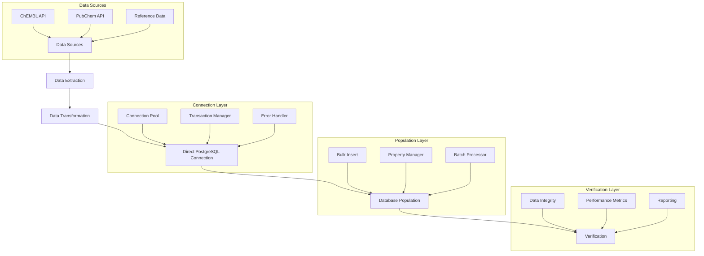

# Direct PostgreSQL Database Population Workflow

This document provides comprehensive documentation for the direct PostgreSQL database population workflow used in CryoProtect v2.

## Table of Contents

- [Architecture Overview](#architecture-overview)
- [Core Components](#core-components)
  - [PostgreSQL Connection Helper (`postgres_direct.py`)](#postgresql-connection-helper-postgres_directpy)
  - [SQL Executor (`sql_executor.py`)](#sql-executor-sql_executorpy)
  - [Property Manager (`property_utils.py`)](#property-manager-property_utilspy)
- [Import & Enhancement Scripts](#import--enhancement-scripts)
  - [Reference Compounds Import (`import_reference_compounds.py`)](#reference-compounds-import-import_reference_compoundspy)
  - [ChEMBL Data Import (`import_full_chembl.py`)](#chembl-data-import-import_full_chemblpy)
  - [Cross-Reference Reconciliation (`reconcile_chembl_properties.py`)](#cross-reference-reconciliation-reconcile_chembl_propertiespy)
  - [PubChem Property Enhancement (`enhance_pubchem_properties.py`)](#pubchem-property-enhancement-enhance_pubchem_propertiespy)
  - [Performance Indexing (`add_performance_indexes.py`)](#performance-indexing-add_performance_indexespy)
- [Orchestration & Verification](#orchestration--verification)
  - [Master Orchestration Script (`populate_database.py`)](#master-orchestration-script-populate_databasepy)
  - [Verification Script (`verify_imported_data.py`)](#verification-script-verify_imported_datapy)
- [Configuration](#configuration)
- [Usage](#usage)
  - [Running Individual Scripts](#running-individual-scripts)
  - [Running the Master Script](#running-the-master-script)
- [Troubleshooting](#troubleshooting)

## Architecture Overview

The Direct PostgreSQL Database Population system provides a high-performance, reliable mechanism for populating the CryoProtect v2 database with molecular data from various sources. This architecture replaces the previous MCP-based approach with direct PostgreSQL connections to Supabase, offering significant improvements in performance, reliability, and flexibility.

The workflow involves several key stages: extracting data from sources like ChEMBL and PubChem, transforming it, establishing a direct connection to the PostgreSQL database using a dedicated connection layer (including pooling and transaction management), populating the database using optimized methods (bulk inserts, batch processing), and finally verifying the integrity and completeness of the imported data.



Key components include:
- **Connection Layer:** Manages database connections (`postgres_direct.py`, `sql_executor.py`).
- **Data Import Components:** Handle data retrieval and processing from different sources (`import_*.py`, `enhance_*.py`, `reconcile_*.py`).
- **Property Management:** Normalizes and stores molecular properties (`property_utils.py`).
- **Orchestration & Verification:** Coordinates the workflow and validates results (`populate_database.py`, `verify_imported_data.py`).

For more detailed component descriptions, see the sections below. The full architecture specification can be found in `.specs/direct_database_population_architecture.md`.

## Core Components

### PostgreSQL Connection Helper (`postgres_direct.py`)

The `postgres_direct.py` module provides a singleton class, `PostgresDirectConnection`, responsible for managing direct, reliable, and efficient connections to the PostgreSQL database (Supabase).

**Key Features:**

*   **Singleton Pattern:** Ensures only one instance manages the connection pool throughout the application.
*   **Thread-Safe Connection Pooling:** Uses `psycopg2.pool.ThreadedConnectionPool` to manage a pool of connections, improving performance by reusing connections and handling concurrent requests safely. Pool size is configurable via constructor arguments (`min_connections`, `max_connections`).
*   **Environment Configuration:** Loads database credentials (`SUPABASE_DB_HOST`, `SUPABASE_DB_PORT`, `SUPABASE_DB_NAME`, `SUPABASE_DB_USER`, `SUPABASE_DB_PASSWORD`) from the `.env` file.
*   **DNS/IP Resolution Fallback:** Includes a mechanism (`_resolve_host`) to resolve the database hostname to an IP address, providing resilience against potential DNS issues.
*   **Automatic Reconnection:** Monitors pool health (`_check_pool_health`) and attempts to automatically re-establish the connection pool if it becomes unhealthy (`reconnect`).
*   **Context Managers:**
    *   `get_connection()`: Provides a safe way to acquire and release connections from the pool.
    *   `transaction()`: Manages database transactions, automatically committing on success and rolling back on exceptions.
*   **Optimized Execution Methods:**
    *   `execute_query()`: Executes standard SQL queries with parameter binding, supporting fetching single or multiple rows, and dictionary cursors. Includes slow query logging.
    *   `bulk_insert()`: Efficiently inserts large volumes of data using a single `INSERT` statement with multiple `VALUES` clauses, processed in configurable chunks. Can optionally return inserted IDs.
    *   `execute_batch()`: Executes the same SQL statement multiple times with different parameter sets using `psycopg2.extras.execute_batch`.
*   **Performance Monitoring:** Tracks metrics like the number of queries executed, connection/query errors, total query time, and connection success rates (`get_metrics`).

**Usage:**

```python
# Import the singleton instance
from postgres_direct import PostgresDirectConnection

# Initialize (usually done once at application start)
db_conn = PostgresDirectConnection(min_connections=2, max_connections=20)

# Execute a simple query
results = db_conn.execute_query("SELECT * FROM molecules WHERE id = %s", (123,))

# Perform a bulk insert within a transaction
data_to_insert = [{'name': 'MoleculeA', 'smiles': 'CC'}, {'name': 'MoleculeB', 'smiles': 'CCO'}]
with db_conn.transaction() as conn: # Use transaction context manager
    inserted_ids = db_conn.bulk_insert('molecules', data_to_insert, return_ids=True)
    print(f"Inserted IDs: {inserted_ids}")

# Get performance metrics
metrics = db_conn.get_metrics()
print(f"Average query time: {metrics.get('avg_query_time', 'N/A'):.4f}s")

# Close the pool when application shuts down
db_conn.close()
```

### SQL Executor (`sql_executor.py`)

The `sql_executor.py` module provides a set of utility functions and decorators designed to simplify common database operations, building upon the `PostgresDirectConnection` class. It handles query execution, batch operations, bulk inserts, transactions, retries, and other common patterns.

**Key Features & Functions:**

*   **Connection Abstraction:** Lazily initializes and retrieves the `PostgresDirectConnection` singleton instance (`get_db`), simplifying access for other modules.
*   **Wrapper Functions:** Provides direct wrappers for the core execution methods of `PostgresDirectConnection`:
    *   `execute_query()`: Executes standard SQL queries.
    *   `bulk_insert()`: Performs efficient bulk inserts.
    *   `execute_batch()`: Executes batch SQL statements.
*   **Transaction Decorator (`@with_transaction`):** Wraps a function call within a database transaction, ensuring atomicity by automatically committing on success or rolling back on failure. The decorated function receives the database connection object as its first argument.
*   **Retry Decorator (`@with_retry`):** Adds automatic retry logic to a function call. It catches specified exceptions and retries the function with configurable exponential backoff (`max_retries`, `retry_delay`, `retry_backoff`, `retry_exceptions`).
*   **Batch Processing (`process_in_batches`):** A utility function to process large lists of items in manageable batches, providing progress logging and estimated time remaining. It accepts a processing function to apply to each batch.
*   **Upsert Operation (`upsert`):** Implements an `INSERT ... ON CONFLICT ... DO UPDATE` operation, allowing insertion or update of records based on a unique key constraint. It processes data in batches for efficiency.
*   **Temporary Table Utilities:**
    *   `create_temp_table()`: Creates a temporary PostgreSQL table.
    *   `copy_from_temp_table()`: Copies data from a temporary table to a target table.
*   **Metrics & Cleanup:**
    *   `get_connection_metrics()`: Retrieves performance metrics from the underlying connection pool.
    *   `close_connections()`: Closes all connections in the pool.

**Usage:**

```python
# Import necessary functions
from sql_executor import execute_query, bulk_insert, with_transaction, with_retry, process_in_batches

# Example: Using transaction and retry decorators
@with_transaction
@with_retry(max_retries=5)
def update_molecule_status(conn, molecule_id, new_status):
    # Note: 'conn' is automatically passed by @with_transaction
    cursor = conn.cursor()
    cursor.execute("UPDATE molecules SET status = %s WHERE id = %s", (new_status, molecule_id))
    logger.info(f"Updated status for molecule {molecule_id}")

# Call the decorated function
update_molecule_status(123, 'processed')

# Example: Processing items in batches
def process_batch_of_molecules(batch):
    # Perform some operation on the batch of molecules
    print(f"Processing {len(batch)} molecules...")
    # Example: Update a property for the batch
    update_data = [{'id': m['id'], 'is_processed': True} for m in batch]
    upsert('molecules', update_data, key_columns=['id'], update_columns=['is_processed'])

all_molecules = execute_query("SELECT id FROM molecules WHERE status = 'pending'")
if all_molecules:
    process_in_batches(all_molecules, batch_size=500, process_func=process_batch_of_molecules)

```

### Property Manager (`property_utils.py`)

The `property_utils.py` module provides the `PropertyManager` class, which is responsible for interacting with the normalized molecular property schema in the database (`property_types` and `molecular_properties` tables). It's designed to work efficiently with the direct PostgreSQL connection layer.

**Key Features:**

*   **Property Type Management:**
    *   Retrieves property type definitions (ID, name, data type) from the `property_types` table.
    *   **Caching:** Maintains an in-memory cache (`_property_types_cache`) of property types to minimize database lookups. The cache is refreshed periodically (`_cache_refresh_interval`).
    *   **Automatic Creation:** If a property type doesn't exist when setting a property, it automatically creates a new entry in the `property_types` table (`get_property_type_id`).
*   **Property Value Operations:**
    *   `set_property()`: Sets (inserts or updates) a single property value for a given molecule ID in the `molecular_properties` table. It automatically determines the correct column (`numeric_value`, `text_value`, `boolean_value`) based on the Python data type of the value.
    *   `get_properties()`: Retrieves one or more property values for a specific molecule.
    *   `delete_property()`: Removes a specific property for a molecule.
*   **Batch Operations:**
    *   `set_properties()`: Sets multiple properties for a single molecule.
    *   `batch_set_properties()`: Efficiently sets properties for a list of molecules using batch processing (`process_in_batches` from `sql_executor`). It pre-caches necessary property types for the batch.
    *   `batch_get_properties()`: Retrieves properties for multiple molecules using a single optimized query.
*   **Integration:** Uses the `PostgresDirectConnection` singleton (via `get_db()` from `sql_executor`) and leverages functions like `execute_query`, `bulk_insert`, and `execute_batch` for database interactions.
*   **Resilience:** Relies on the retry mechanisms implemented in the underlying `sql_executor` or `PostgresDirectConnection` for database operations.

**Usage:**

```python
# Import the PropertyManager
from property_utils import PropertyManager
from uuid import uuid4 # Assuming molecule IDs are UUIDs

# Initialize the manager (uses default connection pool)
prop_manager = PropertyManager()

# Example Molecule ID
molecule_id = uuid4()

# Set a single property
prop_manager.set_property(molecule_id, 'logP', 2.5)
prop_manager.set_property(molecule_id, 'Formula', 'C10H12N2O')
prop_manager.set_property(molecule_id, 'IsToxic', False)

# Set multiple properties for one molecule
properties_to_set = {
    'MolecularWeight': 192.24,
    'Charge': 0
}
success, total = prop_manager.set_properties(molecule_id, properties_to_set)
print(f"Set {success}/{total} properties for molecule {molecule_id}")

# Get properties for the molecule
retrieved_props = prop_manager.get_properties(molecule_id, ['logP', 'Formula'])
print(f"Retrieved properties: {retrieved_props}")

# Batch set properties for multiple molecules
molecule_data = [
    {'molecule_id': uuid4(), 'properties': {'logP': 3.1, 'Charge': -1}},
    {'molecule_id': uuid4(), 'properties': {'logP': 1.8, 'IsToxic': True}},
]
batch_success, batch_total = prop_manager.batch_set_properties(molecule_data)
print(f"Batch set {batch_success}/{batch_total} properties")

# Clear the property type cache (if needed, e.g., after manual DB changes)
# prop_manager.clear_cache()
```

## Import & Enhancement Scripts

### Reference Compounds Import (`import_reference_compounds.py`)

This script is dedicated to importing a predefined list of essential reference cryoprotectant compounds into the database. It ensures these key compounds are present and populated with comprehensive data fetched from both ChEMBL and PubChem.

**Purpose:**

*   To guarantee the presence and completeness of a core set of reference compounds within the database.
*   To serve as an initial population step or a verification/update mechanism for these specific compounds.

**Data Sources:**

*   **Primary List:** Uses a hardcoded list of ChEMBL IDs defined in `chembl.reference_compounds.get_reference_compound_ids()`.
*   **ChEMBL:** Fetches primary molecular data and properties using `chembl.client.ResilientChEMBLClient`.
*   **PubChem:** Fetches supplementary properties using `pubchem.client.ResilientPubChemClient` if a PubChem CID is available via ChEMBL cross-references.

**Core Logic & Features:**

1.  **Initialization:** Initializes ChEMBL/PubChem clients, the `CryoprotectantIdentifierManager`, and the `PropertyManager`.
2.  **Get Reference IDs:** Retrieves the target list of ChEMBL IDs.
3.  **Checkpointing:** Supports resumable imports using checkpoint files (`--checkpoint`, `--resume`/`--no-resume`). Loads previously processed IDs and results if resuming.
4.  **Batch Processing:** Processes the compounds in configurable batches (`--batch-size`) using `sql_executor.process_in_batches`.
5.  **Data Fetching:** For each compound:
    *   Retrieves data from ChEMBL.
    *   Retrieves data from PubChem if a CID exists.
6.  **Property Merging:** Combines properties obtained from both ChEMBL and PubChem.
7.  **Identifier Management:** Uses `CryoprotectantIdentifierManager` to resolve or assign an internal CryoProtect ID (`internal_id`). Updates the manager with the compound's details.
8.  **Database Interaction (Direct Connection):**
    *   Uses `sql_executor.execute_query` to either `INSERT` a new molecule record (basic fields) or `UPDATE` an existing one based on the `internal_id`.
    *   Uses `PropertyManager.set_properties` to store the merged, normalized properties associated with the `internal_id`.
9.  **Error Handling:** Includes try-except blocks to handle errors during API fetching or database operations, logging failures and continuing with the next compound. Partial success (identifier manager updated, DB failed) is also logged.
10. **Reporting:** Generates a JSON report (`--report`) summarizing the import process (total, imported, updated, failed counts, and details for each compound).
11. **Checkpoint Updates:** Saves the progress (processed IDs, results) to the checkpoint file after processing each compound, ensuring minimal data loss on interruption.

**Dependencies:**

*   `chembl.client`, `pubchem.client`
*   `cryoprotectant_identifiers`
*   `chembl.reference_compounds`
*   `postgres_direct`, `sql_executor`, `property_utils`

**Usage (CLI):**

```bash
python import_reference_compounds.py \
    --report reports/reference_import_$(date +%Y%m%d_%H%M%S).json \
    --checkpoint checkpoints/reference_import_checkpoint.json \
    --batch-size 10 \
    # --no-resume  # Optional: Force start from beginning
```

*   `--report`: Specifies the path for the output JSON report.
*   `--checkpoint`: Specifies the path for the checkpoint file.
*   `--batch-size`: Sets the number of compounds processed per batch.
*   `--no-resume`: Disables resuming from an existing checkpoint.

### ChEMBL Data Import (`import_full_chembl.py`)

This script is responsible for importing a large number of cryoprotectant-related compounds from the ChEMBL database. It's designed for scalability and resilience, leveraging direct PostgreSQL connections and worker threads.

**Purpose:**

*   To populate the database with compounds relevant to cryoprotection, identified through keyword searches or by fetching all ChEMBL compounds.
*   To handle potentially large datasets efficiently.

**Data Sources:**

*   **ChEMBL API:** Uses a built-in `ChEMBLClient` (or potentially an external one like `chembl.client`) to interact with the ChEMBL API.
    *   `search_compounds()`: Finds compounds based on search terms (e.g., "cryoprotectant").
    *   `get_similar_compounds()`: Optionally finds compounds structurally similar to initial search results (`--expand-similar`).
    *   `get_all_compound_ids()`: Fetches all compound IDs from ChEMBL, supporting pagination (`--fetch-all`).

**Core Logic & Features:**

1.  **Argument Parsing:** Accepts command-line arguments to control behavior (limit, batch size, workers, mode, search terms, etc.).
2.  **Initialization:** Sets up logging, loads environment variables, and verifies the direct PostgreSQL connection using `sql_executor.get_db()`.
3.  **Compound ID Fetching:**
    *   Optionally includes reference compounds (`--include-refs`).
    *   Fetches all compound IDs (`--fetch-all`) or searches based on specified terms (`--search-terms`, `--search-terms-all`).
    *   Optionally expands the list with similar compounds (`--expand-similar`).
    *   Deduplicates the list of ChEMBL IDs.
    *   Applies a limit (`--limit`) if specified.
4.  **Checkpointing:**
    *   Uses `chembl.checkpoint.CheckpointManager` to manage state (`--checkpoint-dir`).
    *   Supports resuming (`--mode resume`) by skipping already processed compounds based on the checkpoint.
    *   Saves configuration and progress (processed compounds, errors) to the checkpoint file periodically.
5.  **Worker Pool (Conceptual):**
    *   The script sets up a task queue (`Queue`) and a result queue.
    *   It creates and starts multiple worker threads (`chembl.worker.ChEMBLWorker`). *Note: The actual processing logic (fetching details, interacting with DB/PropertyManager) resides within the `ChEMBLWorker` class, which is imported but not defined in this specific file.*
    *   Tasks (ChEMBL IDs) are added to the queue for workers to process.
6.  **Result Processing:**
    *   Collects results from the `result_queue` in batches.
    *   Updates statistics (processed count, success/error counts, timings).
    *   Updates the checkpoint manager with the status of each processed compound.
    *   Displays progress information.
7.  **Database Interaction (via Worker):** The `ChEMBLWorker` (not shown in this file) is expected to use `sql_executor` and `PropertyManager` to insert/update molecule data and properties via the direct PostgreSQL connection.
8.  **Reporting:** Generates a summary report upon completion.
9.  **Dry Run Mode (`--mode dry-run`):** Simulates the import process without making changes to the database or fetching detailed data.

**Dependencies:**

*   `postgres_direct`, `sql_executor`, `property_utils`
*   `chembl.worker` (for actual compound processing logic)
*   `chembl.checkpoint`
*   `chembl.reference_compounds`, `chembl.search_terms` (optional, based on arguments)
*   Standard libraries: `requests`, `logging`, `argparse`, `json`, `os`, `sys`, `time`, `queue`, `datetime`

**Usage (CLI):**

```bash
python import_full_chembl.py \
    --limit 5000 \
    --batch-size 50 \
    --workers 8 \
    --mode resume \
    --checkpoint-dir ./checkpoints \
    --search-terms cryoprotectant antifreeze \
    # --fetch-all # Alternative: Fetch all compounds instead of searching
    # --expand-similar # Optional: Find similar compounds
    # --include-refs # Optional: Include reference compounds
    # --verbose # Optional: Enable more detailed logging
```

*   `--limit`: Max compounds to import.
*   `--batch-size`: Compounds processed per worker batch (influences checkpoint frequency).
*   `--workers`: Number of parallel worker threads.
*   `--mode`: `resume` (default), `full` (start fresh), `dry-run`.
*   `--checkpoint-dir`: Directory for checkpoint files.
*   `--search-terms`: Keywords to search for in ChEMBL.
*   `--fetch-all`: Ignores search terms and attempts to fetch all ChEMBL compounds (up to the limit).

### Cross-Reference Reconciliation (`reconcile_chembl_properties.py`)

This script identifies and links molecule records in the database that represent the same chemical entity but were imported separately from ChEMBL and PubChem sources. It ensures that such records are properly cross-referenced.

**Purpose:**

*   To link duplicate molecule entries originating from different sources (ChEMBL vs. PubChem) based on structural identity (InChI Key).
*   To populate the `chembl_id` field for molecules initially imported from PubChem and the `pubchem_cid` field for molecules initially imported from ChEMBL when a match is found.

**Data Sources:**

*   **Internal Database:** Queries the `molecules` table directly using `sql_executor`.
*   **Identifier Manager:** Uses `CryoprotectantIdentifierManager` to update its internal records after reconciliation.

**Core Logic & Features:**

1.  **Initialization:** Sets up logging and initializes the `CryoprotectantIdentifierManager`.
2.  **Fetch Candidates:**
    *   Queries the `molecules` table to find all molecules that have either a `pubchem_cid` or a `chembl_id`.
    *   Queries the `molecules` table to find all `inchikey` values associated with more than one molecule ID. This identifies potential duplicates based on structure.
3.  **Identify Reconciliation Pairs:** Iterates through the InChI Keys found in step 2. For each InChI Key, it checks if the associated molecule IDs include one record with a `pubchem_cid` and another with a `chembl_id`. These pairs become reconciliation candidates.
4.  **Batch Processing:** Processes the identified reconciliation candidates in batches (`--batch-size`) for efficient database updates.
5.  **Database Updates (Direct Connection & Transactional):**
    *   For each batch of reconciliation pairs, it prepares two sets of updates:
        *   Update the `chembl_id` field for the PubChem-originated molecule.
        *   Update the `pubchem_cid` field for the ChEMBL-originated molecule.
    *   Uses `sql_executor.execute_batch` within a transaction (`@sql_executor.with_transaction`) to apply these updates atomically for the entire batch, ensuring data consistency.
6.  **Identifier Manager Update:** After successfully updating the database for a batch, it updates the corresponding records in the `CryoprotectantIdentifierManager` instance and saves the changes.
7.  **Reporting:** Generates a JSON report (`--report`) summarizing the reconciliation process (number of molecules updated, cross-references added, etc.).
8.  **Dry Run Mode (`--dry-run`):** Simulates the process using mock data without connecting to the database or making changes.

**Dependencies:**

*   `postgres_direct`, `sql_executor`
*   `cryoprotectant_identifiers`
*   Standard libraries: `logging`, `argparse`, `json`, `os`, `sys`, `time`, `datetime`

**Usage (CLI):**

```bash
python reconcile_chembl_properties.py \
    --report reports/reconciliation_$(date +%Y%m%d_%H%M%S).json \
    --batch-size 200 \
    # --dry-run # Optional: Simulate without database changes
```

*   `--report`: Specifies the path for the output JSON report.
*   `--batch-size`: Sets the number of reconciliation candidates processed per database transaction.
*   `--dry-run`: Performs a simulation using mock data.

### PubChem Property Enhancement (`enhance_pubchem_properties.py`)

This script identifies molecules in the database that have a PubChem CID but are missing key calculated properties (like logP, H-bond donors/acceptors). It fetches these missing properties directly from the PubChem API and updates the database using the normalized property schema.

**Purpose:**

*   To enrich existing molecule records (primarily those originating from PubChem or reconciled records) with a standard set of calculated chemical properties.
*   To ensure data completeness for essential properties used in analysis and filtering.

**Data Sources:**

*   **Internal Database:** Queries the `molecules` and `molecular_properties` tables to identify candidate molecules missing specific properties. Uses `sql_executor`.
*   **PubChem PUG REST API:** Fetches properties (MolecularFormula, MolecularWeight, XLogP, TPSA, HBondDonorCount, HBondAcceptorCount, RotatableBondCount, HeavyAtomCount) for specific PubChem CIDs using `pubchem.simple_client.PubChemClient` (or similar) with rate limiting (`pubchem.simple_rate_limiter.RateLimiter`).

**Core Logic & Features:**

1.  **Initialization:** Sets up logging, initializes `PubChemClient`, `RateLimiter`, and `PropertyManager`. Encapsulates logic within the `PubChemEnhancer` class.
2.  **Candidate Identification:** Queries the database to find `molecules` with a `pubchem_cid` but lacking entries in `molecular_properties` for essential properties (e.g., 'logP', 'h_bond_donors', 'h_bond_acceptors').
3.  **Checkpointing:** Uses a checkpoint file (`--checkpoint`, default: `checkpoints/pubchem_enhancement.json`) to store the IDs of molecules already processed. Allows resuming by skipping processed molecules. Supports resetting the checkpoint (`--reset-checkpoint`).
4.  **Batch Processing:** Processes candidate molecules in batches (`--batch-size`) using `concurrent.futures.ThreadPoolExecutor` to fetch properties from PubChem in parallel.
5.  **API Fetching & Retry:**
    *   The `_fetch_pubchem_properties` method handles fetching data from the PubChem API for a given CID.
    *   Includes manual retry logic with exponential backoff for API requests.
    *   Respects rate limits using the `RateLimiter`.
6.  **Property Mapping:** Maps the property names returned by the PubChem API (e.g., `XLogP`, `HBondDonorCount`) to the internal property names used in the database (e.g., `logP`, `h_bond_donors`) via a predefined `PROPERTY_MAPPING`.
7.  **Database Update (Direct Connection):**
    *   Uses `PropertyManager.set_properties` to insert/update the fetched and mapped properties into the `molecular_properties` table.
    *   Updates the `updated_at` timestamp in the `molecules` table for enhanced records.
8.  **Dry Run Mode (`--dry-run`):** Simulates the process, identifying candidates and logging the properties that *would* be updated, but without making actual API calls or database changes.
9.  **Reporting:** Generates a JSON report (`--report`) summarizing the enhancement process (total candidates, enhanced, skipped, failed counts, and details).

**Dependencies:**

*   `postgres_direct`, `sql_executor`, `property_utils`
*   `pubchem.simple_client`, `pubchem.simple_rate_limiter`
*   Standard libraries: `logging`, `argparse`, `json`, `os`, `sys`, `time`, `requests`, `concurrent.futures`, `uuid`, `datetime`

**Usage (CLI):**

```bash
python enhance_pubchem_properties.py \
    --report reports/pubchem_enhancement_$(date +%Y%m%d_%H%M%S).json \
    --batch-size 20 \
    --checkpoint checkpoints/pubchem_enhancement.json \
    # --dry-run # Optional: Simulate without API calls or DB changes
    # --reset-checkpoint # Optional: Ignore checkpoint and process all candidates
```

*   `--report`: Specifies the path for the output JSON report.
*   `--batch-size`: Sets the number of molecules processed concurrently (API requests).
*   `--checkpoint`: Specifies the path for the checkpoint file.
*   `--dry-run`: Performs a simulation.
*   `--reset-checkpoint`: Forces reprocessing of all potentially eligible molecules.

### Performance Indexing (`add_performance_indexes.py`)

This script analyzes database query performance and applies a predefined set of indexes to optimize common query patterns within the CryoProtect v2 schema.

**Purpose:**

*   To improve the speed and efficiency of database queries by creating appropriate indexes on frequently accessed columns and relationships.
*   To measure the impact of these indexes by comparing query performance before and after their application.

**Core Logic & Features:**

1.  **Performance Testing (`run_performance_test`):**
    *   Defines a list of `COMMON_QUERIES` representing typical database operations (fetching molecules, mixtures, properties, searching, filtering).
    *   Uses a `PerformanceMetrics` class to record execution times (min, max, avg, median, p95, p99) for each common query, running each query multiple times for statistical relevance.
    *   Fetches random IDs (`get_random_ids`) from the database to use as parameters in relevant test queries.
2.  **Index Definition (`get_performance_indexes_sql`):**
    *   Contains predefined SQL `CREATE INDEX` statements, grouped into logical batches (RLS, mixture, prediction, text search, additional).
    *   These indexes target foreign keys, frequently filtered columns (e.g., `created_by`, `mixture_id`, `property_type_id`), columns used in text searches (`name`), and timestamp columns.
    *   Includes creation of the `pg_trgm` extension and GIN indexes for efficient text searching.
3.  **Index Application (`apply_performance_indexes`):**
    *   Runs the performance test *before* applying indexes.
    *   Iterates through the predefined batches of index SQL statements.
    *   Executes each batch within a database transaction (`@sql_executor.with_transaction`) for safety.
    *   Verifies the creation of each index using `verify_index_creation` by querying `pg_indexes`.
    *   Logs successful and failed index creations.
4.  **Post-Index Performance Testing:** Runs the performance test again *after* applying the indexes.
5.  **Analysis & Reporting:**
    *   Compares the "before" and "after" performance metrics (`calculate_improvements`).
    *   Generates a detailed report (JSON and text format) including:
        *   Performance metrics before and after indexing.
        *   Analysis identifying slow operations or bottlenecks (`analyze_metrics`).
        *   A list of created and failed indexes.
        *   Calculated performance improvements (percentage change in average and p95 times).
        *   General recommendations (`generate_recommendations`).

**Dependencies:**

*   `postgres_direct`, `sql_executor`
*   Standard libraries: `logging`, `argparse`, `json`, `os`, `sys`, `time`, `datetime`, `statistics`, `pathlib`, `contextlib`

**Usage (CLI):**

```bash
python add_performance_indexes.py \
    --schema public \
    --report reports/performance_report_$(date +%Y%m%d_%H%M%S).json \
    # --test-only # Optional: Run tests without creating indexes
```

*   `--schema`: Specifies the database schema (default: `public`).
*   `--report`: Specifies the base path for the output JSON and text reports.
*   `--test-only`: Runs the "before" performance tests and generates recommendations but skips index creation and "after" tests.

## Orchestration & Verification

### Master Orchestration Script (`populate_database.py`)

This script serves as the central orchestrator for the entire direct PostgreSQL database population workflow. It executes the individual import, reconciliation, enhancement, and optimization scripts in a predefined, logical sequence.

**Purpose:**

*   To provide a single entry point for running the complete database population process.
*   To manage the execution order and dependencies between different population steps.
*   To handle checkpointing, logging, reporting, and error management for the overall workflow.

**Core Logic & Features:**

1.  **Step Definition (`POPULATION_STEPS`):** Defines the sequence of operations, including step ID, name, description, the module and function to call, dependencies, and whether the step is enabled/required.
2.  **Argument Parsing:** Accepts command-line arguments to customize execution:
    *   `--steps`: Run only specific steps (comma-separated IDs).
    *   `--skip`: Skip specific steps (comma-separated IDs).
    *   `--resume`: Resume from the last checkpoint.
    *   `--restart`: Ignore checkpoint and run all selected steps from the beginning.
    *   `--force`: Run steps even if dependencies are not met or if the step previously succeeded (use with caution).
    *   `--continue-on-error`: Continue processing subsequent steps even if a required step fails.
    *   `--checkpoint-dir`, `--report-dir`: Specify directories for checkpoints and reports.
    *   `--batch-size`: Default batch size for steps that support it.
    *   `--verbose`: Enable more detailed logging.
3.  **Population Manager (`PopulationManager` class):**
    *   **Initialization:** Loads configuration, applies step filters based on arguments, validates dependencies, and loads the main checkpoint (`population_checkpoint.json`) if resuming.
    *   **Checkpointing:** Saves the overall progress (status of each step, start/end times) to `population_checkpoint.json` before and after each step.
    *   **Step Execution (`_execute_step`):**
        *   Dynamically imports the required function from the specified module for each step.
        *   Constructs appropriate arguments for each step's function (e.g., report paths, checkpoint paths, batch size). *Note: Handles the `import_full_chembl.py` step specially due to its internal argument parsing.*
        *   Calls the step's function.
        *   Records start time, end time, status (running, success, error), and any errors/tracebacks for the step in the results dictionary.
        *   Updates the checkpoint after each step.
    *   **Run Orchestration (`run`):**
        *   Verifies the initial database connection.
        *   Iterates through the defined steps.
        *   Determines if a step should run based on its enabled status, dependencies, checkpoint status, and command-line flags (`_should_run_step`).
        *   Calls `_execute_step` for steps that should run.
        *   Handles errors based on `required` status and `--continue-on-error` flag.
    *   **Reporting (`_generate_final_report`, `_generate_markdown_report`):** Generates final JSON and Markdown summary reports containing overall status, step statuses, timings, and status counts upon completion.
4.  **Database Connection:** Verifies the initial connection using `sql_executor` and ensures connections are closed at the end.

**Dependencies:**

*   All individual step modules (`import_reference_compounds`, `import_full_chembl`, `reconcile_chembl_properties`, `enhance_pubchem_properties`, `add_performance_indexes`).
*   `postgres_direct`, `sql_executor`.
*   Standard libraries: `logging`, `argparse`, `json`, `os`, `sys`, `time`, `importlib`, `traceback`, `datetime`, `pathlib`.

**Usage (CLI):**

```bash
# Run the full process, resuming from checkpoint if possible
python populate_database.py --resume

# Run only the ChEMBL import and reconciliation steps
python populate_database.py --steps chembl,reconcile

# Run the full process, ignoring checkpoints and forcing execution
python populate_database.py --restart --force

# Run the full process but skip performance indexing
python populate_database.py --skip performance

# Run with a different batch size and verbose logging
python populate_database.py --batch-size 100 --verbose
```

### Verification Script (`verify_imported_data.py`)

This script validates the integrity, completeness, and quality of the data populated into the CryoProtect v2 database by the preceding workflow steps.

**Purpose:**

*   To confirm that the database population process met predefined success criteria.
*   To check for data consistency and completeness (e.g., molecule counts, property presence).
*   To assess basic query performance after population and indexing.
*   To provide a final quality gate for the populated data.

**Core Logic & Features:**

1.  **Initialization:** Sets up logging and ensures a connection to the database via `sql_executor.get_db()`.
2.  **Verification Checks:** Performs several distinct verification routines:
    *   **Molecule Counts (`count_molecules`):** Counts total molecules, molecules with PubChem CIDs, molecules with ChEMBL IDs, molecules with both (cross-referenced), and molecules that have at least one property entry.
    *   **Reference Compounds (`verify_reference_compounds`):** Checks if all predefined reference compounds exist in the `molecules` table and verifies if they have a minimum set of required properties (e.g., 'logP', 'h_bond_donors', 'h_bond_acceptors') stored in `molecular_properties`. Reports missing or incomplete reference compounds.
    *   **Property Completeness (`verify_property_completeness`):** Calculates the number of molecules associated with each property type. Determines the percentage of molecules (that have *any* properties) possessing a core set of essential properties (logP, HBD, HBA).
    *   **Query Performance (`verify_query_performance`):** Executes a predefined set of common query patterns multiple times, measures their execution times (min, max, average), and determines if the overall average performance meets an acceptable threshold (e.g., < 50ms).
3.  **Overall Assessment (`perform_full_verification`):**
    *   Orchestrates the execution of all individual verification checks.
    *   Aggregates the results from each check.
    *   Determines an overall `success` status based on predefined criteria (e.g., total molecule count >= 5000, all reference compounds complete, property completeness >= 90%, acceptable query performance).
4.  **Reporting:**
    *   Generates a detailed JSON report (`--report`) containing the results of all checks, counts, performance metrics, and the overall success status.
    *   Generates a user-friendly Markdown summary report (`generate_markdown_report`) based on the JSON results.
5.  **Project State Update (`update_project_state`):** Optionally updates the main `project_state.json` file, setting the status of the relevant verification phase (e.g., "Verification Script Enhancement") to "Done" or "Failed" based on the overall verification outcome.

**Dependencies:**

*   `postgres_direct`, `sql_executor`
*   Standard libraries: `logging`, `argparse`, `json`, `os`, `sys`, `time`, `datetime`

**Usage (CLI):**

```bash
python verify_imported_data.py \
    --report reports/verification_report_$(date +%Y%m%d_%H%M%S).json \
    # --update-state # Optional: Update project_state.json with results
```

*   `--report`: Specifies the base path for the output JSON and Markdown reports.
*   `--update-state`: If present, attempts to update the status in `project_state.json`.

## Configuration

The primary configuration for the direct database population workflow is managed through environment variables, typically stored in a `.env` file in the project root directory.

**Required Environment Variables:**

*   `SUPABASE_DB_HOST`: The hostname or IP address of the PostgreSQL database server.
*   `SUPABASE_DB_PORT`: The port number for the database server (default: `5432`).
*   `SUPABASE_DB_NAME`: The name of the database (default: `postgres`).
*   `SUPABASE_DB_USER`: The username for database authentication (default: `postgres`).
*   `SUPABASE_DB_PASSWORD`: The password for database authentication.

These variables are primarily used by the `PostgresDirectConnection` class (`postgres_direct.py`) to establish the database connection pool.

**Optional Configuration:**

*   **Checkpoint Files:** Located in the `./checkpoints/` directory by default. These files store the progress of resumable scripts (`import_reference_compounds.py`, `import_full_chembl.py`, `enhance_pubchem_properties.py`, `populate_database.py`). Paths can sometimes be overridden via command-line arguments.
*   **Report Files:** Generated in the `./reports/` directory by default. These JSON and Markdown files contain summaries of script execution. Paths can usually be specified via command-line arguments.
*   **Log Files:** Generated in the `./logs/` directory (e.g., `chembl_import.log`, `database_population_*.log`, `performance_optimization.log`).

## Usage

The database population workflow can be run either step-by-step using individual scripts or orchestrated entirely using the master script.

### Running the Master Script (`populate_database.py`)

This is the recommended way to run the full population process.

```bash
# Run the full process, resuming from the last checkpoint
python populate_database.py --resume

# Run the full process from the beginning, ignoring checkpoints
python populate_database.py --restart

# Run only specific steps (e.g., ChEMBL import and reconciliation)
python populate_database.py --steps chembl,reconcile --resume

# Run all steps but skip performance indexing
python populate_database.py --skip performance --resume

# Run with higher verbosity and custom batch size
python populate_database.py --verbose --batch-size 100 --resume
```

Refer to the documentation section for `populate_database.py` for more details on command-line options.

### Running Individual Scripts

While the master script is preferred, individual scripts can be run for specific tasks or debugging. Ensure dependencies are met (e.g., run reference import before ChEMBL import).

```bash
# Example: Run only the reference compound import
python import_reference_compounds.py \
    --report reports/reference_import_manual_$(date +%Y%m%d_%H%M%S).json \
    --checkpoint checkpoints/reference_import_checkpoint.json

# Example: Run only the reconciliation step
python reconcile_chembl_properties.py \
    --report reports/reconciliation_manual_$(date +%Y%m%d_%H%M%S).json

# Example: Run only the performance indexing step
python add_performance_indexes.py \
    --report reports/performance_report_manual_$(date +%Y%m%d_%H%M%S).json

# Example: Run only the verification step
python verify_imported_data.py \
    --report reports/verification_report_manual_$(date +%Y%m%d_%H%M%S).json
```

Refer to the documentation sections for each individual script for their specific command-line arguments.

## Troubleshooting

**1. Database Connection Errors:**

*   **Symptom:** Errors like "connection refused", "timeout", "authentication failed", "could not resolve host".
*   **Checks:**
    *   Verify `.env` file exists and `SUPABASE_DB_*` variables are correct.
    *   Ensure the database server is running and accessible from where the script is executed (check firewalls, network configuration).
    *   Check Supabase project status and database credentials.
    *   The `PostgresDirectConnection` class attempts IP resolution as a fallback for DNS issues, but persistent resolution problems might indicate network configuration issues.
*   **Logs:** Check script logs and `postgres_direct.py` logs for detailed connection error messages.

**2. API Errors (ChEMBL/PubChem):**

*   **Symptom:** Errors related to HTTP requests (e.g., 4xx, 5xx status codes), timeouts during API calls.
*   **Checks:**
    *   Ensure internet connectivity.
    *   Check the status pages for ChEMBL and PubChem APIs.
    *   Rate limiting might be encountered; the scripts have built-in retries and rate limiting (`pubchem.simple_rate_limiter`), but excessive requests might still cause issues. Consider adjusting batch sizes or adding delays if persistent.
*   **Logs:** Check script logs (e.g., `import_full_chembl.log`, `enhance_pubchem_properties.log`) for specific API error messages.

**3. Checkpoint Issues:**

*   **Symptom:** Script fails to resume correctly, processes already completed items, or fails during checkpoint loading/saving.
*   **Checks:**
    *   Ensure the `./checkpoints/` directory exists and has write permissions.
    *   Examine the relevant checkpoint file (e.g., `population_checkpoint.json`, `chembl_import_*.json`) for corruption (invalid JSON).
    *   If a checkpoint is corrupted or causing issues, consider deleting it and running the script with `--restart` (master script) or without `--resume` (individual scripts), or manually editing the checkpoint if the issue is minor.

**4. Performance Issues:**

*   **Symptom:** Scripts run extremely slowly.
*   **Checks:**
    *   Monitor system resources (CPU, RAM, network, disk I/O) during execution.
    *   Check database server performance.
    *   Run the `add_performance_indexes.py` script to ensure necessary indexes are present. Analyze its report for slow queries.
    *   Consider adjusting `--batch-size` or `--workers` arguments (where applicable) based on system resources.

**5. Data Inconsistencies:**

*   **Symptom:** Verification script (`verify_imported_data.py`) reports failures (e.g., incorrect counts, missing reference compounds, low property completeness).
*   **Checks:**
    *   Review the detailed reports generated by the verification script and preceding steps.
    *   Examine the logs of the specific step that might have caused the inconsistency (e.g., `import_full_chembl.log` if molecule counts are wrong).
    *   Manually query the database to investigate specific discrepancies.
    *   Ensure all prerequisite steps were run successfully before the failing step.