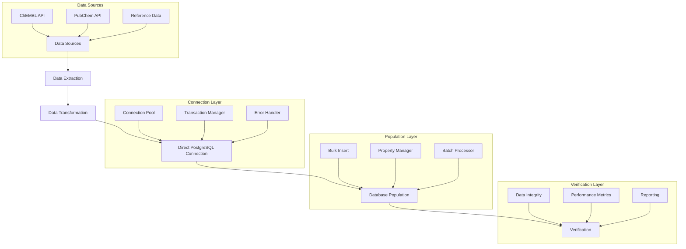

# Direct PostgreSQL Database Population Architecture

## 1. System Overview

The Direct PostgreSQL Database Population system provides a high-performance, reliable mechanism for populating the CryoProtect v2 database with molecular data from various sources. This architecture replaces the previous MCP-based approach with direct PostgreSQL connections to Supabase, offering significant improvements in performance, reliability, and flexibility.



## 2. Architecture Components

### 2.1 Connection Layer

The Connection Layer provides reliable, efficient database connectivity with robust error handling and connection pooling.

#### 2.1.1 PostgresDirectConnection Class

A singleton class that manages direct PostgreSQL connections to Supabase with the following features:

- Thread-safe connection pooling
- Automatic reconnection
- DNS/IP resolution fallback
- Transaction management
- Comprehensive error handling
- Performance monitoring

```python
class PostgresDirectConnection:
    """
    Singleton class for managing direct PostgreSQL connections to Supabase.
    Provides thread-safe connection pooling and SQL execution functions.
    """
    # Implementation as per ROO_DIRECT_DATABASE_POPULATION_DIRECTIVE.md
```

#### 2.1.2 SQL Executor

A utility module that provides optimized SQL execution functions:

- Query execution with parameter binding
- Batch execution
- Bulk insert operations
- Transaction management
- Error handling with retry logic

```python
def execute_query(query, params=None, fetch_one=False):
    """Execute a SQL query with proper error handling and connection management."""
    # Implementation details

def bulk_insert(table, data, columns=None, return_ids=False):
    """Efficiently insert multiple rows into a table."""
    # Implementation details
```

### 2.2 Data Import Components

#### 2.2.1 Reference Compound Importer

Responsible for importing reference cryoprotectant compounds:

- Loads reference data from configuration
- Maps compound properties to database schema
- Uses PropertyManager for normalized property storage
- Verifies import success

#### 2.2.2 ChEMBL Data Importer

Handles importing cryoprotectant compounds from ChEMBL:

- Searches ChEMBL API for relevant compounds
- Processes compound data in batches
- Extracts and normalizes properties
- Handles rate limiting and pagination
- Uses bulk insert for efficient database population

#### 2.2.3 PubChem Property Enhancer

Enhances molecule records with additional properties from PubChem:

- Identifies molecules with missing properties
- Fetches property data from PubChem API
- Updates property records using PropertyManager
- Implements rate limiting and retry logic

#### 2.2.4 Cross-Reference Reconciler

Establishes cross-references between different molecule identifiers:

- Identifies molecules with the same InChI Key
- Updates records to include both ChEMBL and PubChem identifiers
- Maintains data integrity during reconciliation

### 2.3 Batch Processing Utilities

#### 2.3.1 Batch Processor

Handles processing large datasets in manageable batches:

- Divides large operations into smaller batches
- Provides progress tracking
- Implements checkpointing for resumable operations
- Optimizes batch size for performance

```python
def process_in_batches(items, batch_size=1000, process_func=None):
    """Process a large list of items in batches with progress tracking."""
    # Implementation details
```

#### 2.3.2 Retry Handler

Implements retry logic for resilient operations:

- Exponential backoff strategy
- Configurable retry attempts
- Detailed error logging
- Conditional retry based on error type

```python
def with_retry(func, max_retries=3, retry_delay=2):
    """Execute a function with retry logic and exponential backoff."""
    # Implementation details
```

### 2.4 Property Management

#### 2.4.1 PropertyManager

Handles property operations for the normalized database schema:

- Manages property types in the `property_types` table
- Sets property values in the `molecular_properties` table
- Handles different data types (numeric, text, boolean)
- Implements caching for property types
- Provides batch operations for property updates

```python
class PropertyManager:
    """
    Manages molecular properties in the normalized database schema.
    Handles property types and values across multiple tables.
    """
    # Implementation details
```

### 2.5 Verification Components

#### 2.5.1 Data Verifier

Validates the integrity and completeness of imported data:

- Checks molecule counts against success criteria
- Verifies property completeness
- Validates reference compound presence
- Confirms cross-references between identifiers
- Measures query performance

#### 2.5.2 Report Generator

Creates detailed reports on the database population process:

- Generates structured reports in JSON and Markdown formats
- Includes success/failure status for each verification check
- Provides detailed error information
- Includes performance metrics

## 3. Workflow Phases

### 3.1 Initialization Phase

1. Load environment configuration
2. Initialize connection pool
3. Verify database connectivity
4. Set up logging and reporting
5. Initialize PropertyManager

### 3.2 Reference Compound Import Phase

1. Load reference compound data
2. Map properties to database schema
3. Insert basic molecule data
4. Set property values using PropertyManager
5. Verify reference compound import

### 3.3 ChEMBL Data Import Phase

1. Configure search parameters for cryoprotectants
2. Execute ChEMBL API searches
3. Process results in batches
4. Insert molecules and properties
5. Track progress and implement checkpointing
6. Verify ChEMBL data import

### 3.4 Property Enhancement Phase

1. Identify molecules with missing properties
2. Fetch additional properties from PubChem
3. Update property records
4. Handle rate limiting and retries
5. Verify property completeness

### 3.5 Cross-Reference Reconciliation Phase

1. Identify molecules with the same InChI Key
2. Update records with cross-references
3. Verify cross-reference integrity

### 3.6 Performance Optimization Phase

1. Analyze query patterns
2. Create appropriate indexes
3. Optimize database configuration
4. Measure and verify performance improvements

### 3.7 Verification Phase

1. Execute comprehensive verification checks
2. Generate detailed reports
3. Update project state with verification results

## 4. Integration Points

### 4.1 Integration with Existing Components

The direct database population system integrates with several existing components:

- **PropertyManager**: Used for handling properties in the normalized schema
- **Database Adapter Pattern**: Compatible with the existing adapter architecture
- **Verification Scripts**: Enhanced to work with the direct connection approach
- **Project State Management**: Updates project state with operation results

### 4.2 API Integration

The system integrates with external APIs:

- **ChEMBL API**: For retrieving cryoprotectant compound data
- **PubChem API**: For enhancing molecules with additional properties

## 5. Error Handling and Resilience

### 5.1 Connection Error Handling

- DNS resolution with IP fallback
- Automatic reconnection attempts
- Connection pooling with health checks
- Detailed error logging and reporting

### 5.2 API Error Handling

- Rate limiting compliance
- Retry with exponential backoff
- Error categorization and appropriate responses
- Fallback mechanisms for unavailable services

### 5.3 Data Consistency

- Transaction management for atomic operations
- Checkpointing for resumable operations
- Validation before and after database operations
- Rollback mechanisms for failed transactions

## 6. Performance Considerations

### 6.1 Connection Pooling

- Configurable pool size based on workload
- Connection reuse to minimize overhead
- Proper connection cleanup
- Pool statistics for monitoring

### 6.2 Batch Processing

- Optimized batch sizes for different operations
- Parallel processing where appropriate
- Memory usage optimization
- Progress tracking for long-running operations

### 6.3 Query Optimization

- Prepared statements for repeated queries
- Optimized SQL for bulk operations
- Proper indexing strategy
- Minimized network round-trips

## 7. Implementation Tasks

The implementation is divided into the following tasks:

1. **Create PostgreSQL Connection Helper Class**
   - Implement `postgres_direct.py` based on the directive
   - Create SQL execution utility `sql_executor.py`

2. **Update Reference Compounds Import Script**
   - Modify `import_reference_compounds.py` to use direct connection
   - Integrate with PropertyManager for normalized schema

3. **Update ChEMBL Full Import Script**
   - Enhance `import_full_chembl.py` with direct connection
   - Implement batch processing and checkpointing

4. **Update PubChem Property Enhancement**
   - Modify `enhance_pubchem_properties.py` for direct connection
   - Implement rate limiting and retry logic

5. **Optimize Database for Performance**
   - Create `add_performance_indexes.py` script
   - Implement query optimization

6. **Create Execution Script for Full Population**
   - Implement master execution script
   - Add logging, error handling, and reporting

7. **Create Verification Script**
   - Enhance `verify_imported_data.py` for direct connection
   - Implement comprehensive verification checks

## 8. Success Criteria Verification

The implementation will be considered successful when:

- ChEMBL data for at least 5,000 cryoprotectant compounds is imported with complete properties
- All imported compounds have comprehensive property data including logP, H-bond donors/acceptors, etc.
- All reference compounds are present with complete property information
- Cross-references between PubChem CIDs and ChEMBL IDs are established for all possible compounds
- Molecular property visualization works for all imported molecules
- Database queries perform within acceptable parameters (<50ms average response time)
- The entire population process is resilient to network interruptions and API rate limits

## 9. Deployment and Execution

### 9.1 Environment Setup

- Configure environment variables in `.env` file
- Install required dependencies
- Verify database connectivity

### 9.2 Execution Sequence

1. Run reference compound import
2. Execute ChEMBL data import
3. Run cross-reference reconciliation
4. Execute PubChem property enhancement
5. Apply performance optimization
6. Run verification script

### 9.3 Monitoring and Reporting

- Monitor execution through log files
- Track progress via checkpoint files
- Review verification reports
- Update project state with results