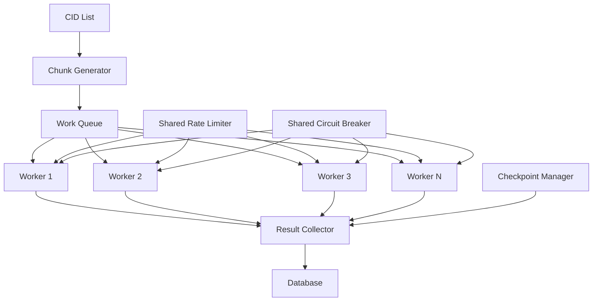

# Infrastructure Optimization Plan

**Spec for:** RESUME-INFRA-1  
**Status:** Draft  
**Author:** Solution Architect  
**Date:** 2025-04-28

---

## 1. Executive Summary

This document outlines a comprehensive infrastructure optimization plan for the CryoProtect v2 data integration processes, focusing on PubChem and ChEMBL data imports. Based on analysis of the current codebase and TASK_CHECKPOINT_STATUS.md, we've identified several opportunities to improve processing efficiency, resilience, and success rates.

The current PubChem import process has achieved only a 2% success rate (4 out of 200 compounds) due to API rate limiting issues. This plan proposes a set of optimizations focused on three key areas:

1. **Parallel Processing Architecture** - Maximize throughput while respecting API limits
2. **Enhanced Adaptive Algorithms** - Improve batch sizing and rate limiting intelligence
3. **Database Operation Optimizations** - Increase efficiency of data storage operations

These optimizations aim to increase the success rate to at least 80% while maintaining data quality and integrity.

---

## 2. Current Infrastructure Analysis

### 2.1. PubChem Import Process

The current PubChem import process uses a chunked processing approach with the following components:

- **ChunkGenerator** - Splits CID list into chunks, adapts size based on performance
- **ChunkProcessor** - Processes each chunk, handles API calls and errors
- **CheckpointManager** - Manages resumability with JSON-based checkpoints
- **ResilientPubChemClient** - Handles API requests with rate limiting and caching
- **AdaptiveRateLimiter** - Provides day-of-week aware rate limiting
- **PubChemCache** - SQLite-based persistent cache for API responses
- **RDKit Fallback** - Property calculation when PubChem API fails

**Key Limitations:**
- Single-threaded processing limits throughput
- Adaptive algorithms react to failures but don't predict them
- Rate limiting doesn't fully utilize API response headers
- Checkpointing at chunk level may be too coarse-grained

### 2.2. ChEMBL Integration Process

The ChEMBL integration process uses direct database connections with the following components:

- **SupabaseDirectConnection** - Direct PostgreSQL connection pool
- **ChEMBL Client** - Handles API requests with Monday-specific rate limiting
- **Progress Tracking** - Checkpoint-based resumability

**Key Limitations:**
- Batch processing may not be optimized for database performance
- Transaction management could be improved
- Progress tracking granularity may be insufficient

---

## 3. Optimization Strategies

### 3.1. Parallel Processing Architecture

#### 3.1.1. Worker Pool Implementation



**Specifications:**

1. **WorkerPool Class**
   - Manages a configurable number of worker threads
   - Implements thread-safe work queue
   - Coordinates shared resources (rate limiter, circuit breaker)
   - Provides status monitoring and worker health checks

2. **Worker Class**
   - Processes chunks from the work queue
   - Reports results to the result collector
   - Implements individual backoff when encountering errors
   - Supports graceful shutdown

3. **ResultCollector Class**
   - Aggregates results from all workers
   - Manages database transactions
   - Updates checkpoint data
   - Provides progress statistics

**Implementation:**

```python
class WorkerPool:
    def __init__(self, num_workers=4, max_queue_size=100):
        self.work_queue = Queue(maxsize=max_queue_size)
        self.result_queue = Queue()
        self.workers = []
        self.shared_rate_limiter = SharedRateLimiter()
        self.shared_circuit_breaker = SharedCircuitBreaker()
        
        # Create worker threads
        for i in range(num_workers):
            worker = Worker(
                id=i,
                work_queue=self.work_queue,
                result_queue=self.result_queue,
                rate_limiter=self.shared_rate_limiter,
                circuit_breaker=self.shared_circuit_breaker
            )
            self.workers.append(worker)
    
    def start(self):
        """Start all worker threads"""
        
    def stop(self):
        """Stop all worker threads gracefully"""
        
    def add_work(self, chunk):
        """Add a chunk to the work queue"""
        
    def get_results(self):
        """Get results from the result queue"""
```

#### 3.1.2. Shared Rate Limiter

**Specifications:**

1. **SharedRateLimiter Class**
   - Thread-safe implementation of token bucket algorithm
   - Distributes rate limit tokens across all workers
   - Adapts to API response headers (Retry-After, X-RateLimit-*)
   - Supports different rate limits for different API endpoints
   - Implements priority-based token allocation

**Implementation:**

```python
class SharedRateLimiter:
    def __init__(self, base_rate=5.0, max_burst=20):
        self.tokens = max_burst
        self.base_rate = base_rate
        self.last_refill_time = time.time()
        self.lock = threading.RLock()
        self.endpoint_stats = defaultdict(dict)
        
    def wait(self, endpoint=None, priority=0):
        """Wait for a token to become available"""
        
    def adjust_rate(self, response_headers, endpoint=None):
        """Adjust rate based on API response headers"""
        
    def get_stats(self):
        """Get rate limiter statistics"""
```

#### 3.1.3. Shared Circuit Breaker

**Specifications:**

1. **SharedCircuitBreaker Class**
   - Thread-safe implementation of circuit breaker pattern
   - Supports per-endpoint circuit breaking
   - Implements half-open state for testing recovery
   - Provides detailed statistics and state information
   - Supports manual reset and configuration

**Implementation:**

```python
class SharedCircuitBreaker:
    def __init__(self, failure_threshold=5, recovery_timeout=30):
        self.failure_threshold = failure_threshold
        self.recovery_timeout = recovery_timeout
        self.circuits = {}
        self.lock = threading.RLock()
        
    def record_success(self, endpoint=None):
        """Record a successful API call"""
        
    def record_failure(self, endpoint=None):
        """Record a failed API call"""
        
    def is_open(self, endpoint=None):
        """Check if the circuit is open"""
        
    def reset(self, endpoint=None):
        """Reset the circuit breaker"""
        
    def get_stats(self, endpoint=None):
        """Get circuit breaker statistics"""
```

### 3.2. Enhanced Adaptive Algorithms

#### 3.2.1. Smart Batch Size Auto-Tuning

**Specifications:**

1. **AdaptiveChunkSizer Class**
   - Uses machine learning to predict optimal chunk size
   - Considers time of day, day of week, and recent API behavior
   - Implements exploration vs. exploitation strategy
   - Adapts to changing API conditions in real-time
   - Provides detailed metrics and explanations for size decisions

**Implementation:**

```python
class AdaptiveChunkSizer:
    def __init__(self, min_size=5, max_size=200, initial_size=50):
        self.min_size = min_size
        self.max_size = max_size
        self.current_size = initial_size
        self.history = []
        self.model = SimpleLinearRegression()  # Or more sophisticated model
        
    def record_result(self, chunk_size, success_rate, response_time, error_type=None):
        """Record the result of processing a chunk"""
        
    def get_next_chunk_size(self, time_of_day=None, day_of_week=None):
        """Get the optimal chunk size for the next chunk"""
        
    def train_model(self):
        """Train the prediction model based on history"""
```

#### 3.2.2. Intelligent Rate Limiting

**Specifications:**

1. **IntelligentRateLimiter Class**
   - Analyzes API response patterns to detect rate limit changes
   - Implements adaptive delay based on response headers
   - Supports different strategies for different times of day
   - Provides detailed metrics on rate limit efficiency
   - Implements proactive rate limiting to prevent 429 responses

**Implementation:**

```python
class IntelligentRateLimiter:
    def __init__(self):
        self.base_delay = 0.5
        self.strategies = {
            "weekday_business_hours": {
                "base_rate": 1.0,
                "backoff_factor": 2.0,
                "max_delay": 10.0
            },
            "weekday_night": {
                "base_rate": 3.0,
                "backoff_factor": 1.5,
                "max_delay": 5.0
            },
            "weekend": {
                "base_rate": 5.0,
                "backoff_factor": 1.2,
                "max_delay": 3.0
            }
        }
        self.current_strategy = self._determine_strategy()
        
    def wait(self):
        """Wait for the appropriate amount of time"""
        
    def adjust_for_response(self, status_code, headers):
        """Adjust rate limiting based on API response"""
        
    def _determine_strategy(self):
        """Determine the appropriate strategy based on time"""
```

#### 3.2.3. Predictive Error Handling

**Specifications:**

1. **PredictiveErrorHandler Class**
   - Categorizes errors based on patterns and frequency
   - Implements specific handling strategies for different error types
   - Predicts likely errors based on compound properties
   - Adjusts retry strategy based on error type
   - Provides detailed error analytics

**Implementation:**

```python
class PredictiveErrorHandler:
    def __init__(self):
        self.error_patterns = {}
        self.error_counts = defaultdict(int)
        self.error_strategies = {
            "rate_limit": lambda: self._handle_rate_limit(),
            "server_error": lambda: self._handle_server_error(),
            "data_error": lambda: self._handle_data_error(),
            "network_error": lambda: self._handle_network_error()
        }
        
    def categorize_error(self, error, context=None):
        """Categorize an error based on its type and message"""
        
    def handle_error(self, error, context=None):
        """Handle an error using the appropriate strategy"""
        
    def predict_errors(self, compound_data):
        """Predict likely errors based on compound properties"""
```

### 3.3. Database Operation Optimizations

#### 3.3.1. Optimized Batch Database Operations

**Specifications:**

1. **BatchDatabaseOperator Class**
   - Implements efficient bulk insert/update operations
   - Uses prepared statements for performance
   - Optimizes transaction size based on database performance
   - Provides detailed performance metrics
   - Implements retry logic for database operations

**Implementation:**

```python
class BatchDatabaseOperator:
    def __init__(self, connection_pool, optimal_batch_size=100):
        self.connection_pool = connection_pool
        self.optimal_batch_size = optimal_batch_size
        self.performance_metrics = []
        
    def bulk_insert(self, table, columns, values):
        """Perform a bulk insert operation"""
        
    def bulk_update(self, table, columns, values, condition_column):
        """Perform a bulk update operation"""
        
    def optimize_batch_size(self):
        """Optimize batch size based on performance metrics"""
```

#### 3.3.2. Intelligent Connection Pool

**Specifications:**

1. **IntelligentConnectionPool Class**
   - Dynamically adjusts pool size based on workload
   - Implements connection health checks
   - Provides detailed connection usage metrics
   - Supports priority-based connection allocation
   - Implements automatic recovery from connection failures

**Implementation:**

```python
class IntelligentConnectionPool:
    def __init__(self, min_connections=2, max_connections=10):
        self.min_connections = min_connections
        self.max_connections = max_connections
        self.current_connections = min_connections
        self.pool = []
        self.usage_metrics = []
        
    def get_connection(self, priority=0):
        """Get a connection from the pool"""
        
    def release_connection(self, connection):
        """Release a connection back to the pool"""
        
    def adjust_pool_size(self):
        """Adjust pool size based on usage metrics"""
```

---

## 4. Implementation Plan

### 4.1. Phase 1: Core Infrastructure Enhancements

**Tasks:**

1. **INFRA-OPT-1: Implement WorkerPool and Worker Classes**
   - Create base classes for parallel processing
   - Implement work queue and result collector
   - Add configuration options for worker count
   - Create unit tests for worker coordination

2. **INFRA-OPT-2: Implement Shared Rate Limiter**
   - Create thread-safe rate limiter
   - Implement token bucket algorithm with shared state
   - Add support for API response header analysis
   - Create unit tests for rate limiting scenarios

3. **INFRA-OPT-3: Implement Shared Circuit Breaker**
   - Create thread-safe circuit breaker
   - Implement per-endpoint circuit breaking
   - Add support for half-open state testing
   - Create unit tests for circuit breaker scenarios

### 4.2. Phase 2: Adaptive Algorithm Improvements

**Tasks:**

1. **INFRA-OPT-4: Implement AdaptiveChunkSizer**
   - Create prediction model for chunk sizing
   - Implement history tracking and analysis
   - Add time-based adaptation strategies
   - Create unit tests for sizing scenarios

2. **INFRA-OPT-5: Implement IntelligentRateLimiter**
   - Create advanced rate limiting strategies
   - Implement response header analysis
   - Add time-based strategy selection
   - Create unit tests for rate limiting scenarios

3. **INFRA-OPT-6: Implement PredictiveErrorHandler**
   - Create error categorization system
   - Implement specific handling strategies
   - Add error prediction capabilities
   - Create unit tests for error handling scenarios

### 4.3. Phase 3: Database Optimizations

**Tasks:**

1. **INFRA-OPT-7: Implement BatchDatabaseOperator**
   - Create efficient bulk operation methods
   - Implement transaction optimization
   - Add performance metrics collection
   - Create unit tests for database operations

2. **INFRA-OPT-8: Implement IntelligentConnectionPool**
   - Create dynamic connection pool
   - Implement health checks and metrics
   - Add priority-based allocation
   - Create unit tests for connection scenarios

### 4.4. Phase 4: Integration and Testing

**Tasks:**

1. **INFRA-OPT-9: Integrate Parallel Processing with PubChem Import**
   - Modify import_pubchem_data_chunked.py to use worker pool
   - Update checkpoint management for parallel processing
   - Add configuration options for parallelism
   - Create integration tests for parallel import

2. **INFRA-OPT-10: Integrate Database Optimizations with ChEMBL Import**
   - Modify ChEMBL_Integrated_Import.py to use optimized database operations
   - Update transaction management
   - Add performance monitoring
   - Create integration tests for ChEMBL import

3. **INFRA-OPT-11: Create Comprehensive Test Suite**
   - Implement simulation tests for API rate limiting
   - Create performance benchmarks
   - Add stress tests for parallel processing
   - Implement end-to-end tests for full import process

---

## 5. Performance Metrics and Success Criteria

### 5.1. Key Performance Indicators

1. **Success Rate**
   - **Current:** 2% (4 out of 200 compounds)
   - **Target:** ≥80% success rate for PubChem imports

2. **Throughput**
   - **Current:** ~2 compounds per minute
   - **Target:** ≥20 compounds per minute (10x improvement)

3. **Resource Utilization**
   - **Current:** Single-threaded, low CPU utilization
   - **Target:** Efficient multi-threaded processing with ≥70% CPU utilization

4. **Resilience**
   - **Current:** Frequent failures requiring manual intervention
   - **Target:** Automatic recovery from >95% of error conditions

### 5.2. Success Criteria

1. **PubChem Import**
   - Successfully process ≥5,000 compounds with ≥80% success rate
   - Complete import within 6 hours (vs. current projected time of 3+ days)
   - Maintain data quality with ≥99% accuracy compared to direct API results

2. **ChEMBL Import**
   - Reduce database operation time by ≥50%
   - Achieve ≥95% success rate for ChEMBL imports
   - Maintain transaction integrity with zero data corruption

3. **System Stability**
   - Zero unrecoverable failures during import processes
   - Automatic resumption after interruptions with ≤1% data loss
   - Detailed logging and monitoring for all operations

---

## 6. Risks and Mitigations

### 6.1. Identified Risks

1. **API Rate Limit Changes**
   - **Risk:** PubChem or ChEMBL could change their rate limiting policies
   - **Impact:** High - Could render optimizations ineffective
   - **Mitigation:** Implement adaptive rate limiting that learns from API responses

2. **Concurrency Issues**
   - **Risk:** Parallel processing could introduce race conditions or deadlocks
   - **Impact:** Medium - Could cause data corruption or process hangs
   - **Mitigation:** Comprehensive testing, thread-safe implementations, and deadlock detection

3. **Database Performance**
   - **Risk:** Optimized batch operations could overload the database
   - **Impact:** Medium - Could cause database slowdowns or timeouts
   - **Mitigation:** Dynamic batch sizing based on database performance metrics

### 6.2. Contingency Plans

1. **Fallback to Sequential Processing**
   - Implement configuration option to disable parallel processing
   - Ensure backward compatibility with current implementation

2. **Circuit Breaker for Database Operations**
   - Apply circuit breaker pattern to database operations
   - Implement automatic throttling based on database response times

3. **Enhanced Monitoring and Alerting**
   - Implement real-time monitoring of import processes
   - Create alerting system for critical failures
   - Provide detailed diagnostics for troubleshooting

---

## 7. References

1. [TASK_CHECKPOINT_STATUS.md](../TASK_CHECKPOINT_STATUS.md)
2. [OPTIMIZED_AGENT_TASK_STRUCTURE.md](../OPTIMIZED_AGENT_TASK_STRUCTURE.md)
3. [.specs/pubchem_chunked_import_algorithm.md](../specs/pubchem_chunked_import_algorithm.md)
4. [.specs/pubchem_cache_system.md](../specs/pubchem_cache_system.md)
5. [import_pubchem_data_chunked.py](../import_pubchem_data_chunked.py)
6. [pubchem/client.py](../pubchem/client.py)
7. [pubchem/rate_limiter.py](../pubchem/rate_limiter.py)
8. [.specs/infrastructure_optimization_plan-reasoning.md](../specs/infrastructure_optimization_plan-reasoning.md)