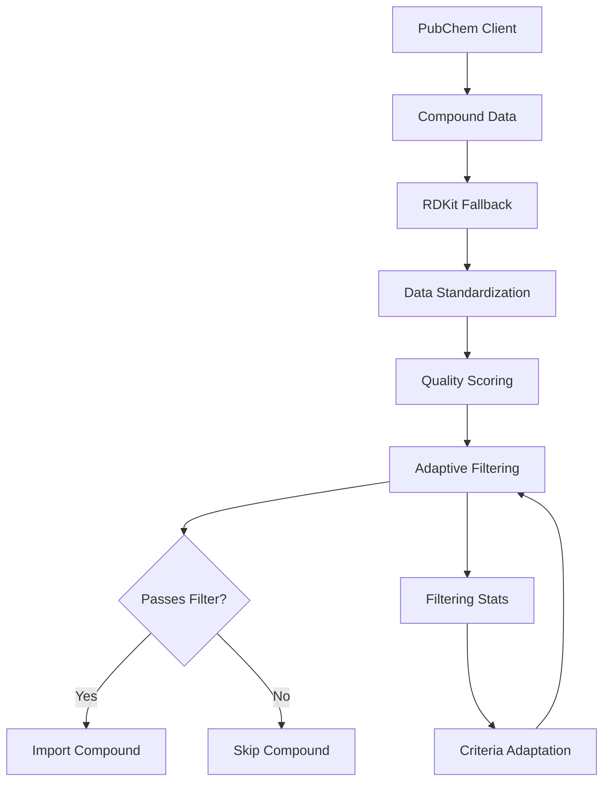

# PubChem Adaptive Filtering and Quality Scoring System Specification

**Spec for:** Task 4, ROO_PUBCHEM_IMPORT_OPTIMIZATION  
**Target Implementation:** 
- `pubchem/filtering.py:1-120`
- `pubchem/quality_scoring.py:1-100`  
**Author:** Solution Architect  
**Date:** 2025-04-28

---

## 1. Overview

This specification defines an adaptive filtering and quality scoring system for PubChem compound import. The system includes progressive criteria relaxation and compound quality scoring to optimize the balance between data quantity and quality. It integrates with the existing PubChem client, cache system, chunked processing, and RDKit fallback components.

The system is designed to:
- Filter compounds based on configurable, multi-tiered criteria
- Progressively relax filtering criteria to achieve target import quantities
- Score compounds based on data completeness, property values, and relevance
- Prioritize high-quality compounds for import and analysis
- Adapt to different research focuses through configurable scoring weights

---

## 2. Architecture

### 2.1. Component Diagram



### 2.2. Main Components

1. **Filtering Criteria Definition** (`pubchem/filtering.py`):
   - Defines multi-tiered filtering criteria for compounds
   - Includes property thresholds for each tier
   - Supports customization through configuration

2. **Adaptive Filtering Engine** (`pubchem/filtering.py`):
   - Applies filtering criteria to compounds
   - Tracks filtering statistics
   - Progressively relaxes criteria based on success rates
   - Integrates with chunked processing

3. **Quality Scoring System** (`pubchem/quality_scoring.py`):
   - Scores compounds based on multiple factors
   - Provides weighted scoring algorithm
   - Supports customization of weights
   - Integrates with filtering for prioritization

4. **Integration Layer** (`pubchem/filtering.py`):
   - Connects with existing PubChem client
   - Integrates with cache system
   - Works with chunked processing
   - Leverages RDKit fallback for missing properties

---

## 3. Detailed Design

### 3.1. Filtering Criteria Definition

#### 3.1.1. Filtering Tiers

The system defines four tiers of filtering criteria, from strictest to most relaxed:

| Tier | Name | Description | Target Success Rate |
|------|------|-------------|---------------------|
| 1 | Strict | Highest quality compounds only | 10-25% |
| 2 | Moderate | Good quality compounds | 25-50% |
| 3 | Relaxed | Acceptable quality compounds | 50-75% |
| 4 | Minimal | Basic validation only | 75-100% |

#### 3.1.2. Property Thresholds

Each tier defines thresholds for molecular properties relevant to cryoprotection:

| Property | Strict | Moderate | Relaxed | Minimal |
|----------|--------|----------|---------|---------|
| Molecular Weight | 100-500 | 75-750 | 50-1000 | >0 |
| LogP | -3 to 3 | -5 to 5 | -7 to 7 | Any |
| TPSA | 40-140 | 20-200 | 10-300 | Any |
| H-Bond Donors | 1-5 | 0-8 | 0-12 | Any |
| H-Bond Acceptors | 2-10 | 1-15 | 0-20 | Any |
| Rotatable Bonds | 0-10 | 0-15 | 0-20 | Any |
| Required Properties | All | 90% | 75% | 50% |

#### 3.1.3. Configuration

Filtering criteria are configurable through a configuration object:

```python
DEFAULT_FILTERING_CONFIG = {
    "tiers": {
        "strict": {
            "molecular_weight": (100, 500),
            "logp": (-3, 3),
            "tpsa": (40, 140),
            "h_bond_donors": (1, 5),
            "h_bond_acceptors": (2, 10),
            "rotatable_bonds": (0, 10),
            "required_properties_percent": 100
        },
        "moderate": {
            "molecular_weight": (75, 750),
            "logp": (-5, 5),
            "tpsa": (20, 200),
            "h_bond_donors": (0, 8),
            "h_bond_acceptors": (1, 15),
            "rotatable_bonds": (0, 15),
            "required_properties_percent": 90
        },
        "relaxed": {
            "molecular_weight": (50, 1000),
            "logp": (-7, 7),
            "tpsa": (10, 300),
            "h_bond_donors": (0, 12),
            "h_bond_acceptors": (0, 20),
            "rotatable_bonds": (0, 20),
            "required_properties_percent": 75
        },
        "minimal": {
            "molecular_weight": (0, float('inf')),
            "logp": (float('-inf'), float('inf')),
            "tpsa": (0, float('inf')),
            "h_bond_donors": (0, float('inf')),
            "h_bond_acceptors": (0, float('inf')),
            "rotatable_bonds": (0, float('inf')),
            "required_properties_percent": 50
        }
    },
    "target_success_rates": {
        "strict": (10, 25),
        "moderate": (25, 50),
        "relaxed": (50, 75),
        "minimal": (75, 100)
    },
    "adaptation": {
        "min_compounds_for_adaptation": 100,
        "check_interval": 100,
        "success_rate_window": 500
    }
}
```

### 3.2. Quality Scoring System

#### 3.2.1. Scoring Factors

The quality score (0-100) is calculated based on multiple factors:

1. **Data Completeness** (0-25 points):
   - Percentage of available properties
   - Higher weight for critical properties

2. **Property Values** (0-50 points):
   - Proximity to ideal ranges for cryoprotection
   - Weighted by property importance

3. **Data Source Quality** (0-15 points):
   - PubChem data preferred over RDKit calculated
   - Higher score for experimentally verified properties

4. **Relevance to Cryoprotection** (0-10 points):
   - Presence of functional groups common in cryoprotectants
   - Similarity to known cryoprotectants

#### 3.2.2. Scoring Weights

Scoring weights are configurable through a configuration object:

```python
DEFAULT_SCORING_CONFIG = {
    "completeness": {
        "weight": 25,
        "critical_properties": {
            "Molecular Formula": 3,
            "Molecular Weight": 3,
            "LogP": 4,
            "TPSA": 4,
            "H-Bond Donors": 5,
            "H-Bond Acceptors": 5,
            "SMILES": 3,
            "InChI": 2
        }
    },
    "property_values": {
        "weight": 50,
        "ideal_ranges": {
            "Molecular Weight": {
                "ideal": (150, 400),
                "acceptable": (100, 500),
                "weight": 10
            },
            "LogP": {
                "ideal": (-2, 2),
                "acceptable": (-3, 3),
                "weight": 15
            },
            "TPSA": {
                "ideal": (60, 120),
                "acceptable": (40, 140),
                "weight": 10
            },
            "H-Bond Donors": {
                "ideal": (2, 4),
                "acceptable": (1, 5),
                "weight": 8
            },
            "H-Bond Acceptors": {
                "ideal": (4, 8),
                "acceptable": (2, 10),
                "weight": 7
            }
        }
    },
    "source_quality": {
        "weight": 15,
        "sources": {
            "pubchem": 15,
            "rdkit": 10,
            "merged": 12
        }
    },
    "relevance": {
        "weight": 10,
        "functional_groups": {
            "hydroxyl": 3,
            "ether": 2,
            "amine": 2,
            "amide": 2,
            "carbonyl": 1
        }
    }
}
```

### 3.3. Adaptive Filtering Engine

#### 3.3.1. Adaptation Mechanism

The filtering engine adapts criteria based on the success rate:

1. Start with the strictest tier (Strict)
2. Monitor success rate (compounds passing filter / total compounds)
3. If success rate is below target minimum for current tier:
   - Relax to next tier after processing min_compounds_for_adaptation
   - Log adaptation event with statistics
4. If success rate is above target maximum for current tier:
   - Consider tightening criteria (optional, configurable)

#### 3.3.2. Circuit Breaker

To prevent excessive relaxation:

1. Never relax beyond the Minimal tier
2. Require minimum number of compounds before adaptation
3. Log warning when reaching Minimal tier
4. Provide option to set absolute minimum quality score

### 3.4. Integration with Existing Components

#### 3.4.1. Chunked Processing Integration

The filtering system integrates with chunked processing:

1. Filter compounds within each chunk
2. Track filtering statistics across chunks
3. Adapt filtering criteria between chunks
4. Update checkpoint with filtering statistics

#### 3.4.2. Cache Integration

Filtering results and quality scores are cached:

1. Store filtering decision and quality score in compound cache
2. Retrieve cached results when available
3. Update cache when filtering criteria change

#### 3.4.3. RDKit Fallback Integration

The filtering system leverages RDKit fallback:

1. Attempt to filter using PubChem data
2. If critical properties are missing, use RDKit calculated properties
3. Consider data source in quality scoring

---

## 4. API Contracts

### 4.1. Filtering Module

```python
def filter_compound(
    compound_data: Dict[str, Any],
    filtering_config: Dict[str, Any] = None,
    current_tier: str = "strict",
    calculate_quality_score: bool = True
) -> Tuple[bool, float, Dict[str, Any]]:
    """
    Filter a compound based on the current filtering tier.
    
    Args:
        compound_data: Compound data dictionary
        filtering_config: Configuration for filtering criteria
        current_tier: Current filtering tier ('strict', 'moderate', 'relaxed', 'minimal')
        calculate_quality_score: Whether to calculate quality score
        
    Returns:
        Tuple containing:
        - passes_filter: Whether the compound passes the filter
        - quality_score: Quality score (0-100) if calculate_quality_score is True, else 0
        - filter_details: Dictionary with details about the filtering decision
    """

def get_optimal_filtering_tier(
    filtering_stats: Dict[str, Any],
    filtering_config: Dict[str, Any] = None
) -> str:
    """
    Determine the optimal filtering tier based on filtering statistics.
    
    Args:
        filtering_stats: Dictionary with filtering statistics
        filtering_config: Configuration for filtering criteria
        
    Returns:
        Optimal filtering tier ('strict', 'moderate', 'relaxed', 'minimal')
    """

class AdaptiveFilteringEngine:
    """
    Engine for adaptive filtering of compounds.
    """
    
    def __init__(
        self,
        filtering_config: Dict[str, Any] = None,
        initial_tier: str = "strict"
    ):
        """
        Initialize the adaptive filtering engine.
        
        Args:
            filtering_config: Configuration for filtering criteria
            initial_tier: Initial filtering tier
        """
    
    def filter_compound(
        self,
        compound_data: Dict[str, Any],
        calculate_quality_score: bool = True
    ) -> Tuple[bool, float, Dict[str, Any]]:
        """
        Filter a compound using the current filtering tier.
        
        Args:
            compound_data: Compound data dictionary
            calculate_quality_score: Whether to calculate quality score
            
        Returns:
            Tuple containing:
            - passes_filter: Whether the compound passes the filter
            - quality_score: Quality score (0-100) if calculate_quality_score is True, else 0
            - filter_details: Dictionary with details about the filtering decision
        """
    
    def update_stats(
        self,
        passes_filter: bool,
        quality_score: float
    ) -> None:
        """
        Update filtering statistics and adapt tier if necessary.
        
        Args:
            passes_filter: Whether the compound passed the filter
            quality_score: Quality score of the compound
        """
    
    def get_stats(self) -> Dict[str, Any]:
        """
        Get current filtering statistics.
        
        Returns:
            Dictionary with filtering statistics
        """
```

### 4.2. Quality Scoring Module

```python
def calculate_quality_score(
    compound_data: Dict[str, Any],
    scoring_config: Dict[str, Any] = None
) -> Tuple[float, Dict[str, Any]]:
    """
    Calculate quality score for a compound.
    
    Args:
        compound_data: Compound data dictionary
        scoring_config: Configuration for scoring weights
        
    Returns:
        Tuple containing:
        - quality_score: Quality score (0-100)
        - score_details: Dictionary with details about the score calculation
    """

def calculate_completeness_score(
    compound_data: Dict[str, Any],
    completeness_config: Dict[str, Any]
) -> Tuple[float, Dict[str, Any]]:
    """
    Calculate completeness score for a compound.
    
    Args:
        compound_data: Compound data dictionary
        completeness_config: Configuration for completeness scoring
        
    Returns:
        Tuple containing:
        - completeness_score: Completeness score (0-25)
        - score_details: Dictionary with details about the score calculation
    """

def calculate_property_values_score(
    compound_data: Dict[str, Any],
    property_values_config: Dict[str, Any]
) -> Tuple[float, Dict[str, Any]]:
    """
    Calculate property values score for a compound.
    
    Args:
        compound_data: Compound data dictionary
        property_values_config: Configuration for property values scoring
        
    Returns:
        Tuple containing:
        - property_values_score: Property values score (0-50)
        - score_details: Dictionary with details about the score calculation
    """

def calculate_source_quality_score(
    compound_data: Dict[str, Any],
    source_quality_config: Dict[str, Any]
) -> Tuple[float, Dict[str, Any]]:
    """
    Calculate source quality score for a compound.
    
    Args:
        compound_data: Compound data dictionary
        source_quality_config: Configuration for source quality scoring
        
    Returns:
        Tuple containing:
        - source_quality_score: Source quality score (0-15)
        - score_details: Dictionary with details about the score calculation
    """

def calculate_relevance_score(
    compound_data: Dict[str, Any],
    relevance_config: Dict[str, Any]
) -> Tuple[float, Dict[str, Any]]:
    """
    Calculate relevance score for a compound.
    
    Args:
        compound_data: Compound data dictionary
        relevance_config: Configuration for relevance scoring
        
    Returns:
        Tuple containing:
        - relevance_score: Relevance score (0-10)
        - score_details: Dictionary with details about the score calculation
    """
```

---

## 5. Error Handling

### 5.1. Missing Properties

- Log warning for missing critical properties
- Use RDKit fallback when possible
- Apply penalty to quality score for missing properties
- Filter based on available properties only

### 5.2. Invalid Property Values

- Log warning for invalid property values
- Apply penalty to quality score for invalid values
- Use default or fallback values when possible

### 5.3. Configuration Errors

- Validate configuration on initialization
- Log error and use default configuration if invalid
- Provide clear error messages for configuration issues

---

## 6. Performance Considerations

### 6.1. Efficient Filtering

- Filter compounds as early as possible in the pipeline
- Use short-circuit evaluation for filtering criteria
- Cache filtering results to avoid redundant calculations

### 6.2. Optimized Scoring

- Calculate quality score only when needed
- Use efficient algorithms for functional group detection
- Cache intermediate scoring results

### 6.3. Batch Processing

- Process compounds in batches for better performance
- Update adaptation statistics in batches
- Optimize memory usage for large datasets

---

## 7. Implementation Plan

### 7.1. Phase 1: Core Components

1. Implement filtering criteria definition and configuration
2. Implement basic filtering function
3. Implement quality scoring algorithm
4. Write unit tests for core components

### 7.2. Phase 2: Adaptation

1. Implement adaptive filtering engine
2. Implement statistics tracking
3. Implement tier adaptation logic
4. Write unit tests for adaptation

### 7.3. Phase 3: Integration

1. Integrate with chunked processing
2. Integrate with cache system
3. Integrate with RDKit fallback
4. Write integration tests

---

## 8. Acceptance Criteria

1. Successfully filters compounds based on configurable criteria
2. Progressively relaxes criteria to achieve target success rates
3. Calculates meaningful quality scores that correlate with compound suitability
4. Adapts filtering tier based on success rate statistics
5. Integrates seamlessly with existing PubChem import components
6. Maintains performance within acceptable limits
7. Comprehensive test coverage for all components

---

## 9. References

- [pubchem_cache_system.md](pubchem_cache_system.md)
- [pubchem_chunked_import_algorithm.md](pubchem_chunked_import_algorithm.md)
- [pubchem_rdkit_fallback_system.md](pubchem_rdkit_fallback_system.md)
- [task-pubchem-4-adaptive-filtering-reasoning.md](task-pubchem-4-adaptive-filtering-reasoning.md)