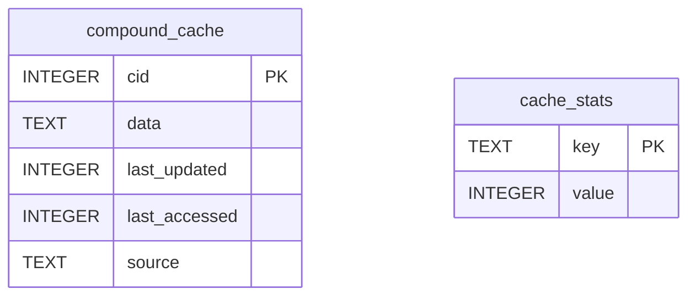

# PubChem API Persistent Cache System Specification

**Spec for:** Task 1, ROO_PUBCHEM_IMPORT_OPTIMIZATION  
**Target Implementation:** `pubchem/cache.py:10-120`  
**Author:** Solution Architect  
**Date:** 2025-04-27

---

## 1. Overview

This specification defines a robust, persistent, and high-performance SQLite-based cache system for PubChem API responses. The cache is designed to:
- Persist between application runs
- Efficiently store and retrieve compound data and molecular properties
- Track cache statistics (hits, misses, age)
- Support pre-warming and future extensibility

## 2. Requirements

- **Persistence:** Cache must survive process restarts and be stored on disk.
- **Capacity:** Efficiently handle at least 10,000 compounds with no significant performance degradation.
- **API:** Provide Python functions for initialization, retrieval (with timestamp/expiry logic), storage, and statistics.
- **Statistics:** Track and expose cache hit/miss rates and last access times.
- **Pre-warming:** Design must allow for a background pre-warming process (see utils.py, out of scope for this file).
- **Thread/process safety:** Must be safe for concurrent access from multiple threads/processes.

## 3. Database Schema

**Database file:** `pubchem_cache.sqlite` (location: configurable, default: same directory as `cache.py`)

### Table: `compound_cache`
| Column         | Type      | Description                                 |
|----------------|-----------|---------------------------------------------|
| cid            | INTEGER   | PubChem Compound ID (Primary Key)           |
| data           | BLOB/TEXT | Serialized JSON of compound data/properties |
| last_updated   | INTEGER   | Unix timestamp of last update               |
| last_accessed  | INTEGER   | Unix timestamp of last retrieval            |
| source         | TEXT      | Source of data (e.g., 'pubchem', 'rdkit')   |

**Indexes:**
- Primary key on `cid`
- Index on `last_accessed` for LRU/aging queries

### Table: `cache_stats`
| Column         | Type      | Description                                 |
|----------------|-----------|---------------------------------------------|
| key            | TEXT      | Stat name (e.g., 'hits', 'misses')          |
| value          | INTEGER   | Stat value                                  |

## 4. Python API

### 4.1. Initialization

```python
def initialize_cache(db_path: Optional[str] = None) -> None
```
- Creates the SQLite database and tables if they do not exist.
- `db_path` is optional; defaults to `pubchem_cache.sqlite`.

### 4.2. Retrieval

```python
def get_compound(cid: int, max_age_seconds: Optional[int] = None) -> Optional[dict]
```
- Returns cached data for `cid` if present and not expired (if `max_age_seconds` is set).
- Updates `last_accessed` timestamp.
- Increments hit/miss statistics.

### 4.3. Storage

```python
def store_compound(cid: int, data: dict, source: str = "pubchem") -> None
```
- Stores or updates compound data for `cid`.
- Updates `last_updated` and `last_accessed` timestamps.
- Overwrites existing entry if present.

### 4.4. Statistics

```python
def get_cache_stats() -> dict
```
- Returns a dictionary with cache statistics: hits, misses, total entries, hit rate, etc.

### 4.5. Maintenance (Optional)

```python
def prune_cache(max_entries: int) -> int
```
- Removes least-recently-used entries if cache exceeds `max_entries`.
- Returns number of entries removed.

## 5. Concurrency & Performance

- Use SQLite's WAL (Write-Ahead Logging) mode for concurrent reads/writes.
- Use connection pooling or per-thread connections if accessed from multiple threads.
- All DB operations must use parameterized queries to prevent SQL injection.

## 6. Extensibility

- Schema and API should allow for future fields (e.g., error codes, fetch duration).
- Pre-warming and background update logic will be implemented in `pubchem/utils.py` but must be compatible with this cache.

## 7. Acceptance Criteria

- Cache persists between runs and is not lost on process exit.
- Handles ≥10,000 compounds with <1s retrieval time for any entry.
- Cache hit rate >90% for repeated requests in typical workflows.
- Statistics are accurate and accessible.
- Pre-warming process can run independently (API supports concurrent access).

---

## 8. Mermaid Diagram



---

## 9. Implementation Notes

- All data for compounds should be stored as JSON (serialized to TEXT or BLOB).
- Timestamps are stored as Unix epoch seconds.
- Consider using `sqlite3` module with `detect_types=sqlite3.PARSE_DECLTYPES` for type safety.
- For statistics, increment counters atomically within transactions.

---

## 10. References

- [Task 1, ROO_PUBCHEM_IMPORT_OPTIMIZATION.md] (see project_state.json log for summary)
- [Python sqlite3 documentation](https://docs.python.org/3/library/sqlite3.html)