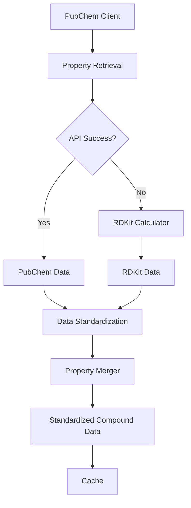

# PubChem RDKit Fallback System Specification

**Spec for:** Task 3, ROO_PUBCHEM_IMPORT_OPTIMIZATION  
**Target Implementation:** 
- `pubchem/rdkit_fallback.py:1-150`
- `pubchem/data_standardization.py:1-100`  
**Author:** Solution Architect  
**Date:** 2025-04-28

---

## 1. Overview

This specification defines a robust fallback system that uses RDKit to calculate molecular properties when PubChem API fails or returns incomplete data. The system includes property calculation, data standardization, and intelligent merging of data from multiple sources.

The fallback system is designed to:
- Provide reliable property data even when PubChem API is unavailable
- Ensure consistency between PubChem and RDKit-calculated properties
- Optimize performance through selective calculation and caching
- Integrate seamlessly with the existing PubChem client and cache system

---

## 2. Architecture

### 2.1. Component Diagram



### 2.2. Main Components

1. **RDKit Property Calculator** (`pubchem/rdkit_fallback.py`):
   - Calculates molecular properties using RDKit based on SMILES or other identifiers
   - Matches PubChem property set for consistency
   - Handles errors and edge cases gracefully

2. **Data Standardization Module** (`pubchem/data_standardization.py`):
   - Normalizes property data from different sources
   - Ensures consistent units, formats, and naming conventions
   - Validates property values against expected ranges

3. **Property Merger** (`pubchem/rdkit_fallback.py`):
   - Combines property data from multiple sources
   - Applies configurable prioritization rules
   - Handles conflicts and missing values

4. **Integration Layer** (`pubchem/rdkit_fallback.py`):
   - Connects with existing PubChem client
   - Integrates with cache system
   - Provides a unified API for property retrieval

---

## 3. Detailed Design

### 3.1. RDKit Property Calculator

#### 3.1.1. Property Mapping

The following properties will be calculated by RDKit to match PubChem properties:

| PubChem Property | RDKit Calculation Method | Notes |
|------------------|--------------------------|-------|
| Molecular Formula | `Chem.rdMolDescriptors.CalcMolFormula(mol)` | Direct match |
| Molecular Weight | `Descriptors.MolWt(mol)` | May differ slightly from PubChem |
| LogP | `Descriptors.MolLogP(mol)` | Uses Crippen method vs. XLogP in PubChem |
| TPSA | `Descriptors.TPSA(mol)` | Direct match |
| H-Bond Donors | `Lipinski.NumHDonors(mol)` | Direct match |
| H-Bond Acceptors | `Lipinski.NumHAcceptors(mol)` | Direct match |
| SMILES | `Chem.MolToSmiles(mol, isomericSmiles=True)` | May have format differences |
| InChI | `Chem.MolToInchi(mol)` | Direct match |
| InChIKey | `Chem.MolToInchiKey(mol)` | Direct match |
| IUPACName | Not available in RDKit | Will be left empty |
| Title | Not available in RDKit | Will be left empty |

#### 3.1.2. Additional RDKit Properties

The following additional properties will be calculated by RDKit to enhance the dataset:

| Property | RDKit Calculation Method | Description |
|----------|--------------------------|-------------|
| Rotatable Bonds | `Descriptors.NumRotatableBonds(mol)` | Count of rotatable bonds |
| Ring Count | `Descriptors.RingCount(mol)` | Number of rings |
| Aromatic Ring Count | `Lipinski.NumAromaticRings(mol)` | Number of aromatic rings |
| Fraction CSP3 | `Descriptors.FractionCSP3(mol)` | Fraction of sp3 hybridized carbons |
| Heavy Atom Count | `Descriptors.HeavyAtomCount(mol)` | Number of non-hydrogen atoms |

#### 3.1.3. API

```python
def calculate_rdkit_properties(
    molecule_data: str,
    input_format: str = 'smiles',
    include_additional_properties: bool = False
) -> Dict[str, Any]:
    """
    Calculate molecular properties using RDKit.
    
    Args:
        molecule_data: Molecular data (SMILES, InChI, etc.)
        input_format: Format of molecule_data ('smiles', 'inchi', 'inchikey')
        include_additional_properties: Whether to include additional RDKit properties
        
    Returns:
        Dictionary of calculated properties
    """
```

### 3.2. Data Standardization Module

#### 3.2.1. Standardization Rules

| Property | Standardization Rule |
|----------|---------------------|
| Molecular Formula | Ensure consistent formatting of element symbols and subscripts |
| Molecular Weight | Round to 2 decimal places |
| LogP | Round to 2 decimal places, handle None values |
| TPSA | Round to 2 decimal places |
| H-Bond Donors/Acceptors | Ensure integer values |
| SMILES | Canonicalize if possible |
| InChI/InChIKey | Validate format |
| All Properties | Convert None to appropriate empty value (0, "", etc.) |

#### 3.2.2. API

```python
def standardize_compound_data(
    compound_data: Dict[str, Any],
    source: str = 'pubchem'
) -> Dict[str, Any]:
    """
    Standardize compound data to ensure consistent format and values.
    
    Args:
        compound_data: Raw compound data
        source: Source of the data ('pubchem', 'rdkit', etc.)
        
    Returns:
        Standardized compound data
    """
```

### 3.3. Property Merger

#### 3.3.1. Prioritization Rules

Default prioritization order for each property:

1. PubChem API data (if available and valid)
2. RDKit calculated data (if available and valid)
3. Default/empty value

Configurable through a priority configuration dictionary:

```python
DEFAULT_PRIORITY = {
    "Molecular Formula": ["pubchem", "rdkit"],
    "Molecular Weight": ["pubchem", "rdkit"],
    "LogP": ["pubchem", "rdkit"],
    "TPSA": ["pubchem", "rdkit"],
    "H-Bond Donors": ["pubchem", "rdkit"],
    "H-Bond Acceptors": ["pubchem", "rdkit"],
    "SMILES": ["pubchem", "rdkit"],
    "InChI": ["pubchem", "rdkit"],
    "InChIKey": ["pubchem", "rdkit"],
    "IUPACName": ["pubchem"],
    "Title": ["pubchem"],
    # Additional properties
    "Rotatable Bonds": ["rdkit"],
    "Ring Count": ["rdkit"],
    "Aromatic Ring Count": ["rdkit"],
    "Fraction CSP3": ["rdkit"],
    "Heavy Atom Count": ["rdkit"]
}
```

#### 3.3.2. API

```python
def merge_compound_data(
    data_sources: Dict[str, Dict[str, Any]],
    priority_config: Dict[str, List[str]] = None
) -> Dict[str, Any]:
    """
    Merge compound data from multiple sources based on priority rules.
    
    Args:
        data_sources: Dictionary of data sources (key: source name, value: compound data)
        priority_config: Configuration for property source prioritization
        
    Returns:
        Merged compound data
    """
```

### 3.4. Integration Layer

#### 3.4.1. Fallback Strategy

1. Try to get data from PubChem API
2. If API fails or returns incomplete data, calculate missing properties with RDKit
3. Standardize all data sources
4. Merge data based on prioritization rules
5. Cache the result

#### 3.4.2. API

```python
def get_compound_properties(
    cid: Union[str, int],
    client: Optional[Any] = None,
    use_cache: bool = True,
    fallback_to_rdkit: bool = True,
    rdkit_fallback_identifier: str = None,
    include_additional_properties: bool = False,
    priority_config: Dict[str, List[str]] = None
) -> Dict[str, Any]:
    """
    Get compound properties with RDKit fallback.
    
    Args:
        cid: PubChem Compound ID
        client: PubChem client instance (optional)
        use_cache: Whether to use cached data
        fallback_to_rdkit: Whether to use RDKit as fallback
        rdkit_fallback_identifier: Identifier to use for RDKit (SMILES, InChI)
        include_additional_properties: Whether to include additional RDKit properties
        priority_config: Configuration for property source prioritization
        
    Returns:
        Compound properties
    """
```

---

## 4. Error Handling

### 4.1. RDKit Calculation Errors

- Log detailed error information
- Return partial results if some properties could be calculated
- Include error information in the result

### 4.2. Missing Identifiers

- If no SMILES or InChI is available for RDKit calculation:
  - Try to find the compound in the cache
  - If not in cache, return error with clear message

### 4.3. Validation Errors

- Log validation errors during standardization
- Apply default values for invalid properties
- Include validation warnings in the result

---

## 5. Performance Considerations

### 5.1. Selective Calculation

- Only calculate RDKit properties when needed
- Allow configuration of which properties to calculate

### 5.2. Caching

- Cache RDKit calculation results
- Use the existing cache system with a different source identifier ('rdkit')

### 5.3. Batch Processing

- Support batch calculation of RDKit properties
- Optimize for the chunked processing workflow

---

## 6. Testing Strategy

### 6.1. Unit Tests

- Test each component in isolation
- Verify property calculations against known values
- Test standardization rules
- Test merging with different priority configurations

### 6.2. Integration Tests

- Test fallback behavior when PubChem API fails
- Verify cache integration
- Test with the chunked processing system

### 6.3. Edge Cases

- Test with invalid/malformed SMILES
- Test with compounds that have missing properties
- Test with very large/complex molecules

---

## 7. Implementation Plan

### 7.1. Phase 1: Core Components

1. Implement RDKit property calculator
2. Implement data standardization module
3. Implement property merger
4. Write unit tests for each component

### 7.2. Phase 2: Integration

1. Implement integration layer
2. Connect with existing PubChem client
3. Integrate with cache system
4. Write integration tests

### 7.3. Phase 3: Optimization

1. Implement performance optimizations
2. Add support for batch processing
3. Enhance error handling
4. Conduct performance testing

---

## 8. Acceptance Criteria

1. Successfully calculates properties using RDKit when PubChem API fails
2. Standardized properties match expected format and values
3. Merged data correctly prioritizes sources based on configuration
4. Seamlessly integrates with existing PubChem client and cache system
5. Handles errors gracefully with appropriate fallbacks
6. Maintains performance within acceptable limits
7. Comprehensive test coverage for all components

---

## 9. References

- [RDKit Documentation](https://www.rdkit.org/docs/index.html)
- [PubChem API Documentation](https://pubchemdocs.ncbi.nlm.nih.gov/pug-rest)
- [pubchem_cache_system.md](pubchem_cache_system.md)
- [pubchem_chunked_import_algorithm.md](pubchem_chunked_import_algorithm.md)