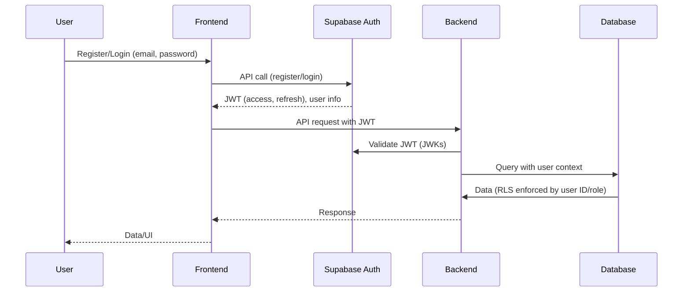
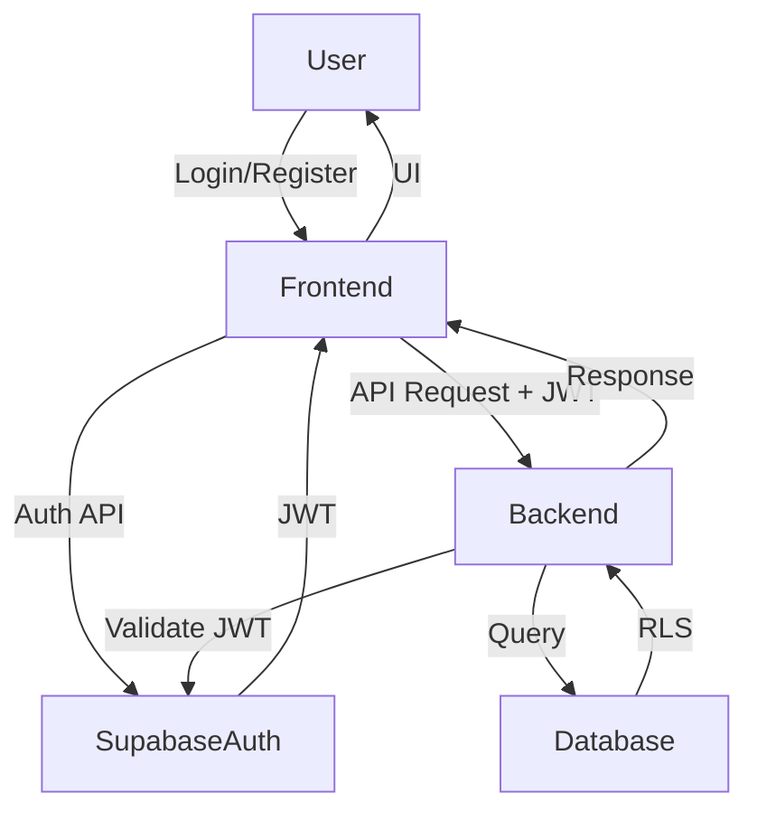

# CryoProtect v2 – Secure Authentication and Role-Based Access Control Design

## Overview

This document specifies a secure, production-ready authentication and authorization system for CryoProtect v2. It eliminates all service role dependencies, implements robust JWT-based authentication, and introduces scalable role-based access control (RBAC) suitable for multi-user, security-sensitive environments.

---

## 1. Objectives

- **Eliminate service role key and all related bypasses**
- **Implement secure, user-specific authentication using JWTs**
- **Support robust session management (timeout, refresh, revocation)**
- **Enable scalable, maintainable RBAC**
- **Ensure all access is auditable and enforces Row Level Security (RLS)**

---

## 2. Key Components

### 2.1. Authentication Provider

- **Supabase Auth** (or alternative, e.g., Auth0, if future migration is needed)
- Handles user registration, login, password reset, and email verification
- Issues JWTs on successful authentication

### 2.2. JWT Token Handling

- JWTs are issued by Supabase Auth and returned to the client
- Tokens are stored securely (preferably in HTTP-only cookies; localStorage is acceptable if XSS is mitigated)
- Backend validates JWTs on every request using Supabase’s public JWKs

### 2.3. Session Management

- **Session Timeout:** JWTs have a short expiry (e.g., 1 hour)
- **Refresh Tokens:** Issued alongside access tokens; allow session renewal without re-login
- **Revocation:** On logout or password change, refresh tokens are invalidated
- **Session Verification:** On each request, backend verifies token validity and session status

### 2.4. Role-Based Access Control (RBAC)

- **Roles:** Defined in Supabase Auth’s user metadata or a dedicated `roles` table
    - Example roles: `user`, `admin`, `curator`, `viewer`
- **Permissions:** Mapped to roles in a `permissions` table or via RLS policies
- **Enforcement:** RLS policies in the database enforce per-row access based on user role and ownership

### 2.5. Integration Points

- **Frontend:** Handles login, logout, registration, and token storage
- **Backend:** Validates JWTs, enforces RBAC, and interacts with Supabase using the user’s access token (never the service role key)
- **Database:** RLS policies reference the authenticated user’s ID and role

---

## 3. Authentication Flow



---

## 4. Session Lifecycle

### 4.1. Login

- User submits credentials to Supabase Auth via frontend
- On success, receives access and refresh tokens
- Tokens are stored securely on the client

### 4.2. Authenticated Requests

- Frontend includes access token in Authorization header (Bearer)
- Backend validates token signature and expiry
- Backend extracts user ID and role from token claims
- All database queries are performed in the context of the authenticated user

### 4.3. Token Refresh

- When access token expires, frontend uses refresh token to obtain a new access token from Supabase Auth
- If refresh token is invalid/expired, user must re-authenticate

### 4.4. Logout/Revocation

- Frontend calls logout endpoint
- Backend (or Supabase Auth) invalidates refresh token
- Tokens are removed from client storage

---

## 5. Role-Based Access Control (RBAC) Model

### 5.1. Role Assignment

- Roles are assigned at user creation or via an admin interface
- User’s role is stored in Supabase Auth metadata or a `roles` table

### 5.2. Permissions

- Each role is mapped to a set of permissions (e.g., CRUD on specific resources)
- Permissions are enforced at two levels:
    - **Backend:** Checks user role before processing sensitive operations
    - **Database (RLS):** Policies restrict access to rows based on user ID and role

#### Example RLS Policy (Postgres/Supabase)
```sql
-- Only allow users to access their own data, or admins to access all
CREATE POLICY "Allow user or admin access"
  ON public.molecule
  FOR SELECT
  USING (
    auth.uid() = user_id OR
    (EXISTS (
      SELECT 1 FROM public.roles
      WHERE user_id = auth.uid() AND role = 'admin'
    ))
  );
```

---

## 6. Security Considerations

- **No service role key in application code or environment**
- **All access is user-specific and auditable**
- **JWTs are validated on every request**
- **Session tokens are short-lived and refreshable**
- **Refresh tokens are revocable**
- **RLS policies strictly enforce per-user and per-role access**
- **Sensitive operations require elevated roles (e.g., admin)**

---

## 7. Implementation Steps

1. **Remove all service role key usage and related code**
2. **Enforce Supabase Auth for all authentication**
3. **Implement JWT validation in backend**
4. **Define roles and permissions in Supabase**
5. **Update RLS policies to reference user ID and role**
6. **Implement session management (timeout, refresh, revocation)**
7. **Update frontend to handle new session/token flow**
8. **Test for multi-user, multi-role scenarios**

---

## 8. Migration/Transition Plan

- Gradually phase out service role code paths
- Migrate existing users to Supabase Auth
- Audit and update all RLS policies
- Conduct security review and penetration testing before production

---

## 9. References

- [Service_Role_Authentication_Analysis.md](Service_Role_Authentication_Analysis.md)
- [README_Authentication.md](README_Authentication.md)
- Supabase Auth Documentation: https://supabase.com/docs/guides/auth
- Supabase RLS Documentation: https://supabase.com/docs/guides/auth/row-level-security

---

## 10. Appendix: Component Diagram



---

**This design provides a secure, scalable, and maintainable authentication and authorization system for CryoProtect v2, fully eliminating service role dependencies and supporting robust RBAC.**