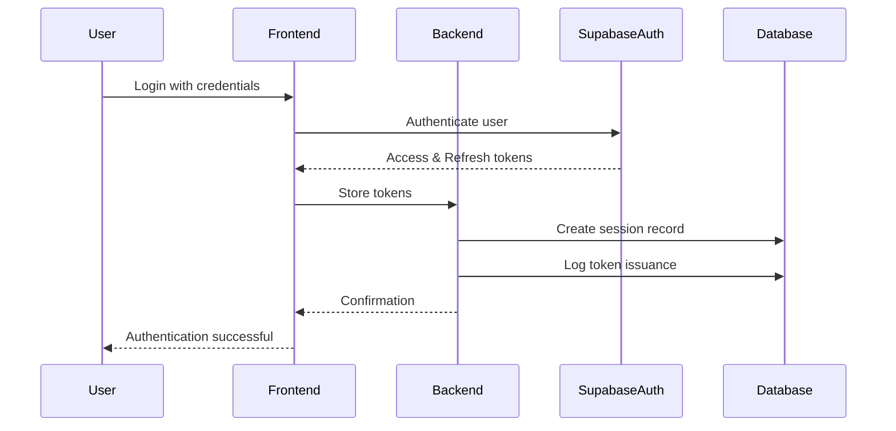
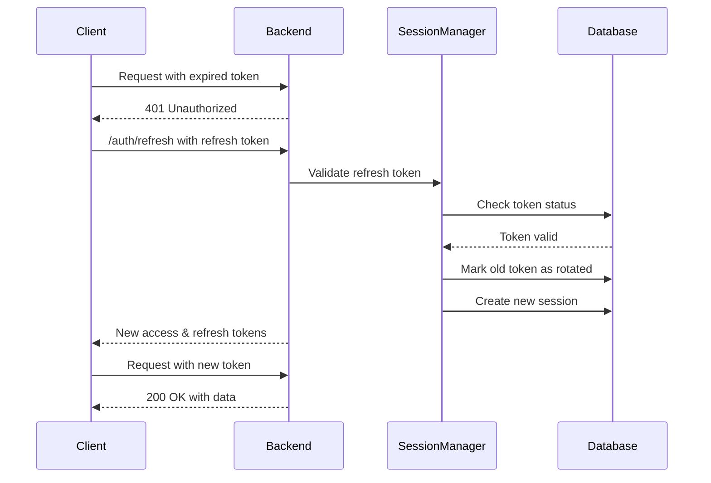

# CryoProtect v2 - Token Management

This document provides comprehensive information on the token management system implemented in CryoProtect v2, covering the complete token lifecycle from issuance to expiration.

## Overview

The token management system is a critical component of the JWT-based authentication system, providing secure, stateful authentication with the following features:

- **Secure Token Generation**: Cryptographically secure token generation
- **Token Validation**: Robust validation of token signatures, claims, and expiry
- **Token Refresh**: Secure mechanism for refreshing expired access tokens
- **Token Revocation**: Immediate invalidation of tokens on logout or security events
- **Session Binding**: Tokens are bound to specific sessions for enhanced security
- **Audit Logging**: Comprehensive logging of token lifecycle events

## Token Types

The system uses two types of tokens:

1. **Access Tokens**: Short-lived JWT tokens used for API authentication
   - Contains user identity and authorization claims
   - Typically expires in 1 hour (configurable)
   - Used for authenticating API requests

2. **Refresh Tokens**: Longer-lived tokens used to obtain new access tokens
   - Stored securely in HTTP-only cookies or secure storage
   - Typically expires in 30 days (configurable)
   - Used only for token refresh operations
   - Can be revoked server-side

## Token Lifecycle

### 1. Token Issuance

Tokens are issued during the following events:

- **User Login**: When a user successfully authenticates with valid credentials
- **Token Refresh**: When a user refreshes an expired access token using a valid refresh token

The token issuance process:

1. User authenticates with Supabase Auth
2. Supabase Auth generates and returns access and refresh tokens
3. The application creates a session record in the database
4. Tokens are securely stored on the client (HTTP-only cookies or secure storage)
5. The activity is logged in the session audit logs



### 2. Token Validation

Every authenticated API request goes through token validation:

1. The client includes the access token in the request (Authorization header or cookie)
2. The backend extracts the token from the request
3. The token signature is verified using Supabase's JWKs (JSON Web Keys)
4. The token claims (expiry, issuer, audience) are validated
5. The user information is extracted from the token
6. If session verification is enabled, the associated session is verified to be active

The validation process is implemented in `api/jwt_auth.py` and enhanced with session verification in `api/enhanced_jwt_auth.py`.

### 3. Token Refresh

When an access token expires:

1. The client detects the expired token (either proactively or after a 401 response)
2. The client sends the refresh token to the `/auth/refresh` endpoint
3. The backend validates the refresh token and checks if it's associated with an active session
4. If valid, the old refresh token is marked as rotated
5. A new access token and refresh token are issued
6. The new tokens are returned to the client
7. The activity is logged in the session audit logs



### 4. Token Revocation

Tokens can be revoked in the following scenarios:

- **User Logout**: The user explicitly logs out
- **Password Change**: The user changes their password
- **Security Event**: An administrator or the user revokes sessions due to suspicious activity
- **Session Management**: The user revokes specific sessions through the session management UI

The revocation process:

1. The client sends a revocation request (e.g., logout)
2. The backend identifies the associated session
3. The session is marked as revoked in the database
4. For password changes, all user sessions are revoked
5. The client removes the tokens from storage
6. The activity is logged in the session audit logs

Note that JWT tokens themselves cannot be directly revoked due to their stateless nature. Instead, the system maintains a session store that tracks which tokens/sessions have been revoked.

### 5. Token Expiration

Tokens have built-in expiration:

- **Access Tokens**: Typically expire after 1 hour (configurable in `auth_config.py`)
- **Refresh Tokens**: Typically expire after 30 days (configurable in `auth_config.py`)

When a token expires:

1. The token becomes invalid for authentication
2. For access tokens, the client must use the refresh token to obtain a new access token
3. For refresh tokens, the user must re-authenticate with their credentials
4. Expired sessions are automatically cleaned up by a background process

## Implementation Details

### Key Components

1. **JWT Authentication (`api/jwt_auth.py`)**: 
   - Core JWT token handling
   - Token validation and user extraction
   - Role-based access control

2. **Session Management (`api/session_management.py`)**: 
   - Session creation and validation
   - Token revocation
   - Refresh token rotation
   - Audit logging

3. **Enhanced JWT Authentication (`api/enhanced_jwt_auth.py`)**: 
   - Extends JWT authentication with session verification
   - Ensures tokens are associated with active sessions

4. **Session Utilities (`api/session_utils.py`)**: 
   - Helper functions for session management
   - Session verification
   - Background cleanup tasks

5. **Session API Routes (`api/session_routes.py`)**: 
   - Endpoints for managing sessions
   - Session revocation
   - Audit log access

### Token Hashing Implementation

Refresh tokens are securely hashed before storage in the database using HMAC-SHA256 with a secret key:

```python
def _hash_token(self, token: str) -> str:
   """
   Create a secure hash of a token for storage using HMAC-SHA256.
   This provides better security than a simple hash by using a secret key.
   """
   import hmac
   import hashlib
   
   # Get the secret key from the application config
   secret_key = current_app.config.get('HMAC_SECRET_KEY') or current_app.config.get('SECRET_KEY')
   
   # Create an HMAC using SHA-256 and the secret key
   return hmac.new(
       key=secret_key.encode(),
       msg=token.encode(),
       digestmod=hashlib.sha256
   ).hexdigest()
```

This approach provides several security benefits:
- Protection against rainbow table attacks
- Added security layer even if the database is compromised
- Verification without storing the original token

### Database Schema

The token management system uses two tables:

1. **sessions**: Stores session information
   ```sql
   CREATE TABLE sessions (
       id UUID PRIMARY KEY DEFAULT uuid_generate_v4(),
       user_id UUID NOT NULL REFERENCES auth.users(id) ON DELETE CASCADE,
       refresh_token TEXT NOT NULL,
       refresh_token_hash TEXT NOT NULL,
       previous_refresh_token_hash TEXT,
       status TEXT NOT NULL,
       expires_at TIMESTAMP WITH TIME ZONE NOT NULL,
       created_at TIMESTAMP WITH TIME ZONE DEFAULT NOW(),
       updated_at TIMESTAMP WITH TIME ZONE DEFAULT NOW(),
       ip_address TEXT,
       user_agent TEXT,
       device_info JSONB
   );
   ```

2. **session_audit_logs**: Tracks session activities
   ```sql
   CREATE TABLE session_audit_logs (
       id UUID PRIMARY KEY DEFAULT uuid_generate_v4(),
       user_id UUID NOT NULL REFERENCES auth.users(id) ON DELETE CASCADE,
       session_id UUID REFERENCES sessions(id) ON DELETE SET NULL,
       action TEXT NOT NULL,
       status TEXT NOT NULL,
       ip_address TEXT,
       user_agent TEXT,
       details JSONB,
       created_at TIMESTAMP WITH TIME ZONE DEFAULT NOW()
   );
   ```

## Security Considerations

### Token Storage

- **Access Tokens**: Should be stored securely, preferably in memory for single-page applications or HTTP-only cookies for traditional web applications
- **Refresh Tokens**: Must be stored in HTTP-only, secure cookies or other secure storage mechanisms

### Token Transmission

- Always use HTTPS to protect tokens in transit
- Use Authorization header (Bearer scheme) or HTTP-only cookies for token transmission
- Never include tokens in URLs or log them

### Token Security Features

- **Short Lifetimes**: Access tokens have short lifetimes to minimize the impact of token theft
- **Refresh Token Rotation**: Refresh tokens are rotated on use, limiting the window of opportunity for replay attacks
- **Session Binding**: Tokens are bound to specific sessions, preventing token reuse across devices
- **Revocation**: Sessions can be revoked immediately when needed
- **Secure Token Hashing**: Refresh tokens are hashed using HMAC-SHA256 with a secret key before storage
- **Audit Trail**: All token lifecycle events are logged for security monitoring

## Usage Examples

### Protecting Routes with Token Validation

```python
from api.jwt_auth import jwt_required

@app.route('/api/protected-resource')
@jwt_required
def protected_resource():
    # This route requires a valid JWT token
    return jsonify({'message': 'Access granted'})
```

### Protecting Routes with Enhanced Token Validation (Session Verification)

```python
from api.enhanced_jwt_auth import session_verified_jwt_required

@app.route('/api/highly-protected-resource')
@session_verified_jwt_required
def highly_protected_resource():
    # This route requires both a valid JWT and an active session
    return jsonify({'message': 'Access granted'})
```

### Revoking Tokens

```python
from api.session_management import get_session_manager

# Revoke a specific session
session_manager = get_session_manager()
session_manager.revoke_session(session_id, reason='security_concern')

# Revoke all sessions for a user
session_manager.revoke_all_user_sessions(user_id, reason='password_change')
```

### Validating Tokens Manually

```python
from api.jwt_auth import decode_token, extract_user_from_token

# Decode and validate a token
try:
    payload = decode_token(token)
    # Token is valid
except jwt.InvalidTokenError:
    # Token is invalid

# Extract user information from a token
try:
    user_data, user_id = extract_user_from_token(token)
    # Use user data
except jwt.InvalidTokenError:
    # Token is invalid
```

## Configuration

Token management settings can be configured in `auth_config.py`:

```python
# JWT Configuration
JWT_EXPIRY = 3600  # 1 hour in seconds
JWT_REFRESH_EXPIRY = 2592000  # 30 days in seconds

# Session Configuration
SESSION_TIMEOUT = 3600  # 1 hour in seconds
REFRESH_TOKEN_ROTATION = True  # Whether to rotate refresh tokens on use

# Security Configuration
SECURE_COOKIES = True  # Use secure cookies (HTTPS only)
HTTP_ONLY_COOKIES = True  # Use HTTP-only cookies for tokens
SAME_SITE_COOKIES = "Lax"  # SameSite cookie policy (Strict, Lax, None)
HMAC_SECRET_KEY = None  # Set this to a strong random value in production or use SECRET_KEY
```

## Troubleshooting

### Common Issues

1. **"Token expired" error**: The access token has expired. Use the refresh token to get a new one.
   - Solution: Implement automatic token refresh in your client application

2. **"Invalid token" error**: The token is malformed or has been tampered with.
   - Solution: Ensure the token is being transmitted correctly and hasn't been modified

3. **"Invalid session" error**: The session associated with the token has been revoked or expired.
   - Solution: The user needs to log in again to create a new session

4. **"Failed to refresh token" error**: The refresh token is invalid, expired, or has been revoked.
   - Solution: The user needs to log in again with their credentials

### Debugging

For debugging token issues:

1. Check the application logs. Token-related errors are logged with the prefix "Authentication error", "Token validation error", or "Session verification error".
2. Inspect the token using a tool like [JWT.io](https://jwt.io/) to verify its contents and expiration time.
3. Check the session status in the database to see if it has been revoked or expired.
4. Review the session audit logs for any security events that might have affected the token.

## Integration with Frontend

### Token Storage on Frontend

```javascript
// Store tokens securely (example using HTTP-only cookies)
function storeTokens(accessToken, refreshToken) {
  // The cookies are set by the server with HTTP-only flag
  console.log('Tokens stored in HTTP-only cookies');
}

// Alternative for SPAs (less secure, but sometimes necessary)
function storeTokensInMemory(accessToken, refreshToken) {
  // Store in memory variables, not localStorage
  this.accessToken = accessToken;
  this.refreshToken = refreshToken;
}
```

### Automatic Token Refresh

```javascript
async function fetchWithTokenRefresh(url, options = {}) {
  // Try with current access token
  let response = await fetch(url, {
    ...options,
    headers: {
      ...options.headers,
      'Authorization': `Bearer ${getAccessToken()}`
    }
  });
  
  // If unauthorized, try to refresh token
  if (response.status === 401) {
    const refreshed = await refreshToken();
    if (refreshed) {
      // Retry with new token
      return fetch(url, {
        ...options,
        headers: {
          ...options.headers,
          'Authorization': `Bearer ${getAccessToken()}`
        }
      });
    } else {
      // Redirect to login if refresh failed
      redirectToLogin();
    }
  }
  
  return response;
}
```

## References

- [README_JWT_AUTH.md](README_JWT_AUTH.md) - JWT Authentication documentation
- [README_SESSION_MANAGEMENT.md](README_SESSION_MANAGEMENT.md) - Session Management documentation
- [AUTHENTICATION_SYSTEM_DESIGN.md](AUTHENTICATION_SYSTEM_DESIGN.md) - Authentication System Design
- [JWT.io](https://jwt.io/) - For more information on JWT tokens
- [OWASP Authentication Cheat Sheet](https://cheatsheetseries.owasp.org/cheatsheets/Authentication_Cheat_Sheet.html) - For best practices on authentication
- [OWASP Session Management Cheat Sheet](https://cheatsheetseries.owasp.org/cheatsheets/Session_Management_Cheat_Sheet.html) - For best practices on session management