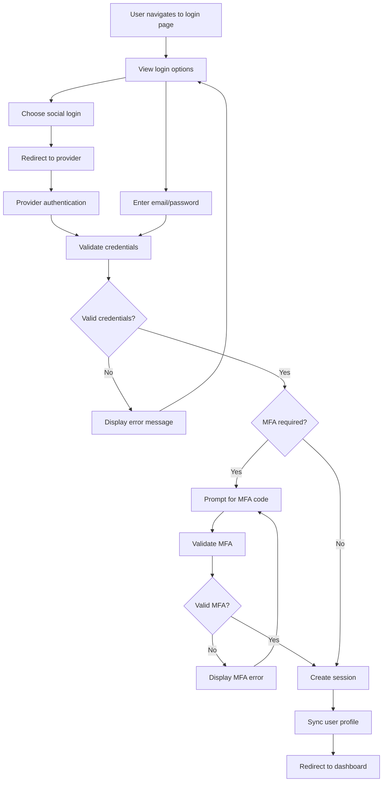
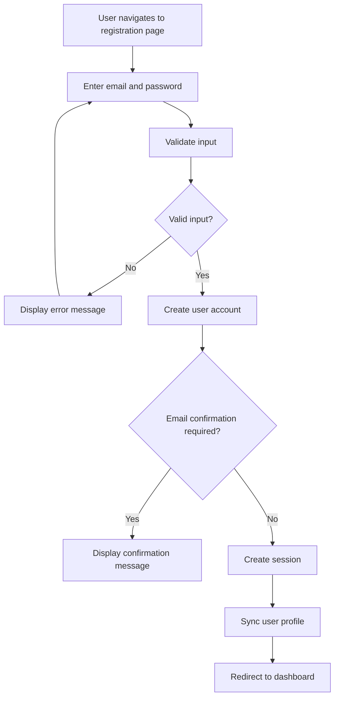
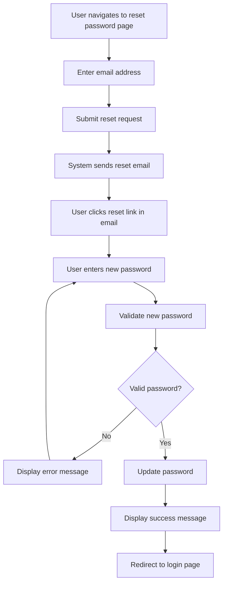
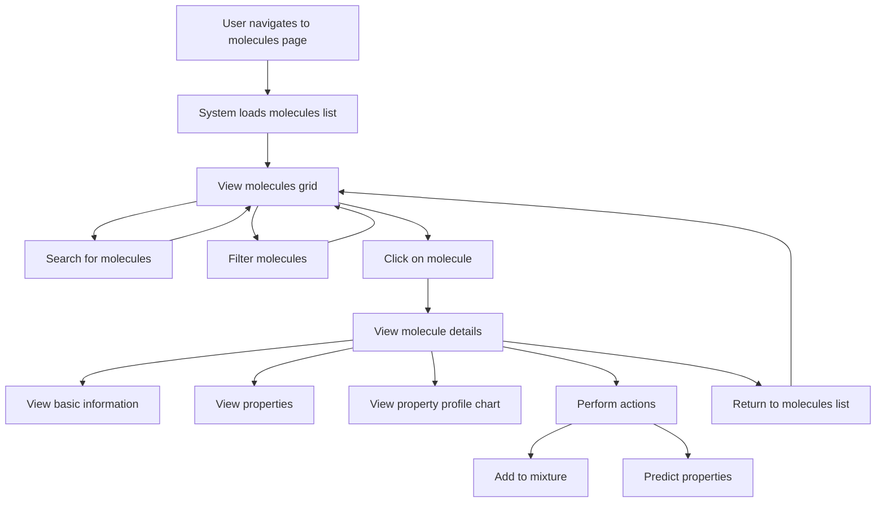
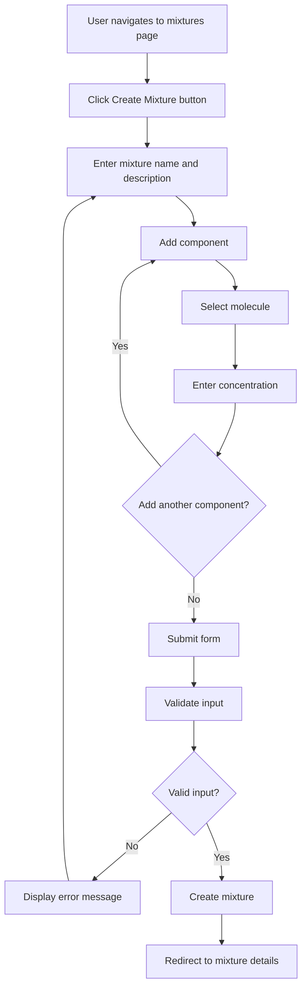
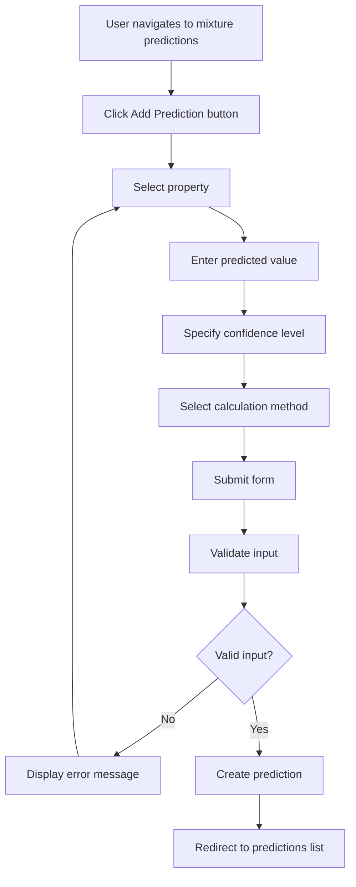
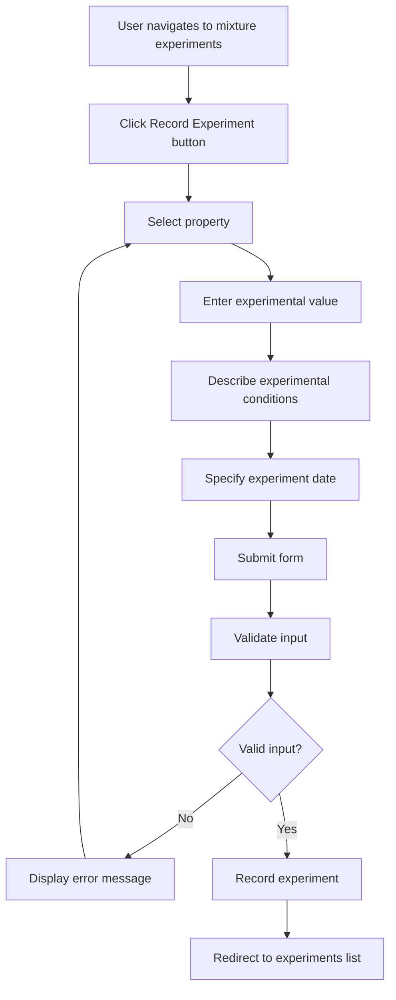
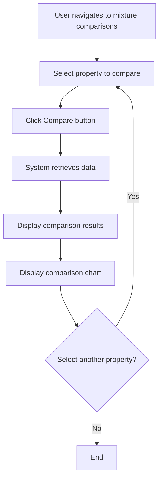

# CryoProtect v2 - UX Workflows Analysis

## Overview

This document provides a detailed analysis of the core user workflows in the CryoProtect v2 web application. Each workflow is broken down step-by-step, visualized with a flowchart, and analyzed for potential pain points and areas for improvement.

## Table of Contents

1. [Authentication Workflows](#authentication-workflows)
   - [Login Flow](#login-flow)
   - [Registration Flow](#registration-flow)
   - [Password Reset Flow](#password-reset-flow)
2. [Core Functionality Workflows](#core-functionality-workflows)
   - [View Molecules Flow](#view-molecules-flow)
   - [Create Mixture Flow](#create-mixture-flow)
   - [Add Prediction Flow](#add-prediction-flow)
   - [Record Experiment Flow](#record-experiment-flow)
   - [Compare Results Flow](#compare-results-flow)
3. [Summary of Recommendations](#summary-of-recommendations)

## Authentication Workflows

### Login Flow

#### Step-by-Step Breakdown

1. User navigates to the login page (`/login`)
2. User is presented with login options:
   - Social login (Google, GitHub)
   - Email/password login
3. User enters credentials or selects social login
4. System validates credentials
5. If MFA is required, user is prompted for MFA code
6. On successful authentication:
   - User session is created
   - User profile is synced with backend
   - User is redirected to the dashboard
7. On failed authentication:
   - Error message is displayed
   - User remains on login page

#### Workflow Diagram

#### Pain Points and Bottlenecks

1. **MFA Implementation Complexity**: The multi-factor authentication flow adds complexity and an additional step that might confuse users.
2. **Social Login Redirect**: The social login process involves a redirect to the provider and back, which can be disorienting for users.
3. **Error Handling**: Error messages are displayed inline but might not be immediately visible if the form is long.
4. **Session Management**: The session token is stored in localStorage, which has security implications.

#### Improvement Suggestions

1. **Streamlined MFA**: Implement a more streamlined MFA process with clearer instructions and visual cues.
2. **Persistent Login State**: Add a "Remember me" option to extend session duration for trusted devices.
3. **Enhanced Error Visibility**: Make error messages more prominent and provide more specific guidance on how to resolve issues.
4. **Security Enhancements**: Consider using HttpOnly cookies for session storage instead of localStorage for better security.
5. **Progressive Enhancement**: Implement a progressive enhancement approach for the login form to work without JavaScript.

### Registration Flow

#### Step-by-Step Breakdown

1. User navigates to the registration page (`/register`)
2. User enters email, password, and confirms password
3. System validates input:
   - Checks if passwords match
   - Ensures password meets minimum length requirement (8 characters)
4. On successful validation:
   - User account is created
   - If email confirmation is required, user is notified to check email
   - If no confirmation is required, user is automatically logged in and redirected to dashboard
5. On validation failure:
   - Error message is displayed
   - User remains on registration page

#### Workflow Diagram

#### Pain Points and Bottlenecks

1. **Limited Password Requirements**: The password validation only checks for minimum length, not complexity.
2. **No Password Strength Indicator**: Users have no visual feedback on password strength.
3. **Email Verification Uncertainty**: Users may be confused about whether email verification is required.
4. **Limited Social Registration**: Unlike login, there are no social registration options.

#### Improvement Suggestions

1. **Enhanced Password Requirements**: Implement stronger password requirements with a visual strength meter.
2. **Social Registration**: Add social registration options to match the login options.
3. **Clear Verification Instructions**: Provide clearer instructions about the email verification process.
4. **Progressive Form Validation**: Implement real-time validation feedback as users type.
5. **Guided Registration**: Consider a step-by-step registration process for collecting additional profile information.

### Password Reset Flow

#### Step-by-Step Breakdown

1. User navigates to the password reset page (`/reset-password`)
2. User enters their email address
3. System sends a password reset link to the provided email
4. User receives email and clicks the reset link
5. User is directed back to the application with a token in the URL
6. User enters new password and confirms it
7. System validates the new password
8. On successful validation:
   - Password is updated
   - Success message is displayed
   - User is redirected to login page
9. On validation failure:
   - Error message is displayed
   - User remains on reset password page

#### Workflow Diagram

#### Pain Points and Bottlenecks

1. **Email Dependency**: The process relies on email delivery, which can be delayed or fail.
2. **Token Expiration**: The reset token may expire before the user completes the process.
3. **Limited Context**: Users arriving from email may lack context about what they're doing.
4. **Same Password Validation**: There's no check to prevent users from reusing their old password.

#### Improvement Suggestions

1. **Alternative Recovery Methods**: Offer alternative recovery methods like SMS or security questions.
2. **Clear Token Expiration**: Clearly communicate how long the reset link is valid.
3. **Contextual Guidance**: Provide clear context and instructions when users arrive from reset emails.
4. **Prevent Password Reuse**: Implement checks to prevent users from reusing recent passwords.
5. **Streamlined Process**: Consider a more streamlined process with fewer steps.

## Core Functionality Workflows

### View Molecules Flow

#### Step-by-Step Breakdown

1. User navigates to the molecules page (`/molecules`)
2. System loads the list of molecules with a loading indicator
3. User can:
   - Search for molecules using the search bar
   - Filter molecules using the dropdown filter
   - Click on a molecule to view details
4. When viewing a molecule:
   - Basic information is displayed (formula, SMILES)
   - Properties are displayed in a table
   - A radar chart shows the property profile
   - Actions are available (add to mixture, predict properties)
5. User can navigate back to the molecules list

#### Workflow Diagram

#### Pain Points and Bottlenecks

1. **Initial Loading Time**: The initial loading of molecules could be slow with a large dataset.
2. **Limited Search Capabilities**: The search functionality appears basic without advanced filtering options.
3. **Visualization Limitations**: The molecular visualization is limited to predefined molecules.
4. **Action Availability**: Actions like "Add to Mixture" are disabled until authentication.
5. **Import Process**: The molecule import process requires knowledge of PubChem CIDs.

#### Improvement Suggestions

1. **Lazy Loading**: Implement lazy loading or pagination for the molecules grid to improve initial load time.
2. **Advanced Search**: Add advanced search and filtering options (by property values, structural features, etc.).
3. **Enhanced Visualization**: Implement more interactive molecular visualization with rotation, zooming, and measurement tools.
4. **Clearer Authentication Requirements**: Clearly communicate why certain actions require authentication.
5. **Simplified Import**: Add the ability to search PubChem directly from the import interface.
6. **Batch Operations**: Allow users to select multiple molecules for batch operations.

### Create Mixture Flow

#### Step-by-Step Breakdown

1. User navigates to the mixtures page (`/mixtures`)
2. User clicks "Create Mixture" button
3. User is presented with a form to:
   - Enter mixture name and description
   - Add components (molecules) with concentrations
4. User can add multiple components using the "Add Component" button
5. For each component, user selects:
   - A molecule from the dropdown
   - Concentration value
6. User submits the form
7. System validates the input
8. On successful validation:
   - Mixture is created
   - User is redirected to the mixture details page
9. On validation failure:
   - Error message is displayed
   - User remains on the create mixture form

#### Workflow Diagram

#### Pain Points and Bottlenecks

1. **Component Selection**: The component selection process requires multiple steps for each component.
2. **Concentration Units**: There's no clear indication of concentration units or validation.
3. **Molecule Selection**: The molecule dropdown could be overwhelming with many molecules.
4. **No Preview**: There's no preview of the mixture composition before submission.
5. **Limited Guidance**: Limited guidance on creating effective mixtures.

#### Improvement Suggestions

1. **Streamlined Component Addition**: Simplify the process of adding components with inline autocomplete.
2. **Clear Units**: Clearly indicate and standardize concentration units with appropriate validation.
3. **Searchable Dropdown**: Implement a searchable dropdown for molecule selection.
4. **Real-time Preview**: Add a real-time visual preview of the mixture composition.
5. **Guided Creation**: Provide guidance or templates for creating effective mixtures.
6. **Drag-and-Drop Interface**: Consider a drag-and-drop interface for adding molecules to mixtures.

### Add Prediction Flow

#### Step-by-Step Breakdown

1. User navigates to a mixture's predictions page
2. User clicks "Add Prediction" button
3. User is presented with a form to:
   - Select a property to predict
   - Enter the predicted value
   - Specify confidence level
   - Select calculation method
4. User submits the form
5. System validates the input
6. On successful validation:
   - Prediction is created
   - User is redirected to the predictions list
7. On validation failure:
   - Error message is displayed
   - User remains on the add prediction form

#### Workflow Diagram

#### Pain Points and Bottlenecks

1. **Property Selection**: The property dropdown may not provide enough context about each property.
2. **Value Format**: There's limited guidance on the expected format for different property types.
3. **Confidence Estimation**: Users may struggle to accurately estimate confidence levels.
4. **Method Selection**: Limited explanation of different calculation methods.
5. **No Validation**: No validation of predicted values against expected ranges.

#### Improvement Suggestions

1. **Property Context**: Provide more context and descriptions for each property in the dropdown.
2. **Format Guidance**: Offer clear guidance on expected value formats with examples.
3. **Confidence Guidance**: Provide guidance on how to estimate confidence levels.
4. **Method Explanations**: Add explanations or tooltips for each calculation method.
5. **Value Validation**: Implement validation of predicted values against expected ranges.
6. **Prediction Assistance**: Offer AI-assisted prediction suggestions based on similar mixtures.

### Record Experiment Flow

#### Step-by-Step Breakdown

1. User navigates to a mixture's experiments page
2. User clicks "Record Experiment" button
3. User is presented with a form to:
   - Select a property that was measured
   - Enter the experimental value
   - Describe experimental conditions
   - Specify the date the experiment was performed
4. User submits the form
5. System validates the input
6. On successful validation:
   - Experiment is recorded
   - User is redirected to the experiments list
7. On validation failure:
   - Error message is displayed
   - User remains on the record experiment form

#### Workflow Diagram

#### Pain Points and Bottlenecks

1. **Property Selection**: Similar to predictions, limited context about properties.
2. **Conditions Description**: Free-form text field for conditions lacks structure.
3. **Date Selection**: Default to current date may not be appropriate for past experiments.
4. **No Standardization**: No standardization of experimental conditions.
5. **Limited Metadata**: Limited ability to add metadata like equipment used, protocols followed, etc.

#### Improvement Suggestions

1. **Structured Conditions**: Implement a structured form for experimental conditions.
2. **Protocol Templates**: Offer templates for common experimental protocols.
3. **Equipment Tracking**: Add the ability to track equipment used in experiments.
4. **Batch Recording**: Allow recording multiple experimental results at once.
5. **Data Import**: Add the ability to import experimental data from CSV or other formats.
6. **Experiment Versioning**: Implement versioning for experiments to track changes.

### Compare Results Flow

#### Step-by-Step Breakdown

1. User navigates to a mixture's comparisons page
2. User selects a property to compare from the dropdown
3. User clicks the "Compare" button
4. System retrieves prediction and experimental data for the selected property
5. System displays:
   - Comparison results (difference, percent error)
   - Visual comparison chart
   - Color-coded evaluation (good, warning, bad)
6. User can select different properties to compare

#### Workflow Diagram

#### Pain Points and Bottlenecks

1. **Limited Property Selection**: Only properties with both predictions and experiments can be compared.
2. **Single Property Focus**: Can only compare one property at a time.
3. **Basic Visualization**: The comparison visualization is relatively basic.
4. **No Historical Tracking**: No tracking of how predictions improve over time.
5. **Limited Analysis**: Limited statistical analysis of prediction accuracy.

#### Improvement Suggestions

1. **Multi-property Comparison**: Allow comparing multiple properties simultaneously.
2. **Enhanced Visualization**: Implement more sophisticated visualization options.
3. **Historical Tracking**: Add tracking of prediction accuracy over time.
4. **Statistical Analysis**: Provide more detailed statistical analysis of prediction accuracy.
5. **Automated Insights**: Generate automated insights about prediction accuracy.
6. **Comparison Export**: Add the ability to export comparison results.

## Summary of Recommendations

### Authentication and User Management

1. Implement more robust password requirements with visual strength indicators
2. Add social registration options to match login options
3. Provide alternative account recovery methods
4. Enhance session security with HttpOnly cookies
5. Streamline the MFA process with better UX

### Molecule Management

1. Implement lazy loading and pagination for molecule lists
2. Enhance search capabilities with advanced filtering
3. Improve molecular visualization with interactive 3D models
4. Simplify the molecule import process with direct PubChem search
5. Add batch operations for molecule management

### Mixture Creation and Analysis

1. Streamline the component addition process
2. Provide real-time visual previews of mixture compositions
3. Implement guided mixture creation with templates
4. Add drag-and-drop functionality for component selection
5. Enhance mixture analysis with more sophisticated tools

### Predictions and Experiments

1. Provide better context and guidance for property selection
2. Implement structured forms for experimental conditions
3. Add protocol templates and equipment tracking
4. Enable batch recording and data import
5. Implement versioning for experiments

### Comparisons and Reporting

1. Allow multi-property comparisons
2. Enhance visualization options for comparisons
3. Add historical tracking of prediction accuracy
4. Provide more detailed statistical analysis
5. Generate automated insights about prediction accuracy
6. Enable exporting of comparison results

By implementing these recommendations, the CryoProtect v2 application can significantly improve user experience, streamline workflows, and enhance overall functionality.