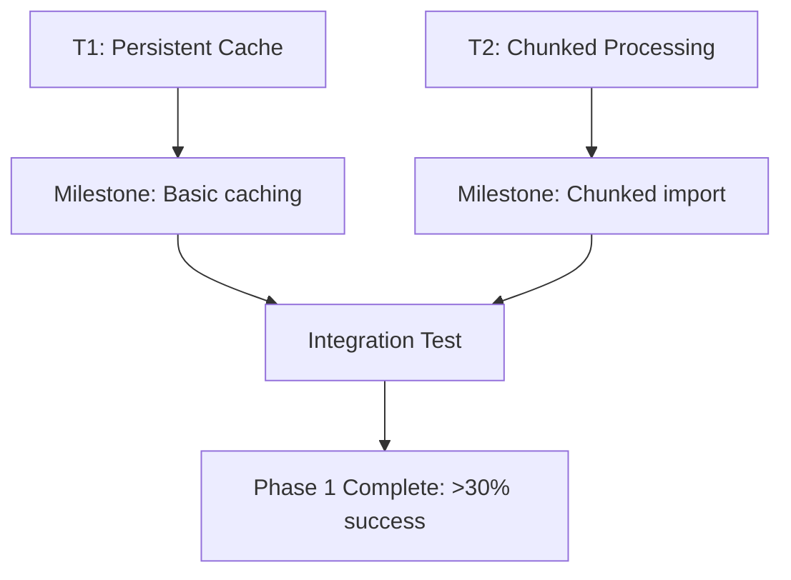
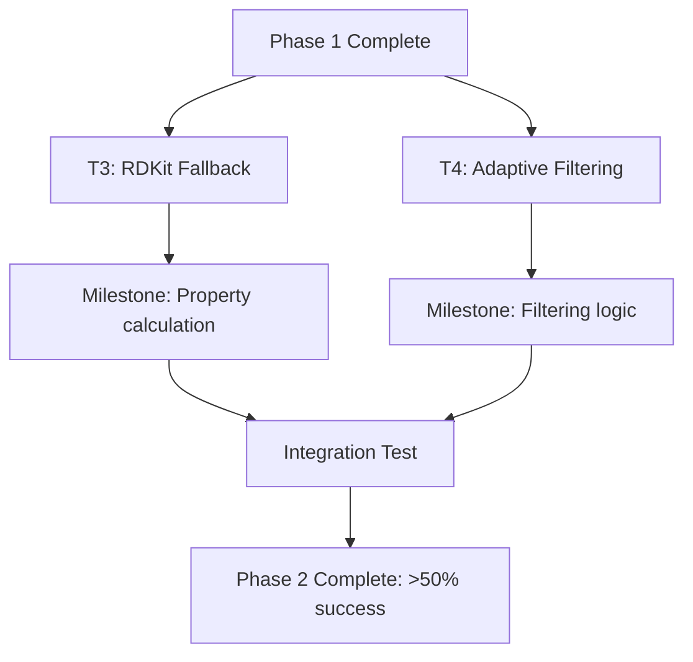
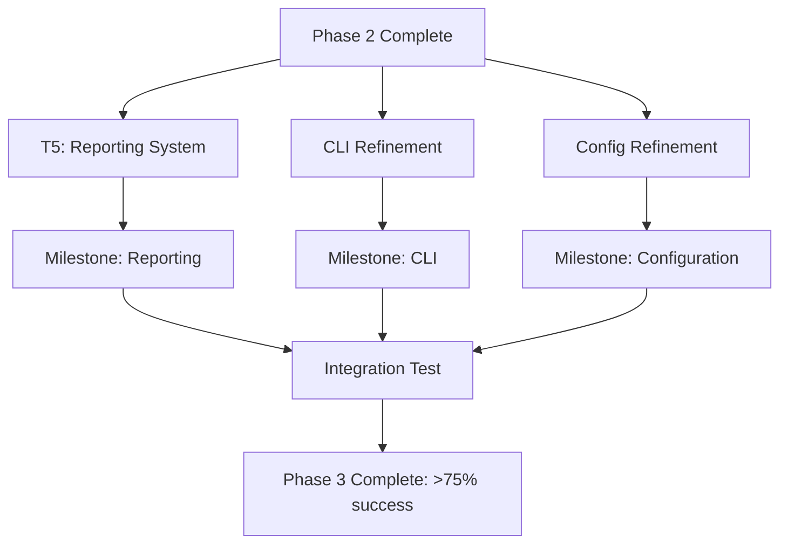

# ROO PUBCHEM IMPORT OPTIMIZATION DIRECTIVE

## EXECUTIVE SUMMARY FOR AGENT DELEGATION

This directive addresses critical issues with PubChem data importation into the CryoProtect v2 database. Current import strategies have achieved only a 1.93% success rate due to severe PubChem API rate limiting issues. This directive is specifically structured for ROO agent delegation and task breakdown, with each task annotated for seamless handoff to specialized solution agents.

> **ATTENTION PM AGENT**: To save API tokens, reference key files when analyzing implementation. Execute tasks in phases according to the prioritization section.

## PROBLEM ANALYSIS FOR AGENT ALLOCATION

Our current PubChem import attempts face several critical issues that need specialized agent attention:

1. **Severe API Rate Limiting** [PROBLEM_CATEGORY=API_INTEGRATION]:
   - Reference file: `/mnt/c/Users/1edwa/Documents/CryoProtect v2/reports/pubchem_import_issues_report.md:25-32`
   - PubChem API consistently returns 503 "Server Busy" errors despite exponential backoff
   - This requires API Integration Specialist focus

2. **High Skip Rate (89.9%)** [PROBLEM_CATEGORY=DATA_QUALITY]:
   - Reference file: `/mnt/c/Users/1edwa/Documents/CryoProtect v2/reports/pubchem_import_issues_report.md:34-40`
   - Key reasons identified as:
     ```
     - "Error in molecule data" from incomplete API responses
     - "No molecular properties found" with 503 status codes
     - Compounds not meeting filtering criteria for cryoprotectants
     ```
   - This requires Data Quality Specialist focus

3. **Filtering Criteria Strictness** [PROBLEM_CATEGORY=CHEMINFORMATICS]:
   - Reference file: `/mnt/c/Users/1edwa/Documents/CryoProtect v2/import_pubchem_data_direct.py:30-35`
   - Current implementation:
     ```python
     CORE_CRITERIA = {
         "logP_range": (-5, 5),
         "mw_range": (0, 1000),
         "TPSA_range": (0, 200)
     }
     ```
   - This requires Cheminformatics Specialist focus

4. **Inefficient Processing Strategy** [PROBLEM_CATEGORY=PERFORMANCE]:
   - Reference file: `/mnt/c/Users/1edwa/Documents/CryoProtect v2/import_pubchem_data_direct.py:180-250`
   - Current approach processes all compounds at once without intelligent batching
   - This requires Performance Optimization Specialist focus

## TASK REQUIREMENTS FOR AGENT ASSIGNMENT

> **ATTENTION MASTER ORCHESTRATOR**: Assign the following requirements to appropriate specialist agents. Tag requirements explicitly to enable independent parallel work streams.

Design and implement a robust PubChem data import solution with these requirements categorized by agent specialty:

1. **[GOAL_ID=G1] [AGENT=PERFORMANCE_SPECIALIST] Achieve >75% Success Rate**: 
   - Reference file: `/mnt/c/Users/1edwa/Documents/CryoProtect v2/reports/pubchem_import_issues_report.md:32-38`
   - Drastically improve current 1.93% success rate through optimized processing
   - Critical success metric for overall solution

2. **[GOAL_ID=G2] [AGENT=ALGORITHM_SPECIALIST] Implement Smart Chunking**: 
   - Reference files: 
     - Current implementation: `/mnt/c/Users/1edwa/Documents/CryoProtect v2/import_pubchem_data_direct.py:180-210`
     - Fix recommendations: `/mnt/c/Users/1edwa/Documents/CryoProtect v2/reports/pubchem_import_issues_report.md:82-85`
   - Process data in optimal-sized batches with adaptive scheduling
   - Include smart backoff and retry mechanisms

3. **[GOAL_ID=G3] [AGENT=DATABASE_SPECIALIST] Create Persistent Caching**: 
   - Reference file: `/mnt/c/Users/1edwa/Documents/CryoProtect v2/reports/pubchem_import_issues_report.md:72-75`
   - Develop durable SQLite cache system preserving API responses between runs
   - Implement cache statistics and optimization

4. **[GOAL_ID=G4] [AGENT=CHEMINFORMATICS_SPECIALIST] Utilize RDKit for Local Computation**: 
   - Reference files:
     - RDKit examples: `/mnt/c/Users/1edwa/Documents/CryoProtect v2/examples/rdkit_example.py`
     - Property calculation: `/mnt/c/Users/1edwa/Documents/CryoProtect v2/api/rdkit_utils.py`
   - Calculate missing properties locally when API fails
   - Ensure consistency between API and locally calculated properties

5. **[GOAL_ID=G5] [AGENT=DATA_QUALITY_SPECIALIST] Implement Progressive Relaxation**: 
   - Reference file: `/mnt/c/Users/1edwa/Documents/CryoProtect v2/reports/pubchem_import_issues_report.md:77-80`
   - Dynamically adjust filtering criteria based on success rates
   - Balance between data completeness and quality

6. **[GOAL_ID=G6] [AGENT=API_INTEGRATION_SPECIALIST] Optimize for Resilience**: 
   - Reference files:
     - Current client: `/mnt/c/Users/1edwa/Documents/CryoProtect v2/pubchem/client.py`
     - Error logs: `/mnt/c/Users/1edwa/Documents/CryoProtect v2/reports/pubchem_import_issues_report.md:140-158`
   - Handle API failures gracefully with intelligent retry mechanisms
   - Implement circuit breaker pattern with variable timeouts

7. **[GOAL_ID=G7] [AGENT=REPORTING_SPECIALIST] Provide Detailed Reporting**: 
   - Reference file: `/mnt/c/Users/1edwa/Documents/CryoProtect v2/reports/pubchem_import_issues_report.md:159-180`
   - Generate comprehensive statistics for monitoring progress
   - Create executive and technical dashboards

## DETAILED TASK BREAKDOWN FOR AGENT EXECUTION

> **ATTENTION ROO AGENTS**: Each task is structured for independent execution. Reference existing files to minimize API token usage and navigate the codebase efficiently.

### TASK 1: PERSISTENT CACHE IMPLEMENTATION [TASK_ID=T1] [LINKS_TO_GOAL=G3]

**Primary Agent**: DATABASE_SPECIALIST
**Supporting Agent**: API_INTEGRATION_SPECIALIST
**Dependencies**: None (can start immediately)
**Priority**: CRITICAL_PATH (Phase 1)

**Existing Code References**:
- Current caching attempt: `/mnt/c/Users/1edwa/Documents/CryoProtect v2/pubchem/cache.py` (if exists)
- Cache recommendation: `/mnt/c/Users/1edwa/Documents/CryoProtect v2/reports/pubchem_import_issues_report.md:72-75`
- Database utilities: `/mnt/c/Users/1edwa/Documents/CryoProtect v2/database/utils/connection.py`

**Deliverables**:
1. [DELIVERABLE_ID=T1.D1] Design and implement a SQLite-based persistent cache system:
   - Target file: `/mnt/c/Users/1edwa/Documents/CryoProtect v2/pubchem/cache.py:10-120`
   - Schema:
   ```sql
   CREATE TABLE compounds (
       cid INTEGER PRIMARY KEY,
       data BLOB,
       timestamp REAL,
       source TEXT
   );
   
   CREATE TABLE properties (
       cid INTEGER PRIMARY KEY,
       data BLOB,
       timestamp REAL,
       source TEXT
   );
   ```
   - Required functions:
   ```python
   def setup_cache_db()  # Initialize cache with schema
   def get_from_cache(cid, table='compounds')  # Retrieve with timestamp checking
   def save_to_cache(cid, data, table='compounds', source='api')  # Store efficiently
   def get_cache_stats()  # Track hits/misses/efficiency
   ```

2. [DELIVERABLE_ID=T1.D2] Implement cache pre-warming functionality:
   - Target file: `/mnt/c/Users/1edwa/Documents/CryoProtect v2/pubchem/utils.py:50-110`
   - Required functions:
   ```python
   def prewarm_cache(cid_list, batch_size=50)  # Background process for fetching basics
   def get_cache_prewarm_status()  # Tracking progress of pre-warming
   ```

**Success Criteria**:
- [CRITERION_ID=T1.C1] Cache persists between application runs (SQLite file remains valid)
- [CRITERION_ID=T1.C2] Cache handles at least 10,000 compounds without performance degradation
- [CRITERION_ID=T1.C3] Cache hit rate exceeds 90% for repeated requests
- [CRITERION_ID=T1.C4] Pre-warming process can run independently of main import

**Testing Strategy**:
- Create unit tests with mock API responses
- Benchmark performance with 10,000+ compound dataset
- Verify persistence across application restarts

### TASK 2: CHUNKED PROCESSING IMPLEMENTATION [TASK_ID=T2] [LINKS_TO_GOAL=G2,G6]

**Primary Agent**: ALGORITHM_SPECIALIST
**Supporting Agent**: PERFORMANCE_OPTIMIZATION_SPECIALIST
**Dependencies**: None (can start immediately)
**Priority**: CRITICAL_PATH (Phase 1)

**Existing Code References**:
- Current implementation: `/mnt/c/Users/1edwa/Documents/CryoProtect v2/import_pubchem_data_direct.py:180-210`
- Error logs showing failures: `/mnt/c/Users/1edwa/Documents/CryoProtect v2/reports/pubchem_import_issues_report.md:140-158`
- Chunking recommendation: `/mnt/c/Users/1edwa/Documents/CryoProtect v2/reports/pubchem_import_issues_report.md:82-85`

**Deliverables**:
1. [DELIVERABLE_ID=T2.D1] Design chunked processing algorithm with adaptive sizing:
   - Target file: `/mnt/c/Users/1edwa/Documents/CryoProtect v2/import_pubchem_data_chunked.py:150-250`
   - Required functions:
   ```python
   def generate_chunks(cids, initial_chunk_size=100)  # Smart chunking with size adaptation
   def process_chunk(chunk, session, delay)  # Process a single chunk completely
   def get_optimal_chunk_size(recent_response_times)  # Dynamically adjust chunk size
   def save_checkpoint(processed_cids)  # Save progress for resuming
   def load_checkpoint()  # Resume from last saved point
   ```

2. [DELIVERABLE_ID=T2.D2] Implement circuit breaker pattern with exponential backoff:
   - Target file: `/mnt/c/Users/1edwa/Documents/CryoProtect v2/pubchem/client.py:80-150`
   - Required components:
   ```python
   class CircuitBreaker:
       def __init__(self, failure_threshold=5, reset_timeout=30)
       def __call__(self, func)  # Decorator for API calls
       def record_success(self)  # Track successful calls
       def record_failure(self)  # Track failures and potentially open circuit
       def reset(self)  # Reset after cooldown period
   
   def exponential_backoff(retry_count, base_delay=0.5, max_delay=60)  # Calculate delay
   ```

**Success Criteria**:
- [CRITERION_ID=T2.C1] Successfully processes 5,000 compounds in manageable chunks
- [CRITERION_ID=T2.C2] Dynamically adjusts chunk size based on API response times
- [CRITERION_ID=T2.C3] Resumes processing from last successful point after interruptions
- [CRITERION_ID=T2.C4] Maintains optimal throughput without triggering API rate limits

**Testing Strategy**:
- Unit test with mock API responses including 503 errors
- Test checkpoint system with interrupted runs
- Measure throughput with various chunk sizes

### TASK 3: RDKIT FALLBACK CALCULATION SYSTEM [TASK_ID=T3] [LINKS_TO_GOAL=G4]

**Primary Agent**: CHEMINFORMATICS_SPECIALIST
**Supporting Agent**: DATA_QUALITY_SPECIALIST
**Dependencies**: None (can start independently)
**Priority**: SECONDARY (Phase 2)

**Existing Code References**:
- RDKit utils: `/mnt/c/Users/1edwa/Documents/CryoProtect v2/api/rdkit_utils.py`
- RDKit examples: `/mnt/c/Users/1edwa/Documents/CryoProtect v2/examples/rdkit_example.py`
- Previous RDKit integration: `/mnt/c/Users/1edwa/Documents/CryoProtect v2/api/rdkit_resources.py`

**Deliverables**:
1. [DELIVERABLE_ID=T3.D1] Implement RDKit property calculation as API fallback:
   - Target file: `/mnt/c/Users/1edwa/Documents/CryoProtect v2/pubchem/rdkit_fallback.py:1-150`
   - Required functions:
   ```python
   def smiles_to_mol(smiles)  # Convert SMILES to RDKit molecule
   def calculate_molecular_weight(mol)  # Calculate MW using RDKit
   def calculate_logp(mol)  # Calculate LogP using RDKit
   def calculate_tpsa(mol)  # Calculate TPSA using RDKit
   def calculate_hbond_counts(mol)  # Calculate H-bond donors/acceptors
   def calculate_all_properties(smiles)  # Calculate all properties from SMILES
   def properties_to_pubchem_format(properties)  # Convert to PubChem API format
   ```

2. [DELIVERABLE_ID=T3.D2] Create data structure normalization between sources:
   - Target file: `/mnt/c/Users/1edwa/Documents/CryoProtect v2/pubchem/data_standardization.py:1-100`
   - Required functions:
   ```python
   def normalize_property(property_name, value, source)  # Normalize property values
   def validate_properties(properties)  # Validate property data
   def tag_property_source(properties, source)  # Track source of each property
   def merge_properties(api_properties, rdkit_properties)  # Combine from multiple sources
   ```

**Success Criteria**:
- [CRITERION_ID=T3.C1] RDKit-calculated properties match PubChem values within 10% margin
- [CRITERION_ID=T3.C2] Fallback activates automatically when API returns 503 or empty data
- [CRITERION_ID=T3.C3] Properties tagged with source for traceability
- [CRITERION_ID=T3.C4] Data structure consistent regardless of property source

**Testing Strategy**:
- Compare RDKit vs PubChem values for 50 known compounds
- Test with mock API failures to verify fallback behavior
- Verify consistency of output format from both sources

### TASK 4: ADAPTIVE FILTERING IMPLEMENTATION [TASK_ID=T4] [LINKS_TO_GOAL=G5]

**Primary Agent**: DATA_QUALITY_SPECIALIST
**Supporting Agent**: CHEMINFORMATICS_SPECIALIST
**Dependencies**: Requires partial completion of T3
**Priority**: SECONDARY (Phase 2)

**Existing Code References**:
- Current criteria: `/mnt/c/Users/1edwa/Documents/CryoProtect v2/import_pubchem_data_direct.py:30-35`
- Filtering recommendation: `/mnt/c/Users/1edwa/Documents/CryoProtect v2/reports/pubchem_import_issues_report.md:77-80`

**Deliverables**:
1. [DELIVERABLE_ID=T4.D1] Implement progressive filtering criteria relaxation:
   - Target file: `/mnt/c/Users/1edwa/Documents/CryoProtect v2/pubchem/filtering.py:1-120`
   - Required components:
   ```python
   # Tiered filtering criteria with increasing leniency
   STRICT_CRITERIA = {
       "logP_range": (-5, 5),
       "mw_range": (0, 1000),
       "TPSA_range": (0, 200)
   }
   
   MODERATE_CRITERIA = {
       "logP_range": (-6, 6),
       "mw_range": (0, 1200),
       "TPSA_range": (0, 250)
   }
   
   RELAXED_CRITERIA = {
       "logP_range": (-8, 8),
       "mw_range": (0, 1500),
       "TPSA_range": (0, 300)
   }
   
   def select_criteria_tier(success_rate)  # Choose criteria based on import success
   def meets_criteria(properties, criteria_tier="strict")  # Check if compound meets criteria
   def get_required_relaxation(target_success_rate, current_success_rate)  # Calculate needed relaxation
   ```

2. [DELIVERABLE_ID=T4.D2] Create compound quality scoring system:
   - Target file: `/mnt/c/Users/1edwa/Documents/CryoProtect v2/pubchem/quality_scoring.py:1-100`
   - Required functions:
   ```python
   def calculate_quality_score(properties)  # Score cryoprotectant potential (0-100)
   def calculate_confidence_score(properties, sources)  # Confidence based on property sources
   def evaluate_data_completeness(properties)  # Calculate % of required properties present
   def flag_verification_needed(properties, sources, quality_score)  # Flag questionable compounds
   ```

**Success Criteria**:
- [CRITERION_ID=T4.C1] System adjusts filtering criteria to maintain target import rate
- [CRITERION_ID=T4.C2] Each compound receives quality (0-100) and confidence (0-100) scores
- [CRITERION_ID=T4.C3] Higher-quality compounds retained even with relaxed filtering
- [CRITERION_ID=T4.C4] Clear documentation of filtering decisions in logs

**Testing Strategy**:
- Test with synthetic datasets to verify relaxation behavior
- Verify quality scoring against known cryoprotectants
- Test confidence scoring with mixed API/RDKit property sources

### TASK 5: COMPREHENSIVE REPORTING SYSTEM [TASK_ID=T5] [LINKS_TO_GOAL=G7]

**Primary Agent**: REPORTING_SPECIALIST
**Supporting Agent**: DATABASE_SPECIALIST
**Dependencies**: Requires basic implementation of T1-T4 for full testing
**Priority**: FINAL (Phase 3)

**Existing Code References**:
- Current reporting: `/mnt/c/Users/1edwa/Documents/CryoProtect v2/reports/pubchem_import_issues_report.md:159-180`
- Example statistics: `/mnt/c/Users/1edwa/Documents/CryoProtect v2/reports/pubchem_import_report_20250427_201037.json`

**Deliverables**:
1. [DELIVERABLE_ID=T5.D1] Implement detailed statistics tracking:
   - Target file: `/mnt/c/Users/1edwa/Documents/CryoProtect v2/pubchem/statistics.py:1-120`
   - Required components:
   ```python
   class ImportStatistics:
       def __init__(self)  # Initialize tracking counters
       def record_success(self, cid)  # Record successful import
       def record_skip(self, cid, reason)  # Record skipped compound with reason
       def record_error(self, cid, error_type)  # Record error with type
       def record_api_response(self, response_time, status_code)  # Track API performance
       def record_cache_event(self, hit=True)  # Track cache performance
       def calculate_metrics(self)  # Calculate derived metrics
       def to_dict(self)  # Convert to dictionary for serialization
       def save(self, filename)  # Save statistics to JSON file
   ```

2. [DELIVERABLE_ID=T5.D2] Create real-time progress visualization:
   - Target file: `/mnt/c/Users/1edwa/Documents/CryoProtect v2/pubchem/reporting.py:1-150`
   - Required functions:
   ```python
   def generate_batch_report(batch_stats, batch_number)  # Generate single batch report
   def generate_cumulative_report(all_batch_stats)  # Combine multiple batch reports
   def estimate_completion_time(processed_count, total_count, elapsed_time)  # Estimate remaining time
   def generate_optimization_recommendations(statistics)  # Suggest performance improvements
   def create_executive_summary(statistics)  # Generate high-level summary
   def create_technical_report(statistics)  # Generate detailed technical report
   ```

**Success Criteria**:
- [CRITERION_ID=T5.C1] Reports provide actionable optimization recommendations
- [CRITERION_ID=T5.C2] Statistics track all key metrics with appropriate detail level
- [CRITERION_ID=T5.C3] System generates both executive and technical reports
- [CRITERION_ID=T5.C4] Visualization clearly shows progress and identifies bottlenecks

**Testing Strategy**:
- Test with synthetic import statistics data
- Verify report generation with various success/error rates
- Test time estimation with different processing rates

## INTEGRATION REQUIREMENTS FOR AGENT COORDINATION

> **ATTENTION SOLUTION ARCHITECT AGENT**: The following integration points require coordination between specialist agents.

The solution must integrate with existing components as follows:

1. **[INTEGRATION_ID=I1] Supabase Client Integration** [OWNER=DATABASE_SPECIALIST]:
   - Reference file: `/mnt/c/Users/1edwa/Documents/CryoProtect v2/api/supabase_client.py`
   - Required implementation:
   ```python
   from api.supabase_client import get_supabase_client
   
   # Safe batch insertion with transaction support
   def insert_compounds_batch(compound_data_list, batch_size=25):
       supabase = get_supabase_client()
       # Implementation with error handling and transaction support
   ```
   - Ensure all database operations use the existing client
   - Implement transactional batch insertions for reliability

2. **[INTEGRATION_ID=I2] Configuration Management** [OWNER=PERFORMANCE_SPECIALIST]:
   - Target file: `/mnt/c/Users/1edwa/Documents/CryoProtect v2/config.py:150-200`
   - Required implementation:
   ```python
   # PubChem Import Configuration
   PUBCHEM_IMPORT = {
       # API configuration
       'api_delay': 1.0,                   # Delay between API calls in seconds
       'max_workers': 1,                   # Maximum concurrent workers
       'retry_attempts': 5,                # Maximum retry attempts
       'circuit_failure_threshold': 3,     # Failures before circuit opens
       'circuit_reset_timeout': 60,        # Seconds before circuit resets
       
       # Processing configuration
       'initial_chunk_size': 50,           # Initial size of processing chunks
       'min_chunk_size': 10,               # Minimum chunk size
       'max_chunk_size': 200,              # Maximum chunk size
       
       # Caching configuration
       'cache_path': 'cache/pubchem',      # Path to cache directory
       'cache_expiry': 2592000,            # Cache expiry in seconds (30 days)
       
       # Filtering configuration
       'filtering': {
           'strict': {
               'logP_range': (-5, 5),
               'mw_range': (0, 1000),
               'TPSA_range': (0, 200)
           },
           'moderate': {
               'logP_range': (-6, 6),
               'mw_range': (0, 1200),
               'TPSA_range': (0, 250)
           },
           'relaxed': {
               'logP_range': (-8, 8),
               'mw_range': (0, 1500),
               'TPSA_range': (0, 300)
           }
       }
   }
   ```
   - Create detailed documentation for each parameter
   - Define appropriate defaults based on testing results

3. **[INTEGRATION_ID=I3] CLI Interface** [OWNER=REPORTING_SPECIALIST]:
   - Target file: `/mnt/c/Users/1edwa/Documents/CryoProtect v2/import_pubchem_cli.py`
   - Required features:
   ```
   usage: import_pubchem_cli.py [-h] --cid-file CID_FILE [--chunk-size CHUNK_SIZE]
                             [--chunk-number CHUNK_NUMBER] [--api-delay API_DELAY]
                             [--workers WORKERS] [--cache-dir CACHE_DIR]
                             [--filtering-level {strict,moderate,relaxed}]
                             [--use-rdkit-fallback] [--output-dir OUTPUT_DIR]
   ```
   - Support both interactive and batch processing modes
   - Include comprehensive help text and examples

4. **[INTEGRATION_ID=I4] Logging System** [OWNER=API_INTEGRATION_SPECIALIST]:
   - Reference file: `/mnt/c/Users/1edwa/Documents/CryoProtect v2/logging_enhanced.py`
   - Required implementation:
   ```python
   import logging
   from logging_enhanced import setup_enhanced_logging
   
   # Setup module-specific logger
   logger = setup_enhanced_logging('pubchem_import', log_level=logging.INFO)
   
   # Usage throughout codebase
   logger.info("Processing chunk %d of %d", chunk_number, total_chunks)
   logger.warning("Rate limiting detected, backing off for %ds", backoff_time)
   logger.error("Failed to process CID %s: %s", cid, str(error))
   ```
   - Define appropriate log levels for different components
   - Ensure logs provide actionable information

## IMPLEMENTATION PHASES FOR MASTER ORCHESTRATOR

> **ATTENTION MASTER ORCHESTRATOR**: Execute implementation in these distinct phases with clear handoffs between specialist agents.

### Phase 1: Foundation (Critical Path)

**Tasks**: T1 (Persistent Cache), T2 (Chunked Processing)  
**Primary Agents**: DATABASE_SPECIALIST, ALGORITHM_SPECIALIST  
**Timeline**: Implement first - highest impact on success rate  
**Dependencies**: None - can start immediately  
**Success Milestone**: Basic chunked import with caching achieving >30% success rate



### Phase 2: Enhancement

**Tasks**: T3 (RDKit Fallback), T4 (Adaptive Filtering)  
**Primary Agents**: CHEMINFORMATICS_SPECIALIST, DATA_QUALITY_SPECIALIST  
**Timeline**: Implement after Phase 1  
**Dependencies**: Basic functionality from T1+T2  
**Success Milestone**: Enhanced import with fallbacks achieving >50% success rate



### Phase 3: Finalization

**Tasks**: T5 (Reporting System), CLI and Configuration Refinement  
**Primary Agents**: REPORTING_SPECIALIST, PERFORMANCE_SPECIALIST  
**Timeline**: Implement after Phase 2  
**Dependencies**: Working system from Phases 1+2  
**Success Milestone**: Production-ready system achieving >75% success rate



## TESTING PROTOCOL FOR VERIFICATION AGENTS

> **ATTENTION VERIFICATION AGENT**: Apply these testing protocols at each phase completion to ensure quality.

### 1. Unit Testing Protocol [PROTOCOL_ID=UT]

**Owner**: Each SPECIALIST_AGENT for their components  
**Files**: Create `tests/test_pubchem_*.py` for each component  
**Requirements**:
- Test each function in isolation with mock data
- Verify edge cases (empty data, API errors, etc.)
- Ensure >90% code coverage for critical components
- Use pytest fixtures for test data

**Sample Test Implementation**:
```python
# Example test for cache component
def test_cache_persistence(mock_database):
    # Setup test data
    test_cid = 12345
    test_data = {"test": "data"}
    
    # Save to cache
    save_to_cache(test_cid, test_data)
    
    # Simulate application restart
    reinitialize_cache()
    
    # Verify data persists
    cached_data = get_from_cache(test_cid)
    assert cached_data == test_data
```

### 2. Integration Testing Protocol [PROTOCOL_ID=IT]

**Owner**: SOLUTION_ARCHITECT_AGENT  
**Files**: Create `tests/integration/test_pubchem_import_pipeline.py`  
**Requirements**:
- Test complete pipeline with small batch (10-20 compounds)
- Verify behavior with simulated API failures
- Test each phase of the implementation
- Validate data integrity throughout the process

**Sample Test Implementation**:
```python
# Example integration test
def test_end_to_end_import(test_cids, mock_pubchem_api):
    # Configure mock API to return mix of successes and 503 errors
    mock_pubchem_api.configure(success_rate=0.7)
    
    # Run the import process
    results = run_import_process(test_cids)
    
    # Verify results
    assert results['success_rate'] > 0.6  # Should handle retries
    assert len(results['imported']) > 0
    
    # Verify database contains correct data
    for cid in results['imported']:
        db_record = get_molecule_from_db(cid)
        assert db_record is not None
        assert db_record['molecular_weight'] > 0
```

### 3. Performance Testing Protocol [PROTOCOL_ID=PT]

**Owner**: PERFORMANCE_OPTIMIZATION_SPECIALIST  
**Files**: Create `tests/performance/test_pubchem_import_performance.py`  
**Requirements**:
- Measure throughput with different configurations
- Test scalability with increasing dataset sizes
- Benchmark cache performance
- Identify optimal settings for production

**Sample Test Implementation**:
```python
# Example performance test
def test_chunk_size_optimization():
    test_sizes = [10, 25, 50, 100, 200]
    results = {}
    
    for size in test_sizes:
        start_time = time.time()
        run_import_with_chunk_size(size)
        elapsed = time.time() - start_time
        
        results[size] = {
            'elapsed_time': elapsed,
            'compounds_per_second': TEST_COMPOUNDS / elapsed
        }
    
    # Find optimal size
    optimal_size = max(results, key=lambda x: results[x]['compounds_per_second'])
    return optimal_size, results
```

## ACCEPTANCE CRITERIA FOR FINAL VERIFICATION

> **ATTENTION VERIFICATION AGENT**: The solution will be considered complete when all these criteria are met.

1. **[CRITERION_ID=AC1] Performance Success**: 
   - Achieves >75% success rate on a test batch of 500 compounds
   - Completes processing of 5,000 compounds within 24 hours
   - Maintains optimal throughput without triggering API rate limits

2. **[CRITERION_ID=AC2] Data Quality**: 
   - Maintains data quality standards with property values matching PubChem
   - RDKit fallback provides values within 10% of PubChem values when available
   - Quality scoring correctly identifies high-value cryoprotectants

3. **[CRITERION_ID=AC3] System Resilience**:
   - Operates within PubChem API usage guidelines without triggering blocks
   - Gracefully handles API failures with appropriate backoff and retry
   - Successfully recovers from interrupted processing runs

4. **[CRITERION_ID=AC4] Usability & Reporting**:
   - Provides comprehensive reporting on the import process
   - CLI interface supports all required options with clear documentation
   - Logging provides adequate visibility into processing status

5. **[CRITERION_ID=AC5] Code Quality**:
   - Well-documented source code following project standards
   - Comprehensive unit and integration tests with >90% coverage
   - Clean architecture with proper separation of concerns

## RESOURCE REFERENCES FOR ALL AGENTS

> **ATTENTION ALL AGENTS**: Reference these resources to minimize API token usage during implementation.

### API Documentation:
- **PubChem REST API**: https://pubchem.ncbi.nlm.nih.gov/docs/pug-rest
- **PubChem Rate Limiting**: https://pubchem.ncbi.nlm.nih.gov/docs/programmatic-access

### RDKit Documentation:
- **Property Calculation**: https://www.rdkit.org/docs/GettingStartedInPython.html#descriptor-calculation
- **SMILES Processing**: https://www.rdkit.org/docs/GettingStartedInPython.html#working-with-molecules

### Existing Project Files:
- **Current Import Script**: `/mnt/c/Users/1edwa/Documents/CryoProtect v2/import_pubchem_data_direct.py`
- **PubChem Client**: `/mnt/c/Users/1edwa/Documents/CryoProtect v2/pubchem/client.py`
- **Import Issues Report**: `/mnt/c/Users/1edwa/Documents/CryoProtect v2/reports/pubchem_import_issues_report.md`
- **RDKit Utilities**: `/mnt/c/Users/1edwa/Documents/CryoProtect v2/api/rdkit_utils.py`
- **Supabase Client**: `/mnt/c/Users/1edwa/Documents/CryoProtect v2/api/supabase_client.py`

## DELIVERY PROTOCOL FOR MASTER ORCHESTRATOR

> **ATTENTION MASTER ORCHESTRATOR**: Follow this protocol when delivering the completed solution.

Upon completion, provide the following deliverables:

1. **Final Solution Architecture Document**:
   - Overall architecture diagram (components and interactions)
   - Key implementation decisions and their rationale
   - Performance characteristics from real-world testing
   - Recommendations for further optimization

2. **Code Implementation Bundle**:
   - All source files with comprehensive docstrings
   - Unit and integration tests with >90% coverage
   - Configuration files with documented parameters
   - Entry point script for CLI usage

3. **Example Commands for Production Use**:
   ```bash
   # Process entire dataset in optimal chunks
   python import_pubchem_cli.py --cid-file data/cryoprotectants_cids.txt --chunk-size 50 --api-delay 1.0 --workers 1 --use-rdkit-fallback
   
   # Process a specific chunk with custom settings
   python import_pubchem_cli.py --cid-file data/cryoprotectants_cids.txt --chunk-number 3 --chunk-size 50 --api-delay 1.5 --filtering-level moderate
   
   # Prewarm cache only (for background preparation)
   python import_pubchem_cli.py --cid-file data/cryoprotectants_cids.txt --prewarm-only
   ```

4. **Performance Report**:
   - Success rates under various configurations
   - Throughput measurements (compounds per hour)
   - API efficiency metrics (% of successful API calls)
   - Cache performance statistics