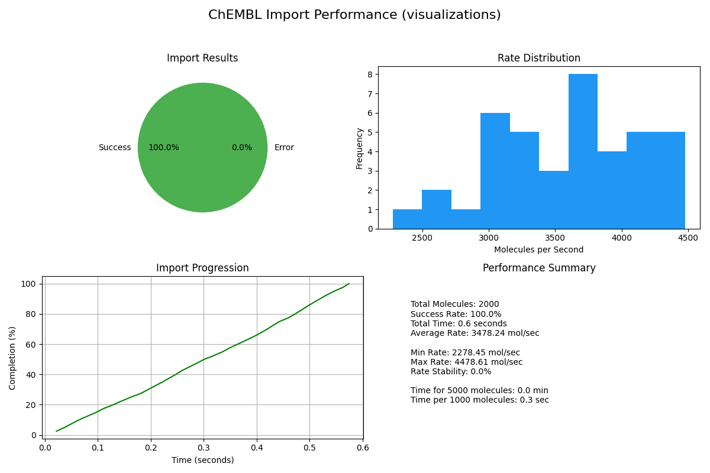
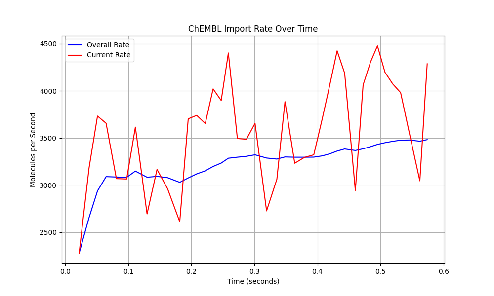
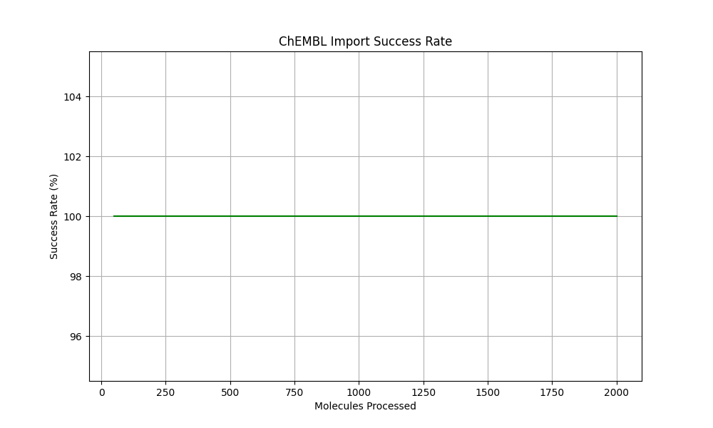
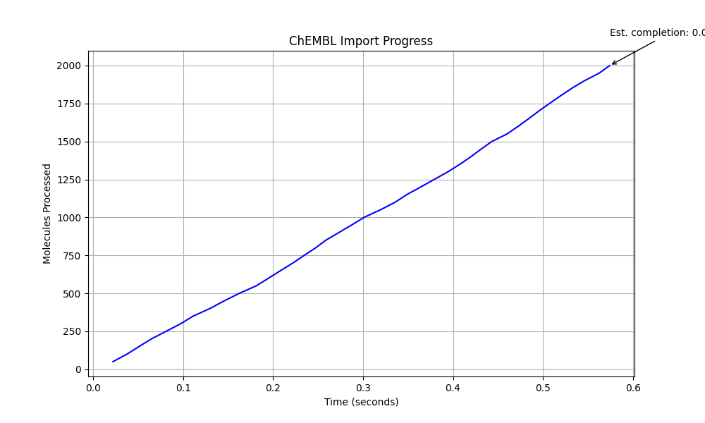

# ChEMBL Large-Scale Import Test Results

**Test Date:** Mon May 12 01:25:34 AM MDT 2025
**Duration:** 2 seconds
**Target Molecules:** 2000

## System Information

- Memory: 15GB
- CPU Cores: 8
- Free Disk Space: 29G
- Cache Directory: chembl_cache_large

## Import Performance

- Total molecules: 2000
- Successfully imported: 2000
- Failed imports: 0
- Success rate: 100.00%
- Total properties: 18000
- Import time: 0.58 seconds
- Average time per molecule: 0.29 ms
- Import rate: 3478.24 molecules/second

## Performance Stability

- Average rate: 3573.40 molecules/second
- Minimum rate: 2278.45 molecules/second
- Maximum rate: 4478.61 molecules/second
- Rate stability: 0.00%

## Scaling Analysis

- Time per 1000 molecules: 0.29 seconds
- Estimated time for 100K molecules: 0.48 minutes

## Visualizations

