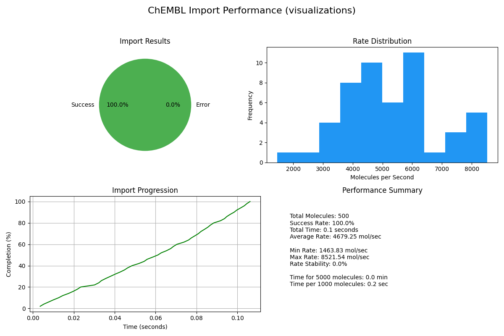
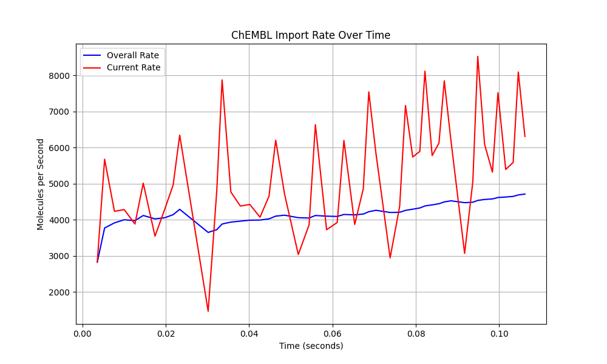
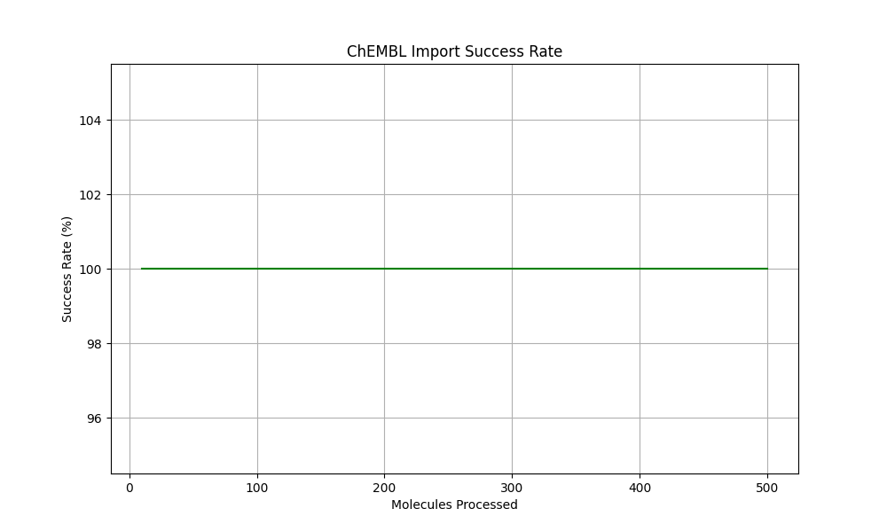
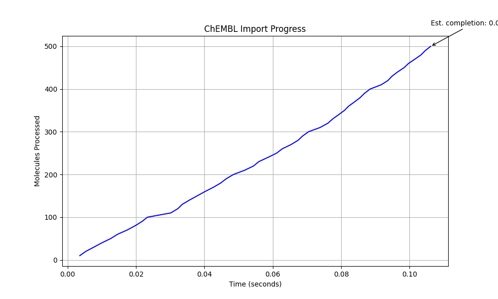

# ChEMBL Large-Scale Import Test Results

**Test Date:** Mon May 12 11:32:12 AM MDT 2025
**Duration:** 2 seconds
**Target Molecules:** 500

## System Information

- Memory: 15GB
- CPU Cores: 8
- Free Disk Space: 31G
- Cache Directory: chembl_cache_large

## Import Performance

- Total molecules: 500
- Successfully imported: 500
- Failed imports: 0
- Success rate: 100.00%
- Total properties: 4500
- Import time: 0.11 seconds
- Average time per molecule: 0.21 ms
- Import rate: 4679.25 molecules/second

## Performance Stability

- Average rate: 5257.84 molecules/second
- Minimum rate: 1463.83 molecules/second
- Maximum rate: 8521.54 molecules/second
- Rate stability: 0.00%

## Scaling Analysis

- Time per 1000 molecules: 0.21 seconds
- Estimated time for 100K molecules: 0.36 minutes

## Visualizations

