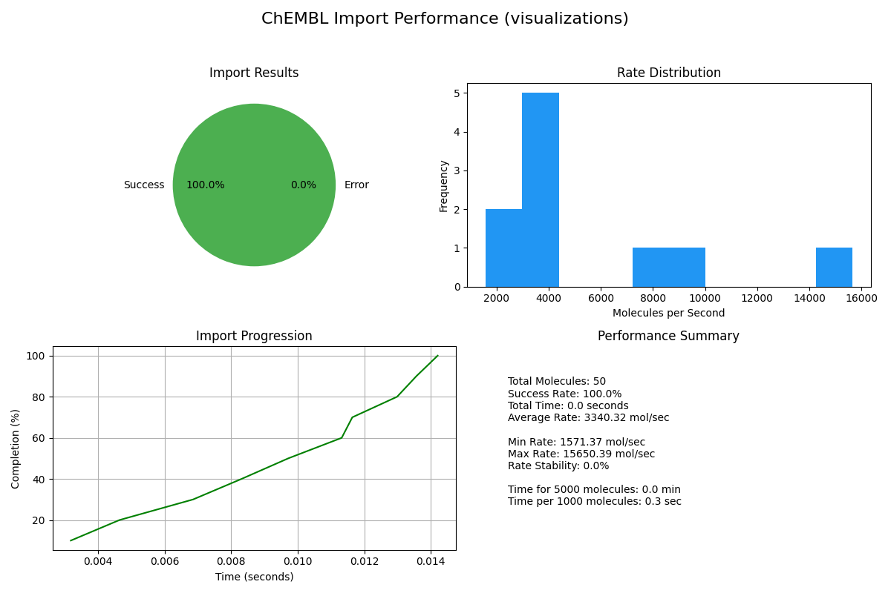
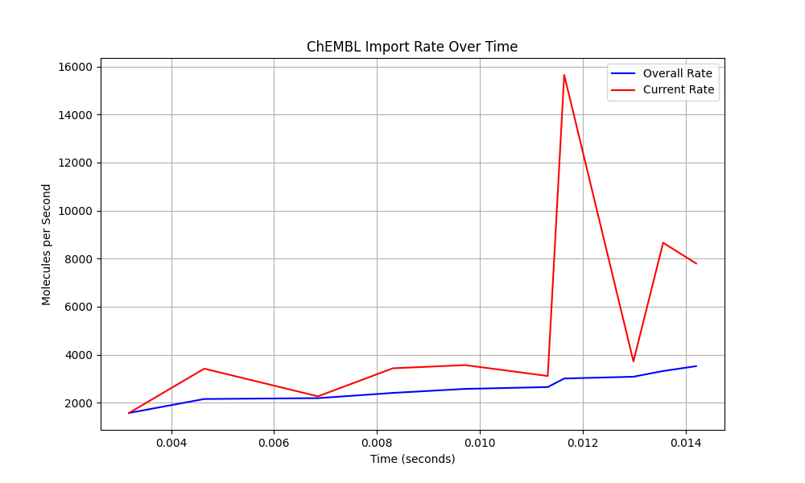
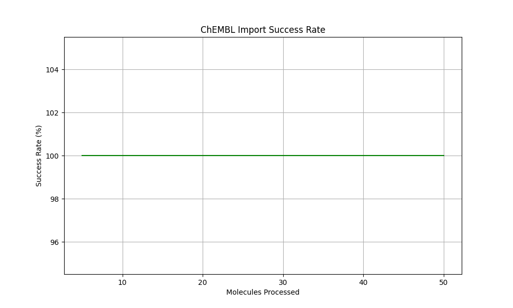

# CryoProtect Comprehensive Test Report

**Test Date:** Mon May 12 01:19:10 AM MDT 2025

## Test Summary

| Test | Status | Duration |
|------|--------|----------|
| System Check | PASSED | 0s |
| ChEMBL Import | PASSED | 0s |
| Toxicity Optimization | FAILED | 1s |
| API Functionality | PASSED | 1s |
| API Performance | FAILED | 0s |
| Visualizations | PASSED | 1s |

## ChEMBL Import Test Results

### Performance Visualizations

### Import Statistics

- Total molecules: 50
- Successful imports: 50
- Failed imports: 0
- Total time: 0.01s
- Average time per molecule: 0.0003s
- Import rate: 3340.32 molecules/second

### Data Verification

- Verification success: Yes
- Molecules verified: 50
- Properties verified: 450

## API Performance Test Results

## Test Logs

Detailed test logs are available in the following files:

- [System Check Log](system_check_log.txt)
- [ChEMBL Import Log](chembl_import_log.txt)
- [Toxicity Optimization Log](toxicity_optimization_log.txt)
- [API Functionality Log](api_functionality_log.txt)
- [API Performance Log](api_performance_log.txt)

## Conclusion

Some tests failed. Please review the detailed logs for more information.
