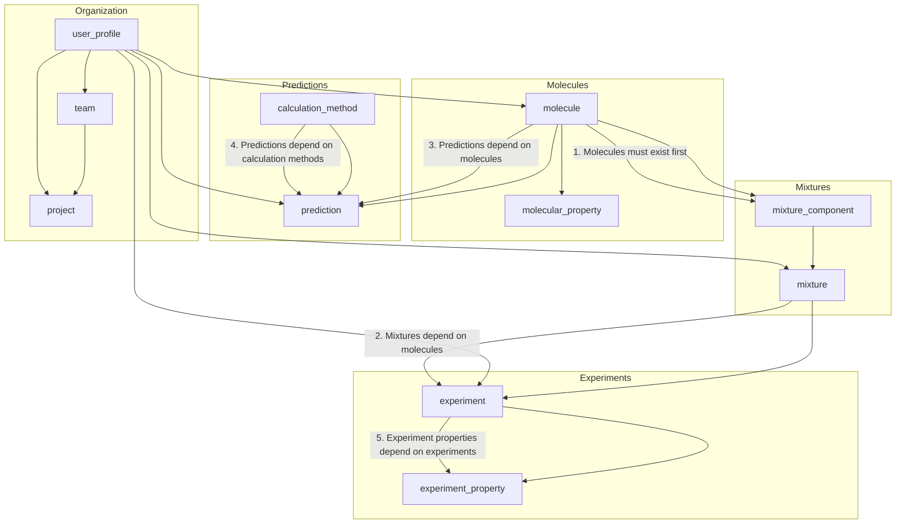

# CryoProtect v2 Data Flow Diagram



## Critical Data Population Paths

The diagram above illustrates the dependencies between tables in the CryoProtect v2 database. The correct sequence for populating related tables is:

1. **Base Data**
   - `molecule` (Cryoprotectant compounds)
   - `molecular_property` (Physical and chemical properties)
   - `calculation_method` (Methods for predictions)
   - `user_profile` (System users)
   - `team` (Research teams)

2. **Derived Data - Level 1**
   - `project` (Research projects, depends on teams)
   - `mixture_component` (Components of mixtures, depends on molecules)
   - `prediction` (Predicted properties, depends on molecules and calculation methods)

3. **Derived Data - Level 2**
   - `mixture` (Cryoprotectant mixtures, depends on mixture components)

4. **Derived Data - Level 3**
   - `experiment` (Cryopreservation experiments, depends on mixtures)

5. **Derived Data - Level 4**
   - `experiment_property` (Experimental results, depends on experiments)

This dependency order ensures proper referential integrity when populating the database. The most critical path is:

```
molecule → mixture_component → mixture → experiment → experiment_property
```

This represents the core scientific workflow from individual cryoprotectant molecules to experimental results.