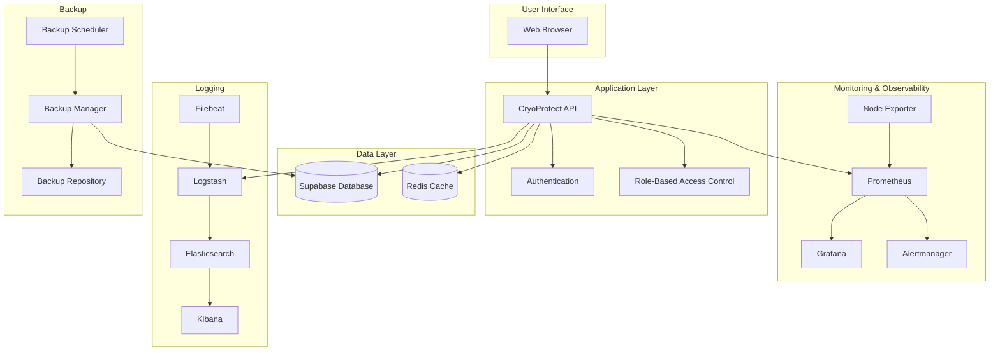
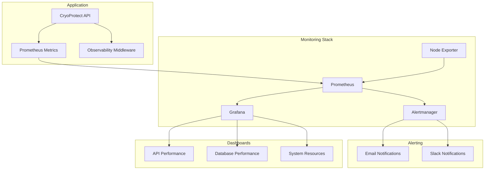
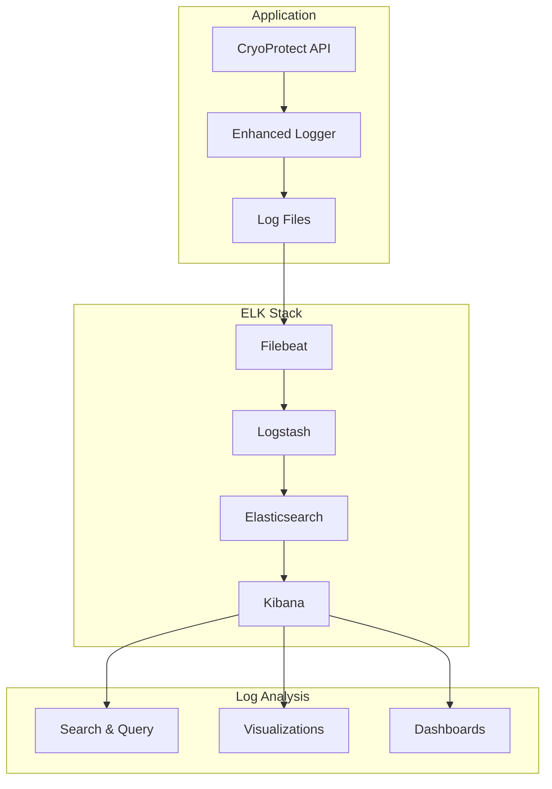
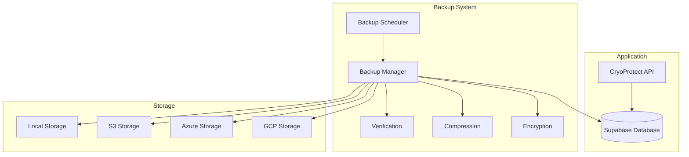

# CryoProtect v2 Architecture Diagrams

## System Architecture Overview



## Monitoring & Observability Architecture



## Logging Architecture



## Backup Architecture



## Component Interaction Diagram

```mermaid
sequenceDiagram
    participant User
    participant API as CryoProtect API
    participant DB as Database
    participant Log as Logging System
    participant Mon as Monitoring System
    participant Back as Backup System

    User->>API: Request
    API->>Log: Log Request
    API->>Mon: Record Metrics
    API->>DB: Query Data
    DB->>API: Return Data
    API->>Log: Log Response
    API->>Mon: Update Metrics
    API->>User: Response
    
    Back->>DB: Scheduled Backup
    Back->>Back: Verify Backup
    Back->>Back: Apply Retention Policy