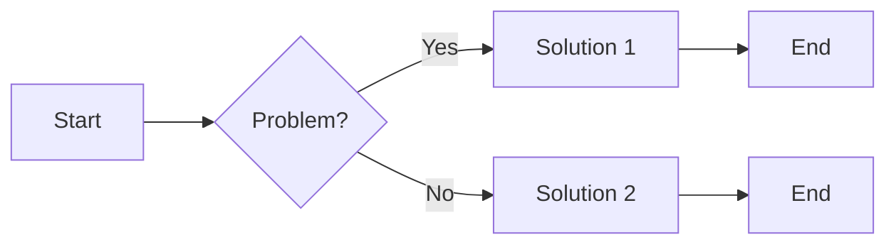

# Troubleshooting Trees

This document provides troubleshooting trees for common issues.

## [Issue Title]

### Troubleshooting Tree

```mermaid
graph LR
    A[Start] --> B{Problem?};
    B -- Yes --> C[Solution 1];
    B -- No --> D[Solution 2];
    C --> E[End];
    D --> F[End];
```

### Explanation

[Explanation of the troubleshooting tree]