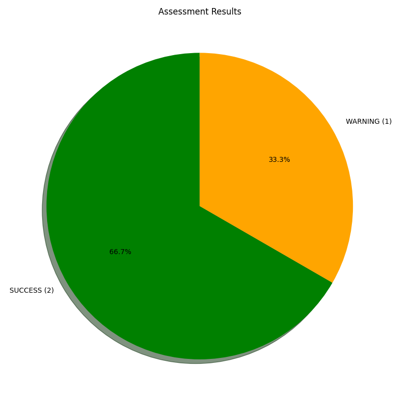
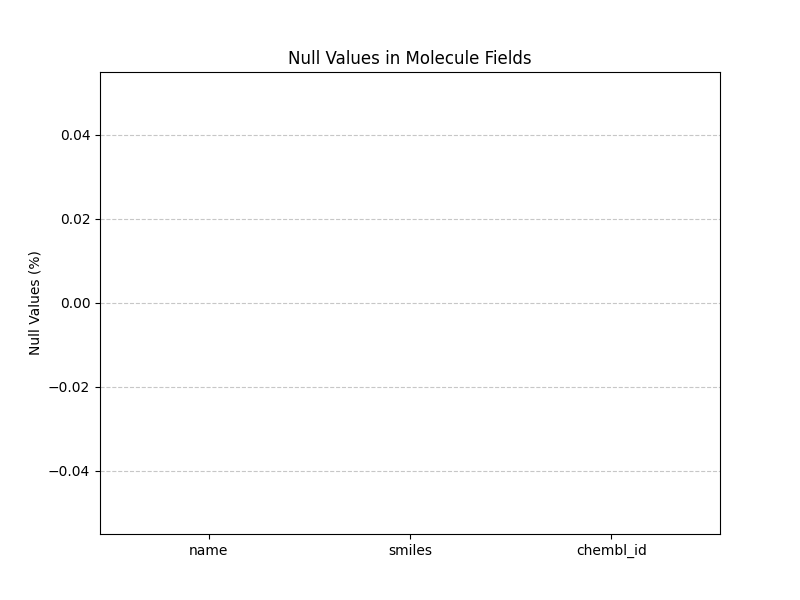
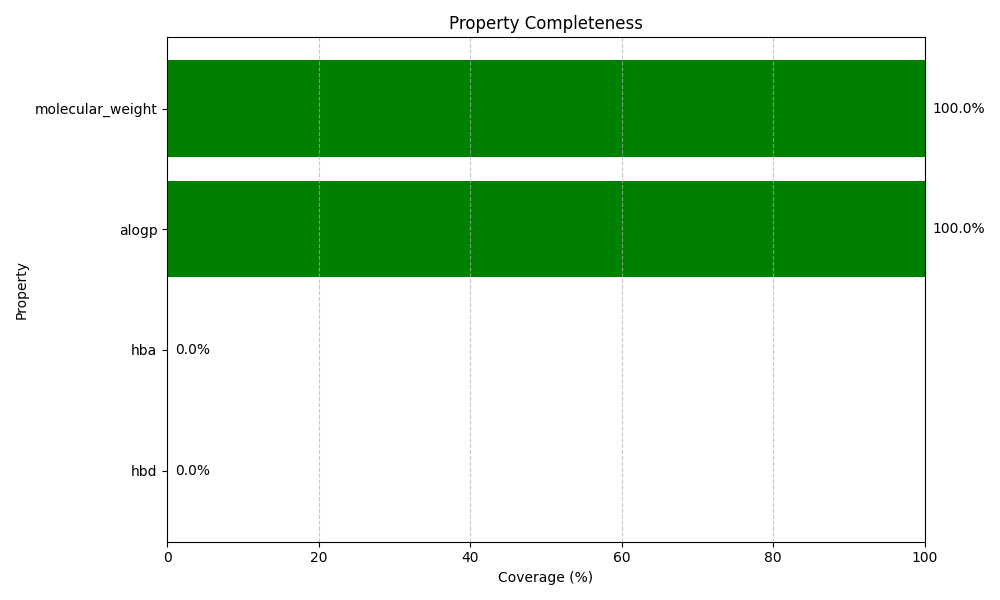

# Data Quality Report: chembl

Generated on: 2025-04-29 19:37:30

## Executive Summary

Overall data quality assessment: **WARNING** ⚠️

### Database Statistics

| Metric | Count |
| ------ | ----- |
| Total Chembl Compounds | 10 |
| Chembl Properties | 10 |

### Assessment Summary

The following chart shows the distribution of assessment results:

## Detailed Assessments

### Counts: SUCCESS ✅

Database count verification results:

| Metric | Count |
| ------ | ----- |
| Total Chembl Compounds | 10 |
| Chembl Properties | 10 |

### Null Checks: SUCCESS ✅

Null value verification results:

#### Molecules Table

| Field | Null Count | Null Percentage |
| ----- | ---------- | --------------- |
| Name | 0 | 0.00% |
| Smiles | 0 | 0.00% |
| Chembl_Id | 0 | 0.00% |

#### Null Values Visualization

### Property Completeness: WARNING ⚠️

Property completeness verification results:

Average property coverage: **50.00%**

| Property | Coverage | Molecules with Property | Total Molecules |
| -------- | -------- | ----------------------- | --------------- |
| molecular_weight | 100.00% | N/A | N/A |
| alogp | 100.00% | N/A | N/A |
| hba | 0.00% | N/A | N/A |
| hbd | 0.00% | N/A | N/A |

#### Property Completeness Visualization

## Recommendations
- **Medium Priority**: Improve property completeness:
  - Increase coverage for hba (currently only 0.00%)
  - Increase coverage for hbd (currently only 0.00%)

## Next Steps

The data quality has some issues that should be addressed. Recommended next steps:
1. Address the recommendations listed above
2. Re-run the verification after fixes are implemented
3. Implement data quality gates in the import process