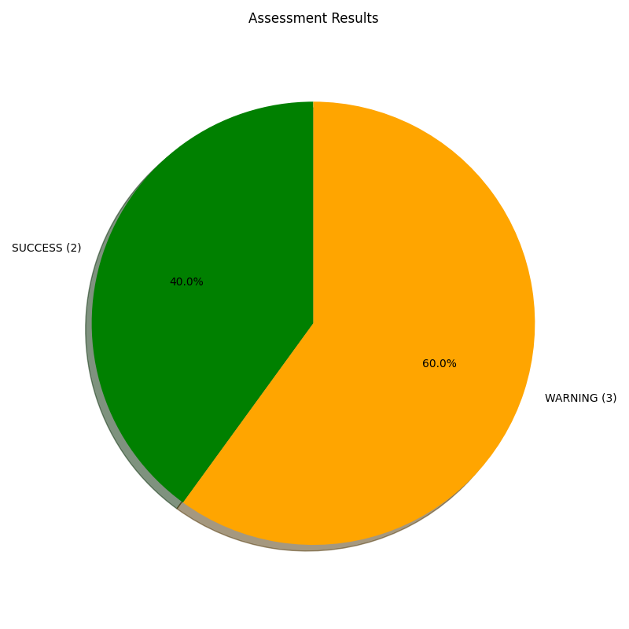
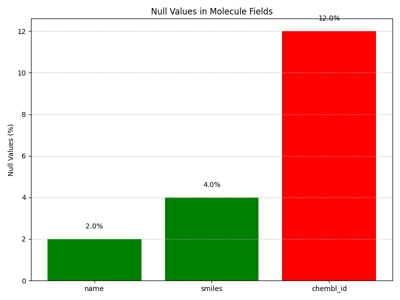
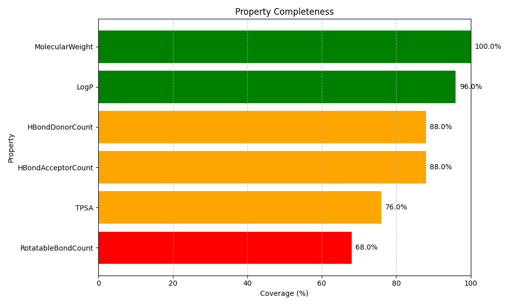

# Data Quality Report: TestData

Generated on: 2025-04-29 02:13:45

## Executive Summary

Overall data quality assessment: **WARNING** ⚠️

### Database Statistics

| Metric | Count |
| ------ | ----- |
| Molecules | 1,250 |
| Properties | 3,750 |
| Properties Per Molecule | 3.0 |

### Assessment Summary

The following chart shows the distribution of assessment results:



## Detailed Assessments

### Counts: SUCCESS ✅

Database count verification results:

| Metric | Count |
| ------ | ----- |
| Molecules | 1,250 |
| Properties | 3,750 |
| Properties Per Molecule | 3.0 |

### Null Checks: WARNING ⚠️

Null value verification results:

#### Molecules Table

| Field | Null Count | Null Percentage |
| ----- | ---------- | --------------- |
| Name | 25 | 2.00% |
| Smiles | 50 | 4.00% |
| Chembl_Id | 150 | 12.00% |

#### Properties Table

| Field | Null Count | Null Percentage |
| ----- | ---------- | --------------- |
| Value | 125 | 3.33% |
| Property_Type | 0 | 0.00% |

#### Null Values Visualization



### Consistency Checks: WARNING ⚠️

Data consistency verification results:

| Issue | Count |
| ----- | ----- |
| Molecules without properties | 15 |
| Orphaned properties | 5 |
| Duplicate molecules | 0 |

### Property Completeness: SUCCESS ✅

Property completeness verification results:

Average property coverage: **86.00%**

| Property | Coverage | Molecules with Property | Total Molecules |
| -------- | -------- | ----------------------- | --------------- |
| MolecularWeight | 100.00% | 1250 | 1250 |
| LogP | 96.00% | 1200 | 1250 |
| HBondDonorCount | 88.00% | 1100 | 1250 |
| HBondAcceptorCount | 88.00% | 1100 | 1250 |
| TPSA | 76.00% | 950 | 1250 |
| RotatableBondCount | 68.00% | 850 | 1250 |

#### Property Completeness Visualization



### Reference Compounds: WARNING ⚠️

Reference compound verification results:

- Total reference compounds: 5
- Present in database: 3
- Missing from database: 2
- Success rate: 60.00%

#### Missing Reference Compounds

```
CHEMBL3, 
CHEMBL5
```

## Recommendations
- **High Priority**: Address the high percentage of null values in key fields.
  - Fix missing chembl_id values (currently 12.00% null)
- **Medium Priority**: Resolve data consistency issues:
  - Add properties for 15 molecules that currently have none
  - Remove or fix 5 orphaned properties
- **High Priority**: Import the 2 missing reference compounds

## Next Steps

The data quality has some issues that should be addressed. Recommended next steps:
1. Address the recommendations listed above
2. Re-run the verification after fixes are implemented
3. Implement data quality gates in the import process